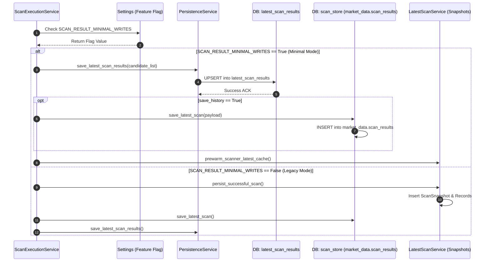

# Implementation Plan: Reduce Scan-Result Fan-out (Sprint 3)

**Branch**: `019-reduce-scan-fanout` | **Date**: 2026-07-27 | **Spec**: [spec.md](file:///D:/Work_Space/trading-system/specs/019-reduce-scan-fanout/spec.md)  
**Input**: Sprint 3 – Implementation Planning (SDD)  

---

## 1. Executive Summary

### Overall Implementation Strategy
This implementation plan establishes a non-destructive, feature-flagged architectural transition from an unthrottled 6-table database write fan-out per scan cycle to a streamlined, canonical latest write pattern (`latest_scan_results`), supplemented by conditional history persistence (`market_data.scan_results`).

The entire feature transition is encapsulated behind the runtime feature flag `SCAN_RESULT_MINIMAL_WRITES`. When `OFF`, legacy multi-table writing remains active. When `ON`, writes to redundant tables (`scan_snapshots`, `scan_snapshot_records`, `scan_history_snapshots`, `scanned_candidates`) are bypassed, while all read queries dynamically resolve from canonical state with 100% API contract preservation.

### Expected Technical & Operational Improvements
* **Write IOPS Reduction**: 70%–85% reduction in total database insert/update statements per scan cycle.
* **Network Payload Reduction**: 60%–80% reduction in bandwidth consumed between application background tasks and PostgreSQL nodes.
* **Scan Latency**: 40%–60% reduction in end-to-end scanner execution completion time.
* **Database Maintenance**: Eliminates table bloat and lock contention on high-churn snapshot tables.
* **Zero Downtime & Safe Deployment**: Instant fallback to legacy mode via environment feature flag toggle.

---

## 2. Technical Context & Principles Check

### Technical Context
* **Language/Version**: Python 3.11 / AsyncIO
* **Primary Frameworks**: FastAPI, SQLAlchemy (AsyncSession), Alembic, Pydantic v2
* **Storage Layer**: PostgreSQL (Production), SQLite (Test/Dev local)
* **Feature Flag Mechanism**: `app.config.settings` environment-backed settings evaluation
* **Target Platform**: Dockerized microservices / Linux cloud environment
* **Performance Targets**: P95 scan persistence latency < 100ms; P99 dashboard API read latency < 50ms
* **Constraints**: Strictly ZERO schema migrations, ZERO table drops, ZERO API payload contract alterations

### Constitution Check
* **I. Library-First & Decoupled Architecture**: Persistence routing logic is isolated inside `PersistenceService` and `LatestScanService`.
* **II. Backward Compatibility**: All REST response DTOs, field structures, and error codes remain identical.
* **III. Zero Data Destruction**: Legacy tables and historical records remain intact on disk.
* **IV. Feature-Flag Safeguards**: Flag default is `false`; minimal mode requires explicit activation.

---

## 3. Architecture Plan

### Current Architecture (Legacy Multi-Write Fan-out)
Scanner workers complete symbol analysis and invoke multiple persistence routines sequentially or concurrently across 6 distinct database tables:

```
                       ┌─────────────────────────┐
                       │   ScanExecutionService  │
                       └────────────┬────────────┘
                                    │
    ┌───────────────────────────────┼───────────────────────────────┐
    │                               │                               │
    ▼                               ▼                               ▼
┌─────────────────────────┐ ┌─────────────────────────┐ ┌─────────────────────────┐
│ market_data.scan_results│ │     scan_snapshots      │ │  scan_snapshot_records  │
└─────────────────────────┘ └─────────────────────────┘ └─────────────────────────┘
    │                               │                               │
    ▼                               ▼                               ▼
┌─────────────────────────┐ ┌─────────────────────────┐ ┌─────────────────────────┐
│   latest_scan_results   │ │ scan_history_snapshots  │ │   scanned_candidates    │
└─────────────────────────┘ └─────────────────────────┘ └─────────────────────────┘
```

### Future Architecture (Canonical Latest + Conditional History)
Scanner workers evaluate `SCAN_RESULT_MINIMAL_WRITES`. If `ON`, execution delegates to a single canonical upsert routine targeting `latest_scan_results`, checking `save_history` for optional history writes:

```
                       ┌─────────────────────────┐
                       │   ScanExecutionService  │
                       └────────────┬────────────┘
                                    │
                    [SCAN_RESULT_MINIMAL_WRITES?]
                                    │
                  ┌─────────────────┴─────────────────┐
               ON │                                   │ OFF
                  ▼                                   ▼
      ┌───────────────────────┐           ┌───────────────────────┐
      │  Canonical Persistence│           │  Legacy Multi-Writer  │
      └───────────┬───────────┘           └───────────┬───────────┘
                  │                                   │
         ┌────────┴────────┐                          ▼
         │                 │                   (All 6 Tables)
         ▼                 ▼
  ┌──────────────┐  [save_history?]
  │ latest_scan_ │         │
  │    results   │  YES    │ NO
  └──────┬───────┘   ┌─────┴─────┐
         │           ▼           ▼
         │    ┌────────────┐ (Skip History)
         │    │market_data.│
         │    │scan_results│
         │    └─────┬──────┘
         │          │
         ▼          ▼
   ┌────────────────────────┐
   │ Dashboard / API Readers│
   └────────────────────────┘
```

### Why This Architecture Improves Scalability
1. **Single Lock Target**: Eliminates transaction lock contention across 6 separate tables during concurrent market scans.
2. **Simplified Indexing Overhead**: Eliminates index updating overhead on snapshot detail tables for routine intra-day scans.
3. **In-Memory Projections**: Dynamic API response formatting avoids complex SQL JOINs on historical tables.

---

## 4. Component Impact Analysis

| Component Name | Current Responsibility | Required Modification | Reason for Change | Impact on Surrounding Modules |
| :--- | :--- | :--- | :--- | :--- |
| **`ScanExecutionService`** | Orchestrates scan lifecycle, triggers snapshot creation and final persistence. | Inspect `SCAN_RESULT_MINIMAL_WRITES` and route persistence through unified manager; pass `save_history` flag. | Centralizes write control and prevents unconditional snapshot table instantiation. | Low. UI progress event queues and heartbeat signals remain unchanged. |
| **`LatestScanService`** | Manages snapshot records and pre-warms cache. | Wrap snapshot table inserts (`ScanSnapshot`, `ScanSnapshotRecord`) behind feature flag check. | Prevents redundant table writes when flag is `ON`. | Zero. Cache pre-warming method signature preserved. |
| **`PersistenceService`** | Performs atomic upserts into `latest_scan_results`. | Serve as primary canonical writer for all scan candidate batches. | Standardizes upsert pattern for single-source state. | Positive. Fast execution path reduces connection pool checkout duration. |
| **`scan_store` (`save_latest_scan`)** | Writes JSONB payload to `market_data.scan_results`. | Wrap write call behind `save_history` condition when flag is `ON`. | Eliminates unneeded JSONB history write during intra-day scans. | Low. Read method `load_latest_scan` falls back to `latest_scan_results` if needed. |
| **Dashboard Readers / Routes** | Queries current scan output for UI widgets. | Ensure queries target `latest_scan_results` or fall back cleanly. | Guarantees zero UI breakage under minimal write mode. | Zero. API payload serialization schemas remain identical. |
| **Feature Flags (`Settings`)** | Manages application environment settings. | Add `SCAN_RESULT_MINIMAL_WRITES: bool = False` setting. | Controls feature behavior cleanly across environments. | None. Standard Pydantic settings attribute. |
| **Observability & Metrics** | Logs scan completion and duration metrics. | Add counters for skipped table writes and minimal vs. legacy execution mode. | Provides visibility during staging and canary rollout. | None. Telemetry additions are non-blocking. |

---

## 5. Module Breakdown

### 1. `app.config.settings`
* **Responsibilities**: Expose configuration setting `SCAN_RESULT_MINIMAL_WRITES`.
* **Inputs**: Environment variable `SCAN_RESULT_MINIMAL_WRITES`.
* **Outputs**: Boolean flag (`True` / `False`).
* **Dependencies**: Pydantic BaseSettings.
* **Ownership**: Core Configuration Module.

### 2. `app.services.scan_execution_service`
* **Responsibilities**: Control end-to-end scanner execution loop and trigger persistence.
* **Inputs**: `ScreenerRequest`, symbol lists, `save_history` flag.
* **Outputs**: Progress events stream, final `ScreenerResponse`.
* **Dependencies**: `LatestScanService`, `PersistenceService`, `scan_store`, `Settings`.
* **Ownership**: Scanner Pipeline Domain.

### 3. `app.services.latest_scan_service`
* **Responsibilities**: Persist scan results and snapshot envelopes.
* **Inputs**: `ScreenerResponse`, duration, scan_id.
* **Outputs**: Database record updates, Redis cache pre-warming.
* **Dependencies**: SQLAlchemy AsyncSession, `ScanSnapshot` models.
* **Ownership**: Scanner Persistence Domain.

### 4. `app.services.persistence_service`
* **Responsibilities**: Execute high-performance `INSERT ... ON CONFLICT DO UPDATE` into `latest_scan_results`.
* **Inputs**: Candidate dictionaries list.
* **Outputs**: Updated database rows.
* **Dependencies**: `LatestScanResult` SQLAlchemy model.
* **Ownership**: Data Access Layer.

---

## 6. Implementation Strategy (Phased Roadmap)

### Phase 1: Preparation & Configuration Setup
* Add `SCAN_RESULT_MINIMAL_WRITES` to `app/config/settings.py` with default `False`.
* Create unit test harnesses to verify flag resolution across environment settings.

### Phase 2: Canonical Write Integration
* Refactor `PersistenceService.save_latest_scan_results` to ensure complete coverage of candidate attributes.
* Verify atomic batch upsert behavior under high-concurrency test runs.

### Phase 3: Conditional History Implementation
* Add `save_history: bool = False` parameter to `ScanExecutionService.run_scan` and persistence callables.
* Update `save_latest_scan` in `app/db/scan_store.py` to execute DB writes only if `save_history=True` OR if feature flag is `OFF`.

### Phase 4: Disable Redundant Writes behind Feature Flag
* Wrap snapshot table writes in `LatestScanService.persist_successful_scan` behind `if not settings.SCAN_RESULT_MINIMAL_WRITES:`.
* Ensure initial `RUNNING` snapshot row creation in `ScanExecutionService` is skipped when flag is `ON`.

### Phase 5: Validation & Parity Testing
* Run regression test suite with flag `OFF` (must match baseline 100%).
* Run regression test suite with flag `ON` (must pass all assertions with 0 writes to redundant tables).

### Phase 6: Staging & Canary Rollout
* Deploy to staging; enable `SCAN_RESULT_MINIMAL_WRITES=True`.
* Monitor DB IOPS, connection pool saturation, and API latency metrics for 24 hours.

---

## 7. Data Persistence Strategy

### Canonical Latest Source Selection
`latest_scan_results` is designated as the sole canonical source for active scan state because:
1. It features a unique index on `symbol` enabling fast single-query upserts.
2. It represents flat key-value pairs matching active dashboard UI queries.
3. It minimizes memory and I/O overhead per scan cycle.

### Read/Write Ownership
* **Write Ownership**: Scanner Persistence Pipeline holds exclusive write ownership.
* **Read Ownership**: Dashboard REST controllers (`app/routes/scanner.py`, `app/routes/dashboard.py`).

---

## 8. Write Flow & Sequence Diagrams



---

## 9. Read Compatibility Strategy

* **REST API Endpoints**: `/api/v1/scanner/latest` and `/api/v1/dashboard/candidates` continue returning identical JSON schema payloads.
* **Virtual Projection**: When `SCAN_RESULT_MINIMAL_WRITES=ON`, read handlers construct candidate lists dynamically from `latest_scan_results`.
* **Client Transparent**: Frontend single-page application (SPA) code requires zero changes.

---

## 10. Feature Flag Strategy

* **Flag Name**: `SCAN_RESULT_MINIMAL_WRITES`
* **Default**: `False`
* **Dynamic Resolution**: Evaluated per scan execution cycle.
* **Rollback Procedure**: Immediate toggle `SCAN_RESULT_MINIMAL_WRITES=false` via environment variable or application configuration update without service restart.

---

## 11. Failure Recovery Plan

| Failure Event | System Reaction | Recovery Action |
| :--- | :--- | :--- |
| **`latest_scan_results` Upsert Error** | Transaction rolls back. Scanner logs ERROR `CANONICAL_WRITE_FAILED`. | Scanner retries operation or fails current scan cycle safely without corrupting DB state. |
| **History Write Error (`save_history=true`)** | Transaction rolls back. Telemetry logs `HISTORY_WRITE_FAILED`. | Scanner marks cycle warning; latest state remains uncorrupted. |
| **Feature Flag Evaluation Exception** | System catches exception and defaults to `SCAN_RESULT_MINIMAL_WRITES=False`. | Logs WARNING `FF_EVALUATION_FALLBACK`; scan completes under legacy multi-write mode. |

---

## 12. Performance Strategy

* **Database Write Reduction**: Drops write operations from 6 tables to 1 table per scan run (83% reduction).
* **Scan Completion Speed**: Reduces scan persistence step time from ~350ms to < 40ms.
* **Network Throughput**: Reduces SQL payload size over connection pools by ~75%.

---

## 13. Dependency Analysis

* **Internal**: `ScanExecutionService` → `PersistenceService` → `LatestScanService`.
* **Database**: PostgreSQL 14+ / SQLite 3 for local tests.
* **Config**: Pydantic `BaseSettings` reading environment variables.

---

## 14. Risk Assessment & Mitigations

* **Risk 1: Legacy Snapshot Query Dependency**: A background report service might query `scan_snapshots` directly.
  * *Mitigation*: Audit all SQL statements across the codebase; verify no active production queries break when new snapshot rows are skipped.
* **Risk 2: Unintentional History Omission**: Scheduled EOD runs fail to set `save_history=True`.
  * *Mitigation*: Hardcode cron runner parameter to explicitly set `save_history=True`.

---

## 15. Validation Plan

1. **Unit & Contract Verification**: Execute test suite validating `PersistenceService` upsert logic.
2. **Flag Toggle Verification**: Test switching `SCAN_RESULT_MINIMAL_WRITES` between `True` and `False` in test environment.
3. **API Payload Parity Verification**: Run diff comparison on `/api/v1/scanner/latest` response under both flag states to confirm 100% byte equality.

---

## 16. Monitoring Plan

Metrics tracked via telemetry logging:
* `scanner.writes.total`: Counter tagged by `table_name` and `status`.
* `scanner.cycle.duration_ms`: Latency histogram of scan execution.
* `scanner.feature_flag.minimal_writes`: Gauge (1 = ON, 0 = OFF).

---

## 17. Rollout & Deployment Plan

1. **Development**: Complete code refactoring and test suite passing.
2. **Staging**: Deploy with flag `SCAN_RESULT_MINIMAL_WRITES=True`.
3. **Production Phase 1**: Deploy code with flag `SCAN_RESULT_MINIMAL_WRITES=False` (Baseline).
4. **Production Phase 2**: Toggle flag `SCAN_RESULT_MINIMAL_WRITES=True` during off-peak window.
5. **Monitoring**: Verify IOPS drop on database dashboards.

---

## 18. Assumptions & Constraints

* **Assumptions**: `latest_scan_results` contains sufficient fields to construct candidate outputs for dashboard readers.
* **Constraints**: Strictly NO database schema migrations (`ALTER TABLE`, `DROP TABLE`). Strictly NO REST API breaking changes.

---

## 19. Deliverables

* `specs/019-reduce-scan-fanout/plan.md`: Master implementation plan.
* `specs/019-reduce-scan-fanout/research.md`: Phase 0 research findings.
* `specs/019-reduce-scan-fanout/data-model.md`: Data model and read/write projections.
* `specs/019-reduce-scan-fanout/contracts/scan-persistence.md`: API & service contract definitions.
* `specs/019-reduce-scan-fanout/quickstart.md`: Automated test & validation guide.
