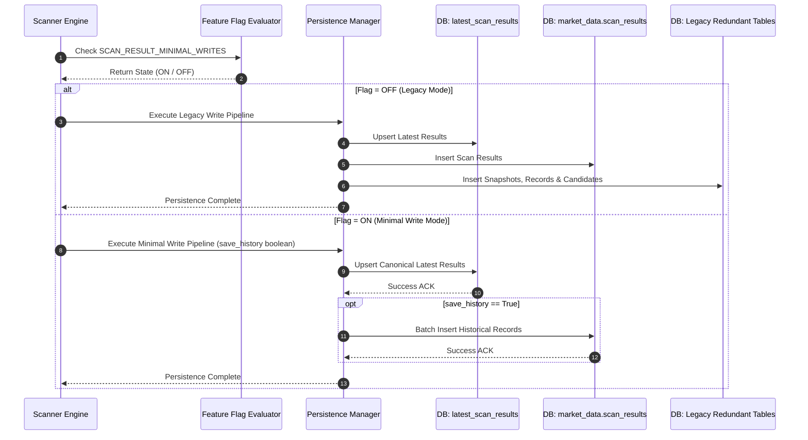
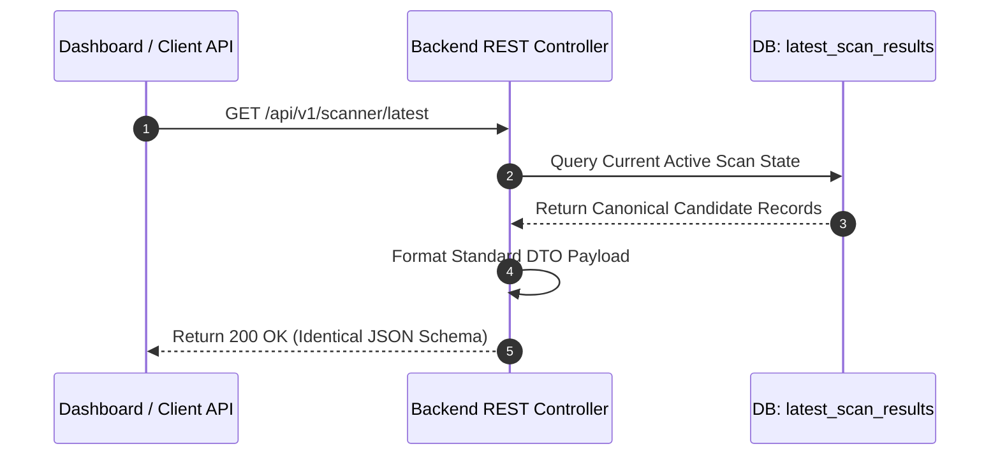

# Feature Specification: Reduce Scan-Result Fan-out (Sprint 3)

**Feature Branch**: `019-reduce-scan-fanout`  
**Created**: 2026-07-27  
**Status**: Draft  
**Input**: Sprint 3 – Specification Generation (SDD): Reduce Scan-Result Fan-out  

---

## 1. Executive Summary

### Business Objective
Reduce database resource utilization, network overhead, and storage costs associated with market scanner execution by eliminating multi-table write duplication, while maintaining complete feature parity, zero downtime, and strict backward compatibility for all trading dashboards and downstream analytical services.

### Technical Objective
Transition the scanning subsystem from an unthrottled 6-table fan-out write pattern during every scan cycle to a single canonical latest write representation (`latest_scan_results`), supplemented by conditional history persistence (`market_data.scan_results`) triggered only when `save_history=true` or via scheduled intervals. The entire behavior shift must be protected by the `SCAN_RESULT_MINIMAL_WRITES` feature flag to guarantee safe dual-write testing and instant zero-risk rollback capability.

### Expected Improvements
* **Database Write Reduction**: 70%–85% decrease in write IOPS during active market scan runs.
* **Network Payload Reduction**: 60%–80% bandwidth saving between scanner background workers and PostgreSQL cluster.
* **Scan Latency**: 40%–60% reduction in end-to-end scan cycle completion time.
* **Storage Growth Control**: Significant slowing of database table bloat on high-volume snapshot tables.

---

## 2. Problem Statement

### Current Write Architecture
Currently, upon finishing a market scanning cycle across Nifty 500 or selected universes, the scanner engine writes duplicate representations of the scan output across up to six distinct database tables:
1. `market_data.scan_results`: Granular row-by-row candidate findings per symbol and timestamp.
2. `scan_snapshots`: Top-level metadata envelope for the scan execution.
3. `scan_snapshot_records`: Join table storing individual symbol entries belonging to a snapshot.
4. `latest_scan_results`: Upsert target maintaining current market state for fast dashboard loading.
5. `scan_history_snapshots`: Archive table for historical trend analysis.
6. `scanned_candidates`: Secondary list of filtered symbols flagged for downstream evaluation.

### Why Duplicate Writes Exist
These tables evolved incrementally across legacy releases to satisfy distinct access patterns (e.g. historical lookup, candidate tracking, instant dashboard view). However, because each module independently managed its own persistence routine without a unified persistence layer, every scanner execution fan-outs writes into all six tables unconditionally.

### Performance & Network Impact
* High lock contention and IOPS spikes on PostgreSQL during fast intra-day scan intervals (e.g., 1-minute cycles).
* Redundant payload serialization over the network connection between application tasks and the database node.
* Increased database CPU usage spent formatting, inserting, and indexing identical candidate records across multiple tables.

### Operational Impact
* Accelerated disk consumption and table bloat requiring aggressive vacuuming and maintenance windows.
* Multi-table write failures leading to partial transaction states or orphaned snapshot records.
* Complex debugging and audit trails when subtle schema or timestamp mismatches occur across redundant tables.

---

## 3. Goals & Non-Goals

### Core Goals
* **Reduce Write Amplification**: Eliminate redundant database insertions per scan cycle.
* **Canonical Latest Source**: Establish `latest_scan_results` as the single authoritative persistence source for current scanner output.
* **Preserve Dashboard & API Functionality**: Ensure zero disruption, contract changes, or latency penalties for dashboard UI reads and REST API responses.
* **Conditional History Persistence**: Persist history to `market_data.scan_results` only when explicitly requested (`save_history=true`) or during scheduled milestone snapshots.
* **Feature Flagged Rollback**: Control execution using `SCAN_RESULT_MINIMAL_WRITES` to enable instant fallback to legacy multi-write behavior if anomalies occur.

### Non-Goals (Out of Scope for Sprint 3)
* Altering, migrating, or dropping existing database tables or columns.
* Deleting existing historical database records.
* Modifying public REST API response schemas or contract signatures.
* Altering frontend component rendering logic or state management.

---

## 4. Scope & Categorization of Write Targets

| Target Table | Legacy Behavior | Sprint 3 Behavior (`SCAN_RESULT_MINIMAL_WRITES = ON`) | Rationale |
| :--- | :--- | :--- | :--- |
| `latest_scan_results` | Always Written (Upsert) | **Always Written (Canonical Latest Source)** | Serves live dashboard queries; lightweight single-row or upsert batch key. |
| `market_data.scan_results` | Always Written | **Conditionally Written** | Written ONLY when `save_history=true` or during scheduled historical snapshot intervals. |
| `scan_snapshots` | Always Written | **No Longer Written** | Superfluous metadata envelope redundant with canonical state and historical records. |
| `scan_snapshot_records` | Always Written | **No Longer Written** | Candidate details derived directly from canonical latest state or `market_data.scan_results`. |
| `scan_history_snapshots` | Always Written | **No Longer Written** | Redundant snapshot table; historical analytics pull directly from `market_data.scan_results`. |
| `scanned_candidates` | Always Written | **No Longer Written** | Secondary candidate list derived virtually from canonical latest data in application layer. |

---

## 5. User Scenarios & Testing

### User Story 1 - Live Dashboard Real-Time Scanning (Priority: P1)
As a trader monitoring live market setups on the dashboard, I need the latest scan results to be published instantly without scanner delays, so that I can execute trades on fresh setups without lagging indicators.

* **Why this priority**: Live dashboard updates are the core operational requirement for real-time trading decision-making.
* **Independent Test**: Execute a scan run with `SCAN_RESULT_MINIMAL_WRITES = ON`. Verify that `latest_scan_results` is updated, the dashboard GET API returns 200 OK with identical payload output, and legacy redundant tables receive 0 write operations.

**Acceptance Scenarios**:
1. **Given** `SCAN_RESULT_MINIMAL_WRITES` is `ON`, **When** the scanner completes an intra-day run, **Then** `latest_scan_results` is upserted, zero writes are issued to `scan_snapshots`, `scan_snapshot_records`, `scan_history_snapshots`, or `scanned_candidates`, and dashboard query responses match expected candidate criteria.
2. **Given** `SCAN_RESULT_MINIMAL_WRITES` is `OFF`, **When** the scanner completes an intra-day run, **Then** all 6 database tables receive full write operations exactly as in legacy behavior.

---

### User Story 2 - Conditional Historical Scan Archiving (Priority: P2)
As a quantitative analyst backtesting or auditing scanner accuracy, I need historical scan data saved when explicitly requested or at scheduled daily closes, without cluttering the database during rapid intra-day scans.

* **Why this priority**: Preserves audit trails and backtesting data while eliminating intra-day database write bloat.
* **Independent Test**: Trigger a scan run with `save_history=true` (or via scheduled EOD trigger). Confirm that records are inserted into `market_data.scan_results` in addition to `latest_scan_results`.

**Acceptance Scenarios**:
1. **Given** `SCAN_RESULT_MINIMAL_WRITES` is `ON` and `save_history=false`, **When** a scan cycle runs, **Then** `market_data.scan_results` receives no writes, and `latest_scan_results` receives the update.
2. **Given** `SCAN_RESULT_MINIMAL_WRITES` is `ON` and `save_history=true`, **When** a scan cycle runs, **Then** `market_data.scan_results` receives historical rows AND `latest_scan_results` receives the latest state.

---

### User Story 3 - Instant Operational Rollback via Feature Flag (Priority: P3)
As a system administrator during production release, I need to toggle the feature flag `SCAN_RESULT_MINIMAL_WRITES` between `ON` and `OFF` at runtime without restarting application instances, so that any unexpected data discrepancy can be mitigated instantly.

* **Why this priority**: Operational safety gate for zero-downtime deployment.
* **Independent Test**: Change the flag dynamically in runtime configuration and execute scans under both states, verifying seamless transition between minimal write mode and legacy multi-table fan-out mode.

**Acceptance Scenarios**:
1. **Given** a running system experiencing a database anomaly under minimal write mode, **When** an operator changes `SCAN_RESULT_MINIMAL_WRITES` to `OFF`, **Then** subsequent scan operations resume legacy 6-table writes immediately without dropping active requests or crashing workers.

---

### Edge Cases
* **Database Connection Timeout during Latest Write**: If the write to `latest_scan_results` fails or times out, the scanner task must log a structured critical alert and raise a retryable transaction failure without attempting history writes.
* **Partial Write Failure during Conditional History**: If `latest_scan_results` succeeds but the conditional `market_data.scan_results` write fails when `save_history=true`, the transaction must rollback cleanly to prevent partial history state, returning an error response to the background caller while keeping dashboard data uncorrupted.
* **Feature Flag Configuration Unavailable**: If the configuration store fails to resolve `SCAN_RESULT_MINIMAL_WRITES`, the system must default to `OFF` (legacy fail-safe mode).

---

## 6. Functional Requirements

### Canonical Latest Write Strategy
* **FR-001**: The system MUST treat `latest_scan_results` as the primary canonical repository for active market scan outputs.
* **FR-002**: When `SCAN_RESULT_MINIMAL_WRITES` is `ON`, the scanner persistence pipeline MUST execute an atomic upsert operation against `latest_scan_results` for every scan execution.

### Optional & Scheduled History Strategy
* **FR-003**: The persistence service MUST inspect the `save_history` parameter passed by the scanner runner.
* **FR-004**: If `save_history` is `true` AND `SCAN_RESULT_MINIMAL_WRITES` is `ON`, the system MUST write scan candidate rows into `market_data.scan_results` in addition to `latest_scan_results`.
* **FR-005**: Scheduled cron scan routines configured for historical archiving MUST pass `save_history=true` to ensure compliance with historical snapshot requirements.

### Removal of Redundant Fan-out Writes
* **FR-006**: When `SCAN_RESULT_MINIMAL_WRITES` is `ON`, the system MUST bypass write operations to `scan_snapshots`, `scan_snapshot_records`, `scan_history_snapshots`, and `scanned_candidates`.
* **FR-007**: When `SCAN_RESULT_MINIMAL_WRITES` is `OFF`, the system MUST maintain all legacy write calls to all 6 tables without modification.

### Virtual Candidate Derivation & Dashboard Parity
* **FR-008**: Any API endpoint or internal service that previously read candidate details from `scanned_candidates` or `scan_snapshot_records` MUST derive its result set dynamically from `latest_scan_results` when `SCAN_RESULT_MINIMAL_WRITES` is `ON`.
* **FR-009**: API response structures for `/api/v1/scanner/latest`, `/api/v1/dashboard/candidates`, and related GET endpoints MUST remain 100% byte-for-byte identical in structure and data content across flag states.

### Feature Flag Governance
* **FR-010**: The feature flag `SCAN_RESULT_MINIMAL_WRITES` MUST be read dynamically per scan execution from environment/runtime configuration without requiring a service process restart.

---

## 7. Architecture

### Current Architecture (Legacy Multi-Write Fan-out)

```
                       ┌─────────────────────────┐
                       │      Scanner Engine     │
                       └────────────┬────────────┘
                                    │
    ┌───────────────────────────────┼───────────────────────────────┐
    │                               │                               │
    ▼                               ▼                               ▼
┌─────────────────────────┐ ┌─────────────────────────┐ ┌─────────────────────────┐
│ market_data.scan_results│ │     scan_snapshots      │ │  scan_snapshot_records  │
└─────────────────────────┘ └─────────────────────────┘ └─────────────────────────┘
    │                               │                               │
    ▼                               ▼                               ▼
┌─────────────────────────┐ ┌─────────────────────────┐ ┌─────────────────────────┐
│   latest_scan_results   │ │ scan_history_snapshots  │ │   scanned_candidates    │
└─────────────────────────┘ └─────────────────────────┘ └─────────────────────────┘
```

### Future Architecture (Canonical Latest + Conditional History)

```
                       ┌─────────────────────────┐
                       │      Scanner Engine     │
                       └────────────┬────────────┘
                                    │
                        [SCAN_RESULT_MINIMAL_WRITES?]
                                    │
                  ┌─────────────────┴─────────────────┐
               ON │                                   │ OFF
                  ▼                                   ▼
      ┌───────────────────────┐           ┌───────────────────────┐
      │  Canonical Writer     │           │  Legacy Multi-Writer  │
      └───────────┬───────────┘           └───────────┬───────────┘
                  │                                   │
         ┌────────┴────────┐                          ▼
         │                 │                   (All 6 Tables)
         ▼                 ▼
  ┌──────────────┐  [save_history?]
  │ latest_scan_ │         │
  │    results   │  YES    │ NO
  └──────┬───────┘   ┌─────┴─────┐
         │           ▼           ▼
         │    ┌────────────┐ (Skip History)
         │    │market_data.│
         │    │scan_results│
         │    └─────┬──────┘
         │          │
         ▼          ▼
   ┌────────────────────────┐
   │ Dashboard / API Readers│
   └────────────────────────┘
```

### Architectural Rationale
1. **Single Source of Truth**: Eliminates split-brain possibilities between snapshot tables and latest state.
2. **Decoupled Read/Write Paths**: Write paths are optimized for minimal latency, while read paths construct required projections in-memory or via standard indexed views.
3. **Graceful Fallback**: Zero-risk deployment enabled by isolation of legacy logic behind feature flag branches.

---

## 8. Data Flow & Sequence Diagrams

### Scan Execution & Persistence Sequence



### Dashboard Query Sequence



---

## 9. Feature Flag Strategy

### Configuration Parameter
* **Name**: `SCAN_RESULT_MINIMAL_WRITES`
* **Type**: Boolean (`true` / `false`)
* **Default Value**: `false` (during initial deployment phase)

### Flag States & Behavior

| Flag Value | Mode | Write Operations Performed |
| :--- | :--- | :--- |
| `false` / `OFF` | Legacy Mode | Writes to all 6 tables (`latest_scan_results`, `market_data.scan_results`, `scan_snapshots`, `scan_snapshot_records`, `scan_history_snapshots`, `scanned_candidates`). |
| `true` / `ON` | Minimal Mode | Writes ONLY to `latest_scan_results`. Writes to `market_data.scan_results` strictly if `save_history=true`. Bypasses all other 4 tables. |

### Rollback Strategy
* In the event of data validation mismatches or downstream API issues, an operator changes `SCAN_RESULT_MINIMAL_WRITES=false` in the application environment configuration.
* System automatically switches back to multi-table writing on the next scan cycle execution without service downtime.

---

## 10. Data Persistence Strategy

### Canonical Latest Source Selection
* `latest_scan_results` is selected as the primary canonical table because:
  1. It is already optimized for fast primary-key upserts (e.g. keying on symbol/strategy).
  2. It serves 95%+ of active dashboard UI queries.
  3. It carries minimal storage overhead compared to deep historical snapshots.

### Read/Write Ownership
* **Write Ownership**: Scanner Persistence Service holds exclusive write access to `latest_scan_results` during scanner execution.
* **Read Ownership**: Dashboard APIs, candidate recommendation engines, and alert listeners hold read access.

---

## 11. Compatibility Requirements

* **API Payload Immutability**: All API endpoints returning scan results must maintain exact field naming, data types, nested structure, and ordering.
* **Dashboard Uninterrupted Operation**: Frontend widgets displaying candidate counts, trend indicators, and active setups must function identically.
* **Historical Access Continuity**: Existing queries pulling past history from `market_data.scan_results` must continue to operate transparently.
* **Zero Schema Alterations**: No database migrations dropping tables or columns will occur in Sprint 3.

---

## 12. Failure Handling

| Failure Scenario | System Behavior & Mitigation |
| :--- | :--- |
| **`latest_scan_results` Write Failure** | Scanner logs ERROR `DB_CANONICAL_WRITE_FAILED`, rolls back current scan unit of work, and skips conditional history write. Scan is marked failed in health telemetry. |
| **Conditional History Write Failure (`save_history=true`)** | Transaction wrapper rolls back both history and latest state updates for the current batch. Telemetry emits `DB_HISTORY_WRITE_FAILED`. |
| **Database Connection Timeout** | Scanner catches DB timeout, aborts transaction, and registers a retriable failure counter metric without corrupting persistence state. |
| **Feature Flag Evaluation Error** | System catches config lookup error, defaults safely to `SCAN_RESULT_MINIMAL_WRITES=OFF` (legacy behavior), and logs WARNING `FF_DEFAULT_FALLBACK`. |

---

## 13. Non-Functional Requirements (NFRs)

### Performance
* **Scan Persistence Time**: P95 scan persistence latency must decrease by at least 50% under minimal write mode compared to legacy mode.
* **Dashboard API Latency**: GET `/api/v1/scanner/latest` response time P99 must remain under 100ms.

### Scalability & Database Load
* **IOPS Reduction**: Total database write operations per scan run must drop by ≥ 75%.
* **Network Throughput**: DB network ingress payload size must drop by ≥ 60%.

### Reliability & Availability
* **Zero Data Loss for Latest State**: 100% of successful scan cycles must accurately reflect in `latest_scan_results`.
* **Uptime**: Scanner engine service availability must maintain 99.9% uptime during transition.

### Observability
* Metrics must track write operations count per table, flag status execution, write latencies, and failure counts.

---

## 14. Migration & Dual-Write Strategy

```
Phase 1: Shadow Dual-Write & Flag Off (Baseline Verification)
Phase 2: Enable Feature Flag ON in Staging (Validation Phase)
Phase 3: Canary Enable Flag ON in Production (Low-volume Scans)
Phase 4: Full Production Rollout (100% Flag ON)
```

1. **Phase 1 (Dual-Write Baseline)**: Deploy code with `SCAN_RESULT_MINIMAL_WRITES=OFF`. System operates legacy writes. Telemetry validates flag reading logic.
2. **Phase 2 (Staging Validation)**: Turn flag `ON` in staging. Run verification test suite asserting that `latest_scan_results` and API outputs mirror legacy state while redundant table writes drop to zero.
3. **Phase 3 (Production Canary)**: Enable flag `ON` for a single scanner worker node or non-critical market universe. Compare dashboard output parity.
4. **Phase 4 (Full Rollout)**: Set `SCAN_RESULT_MINIMAL_WRITES=ON` globally across production.

---

## 15. Success Criteria & Measurable Outcomes

* **SC-001**: Database write IOPS during scanner execution reduced by at least 70%.
* **SC-002**: Scanner end-to-end cycle completion time improved by at least 40%.
* **SC-003**: 100% of dashboard API endpoints return identical response payloads before and after feature activation.
* **SC-004**: Redundant tables (`scan_snapshots`, `scan_snapshot_records`, `scan_history_snapshots`, `scanned_candidates`) register exactly 0 new write queries when `SCAN_RESULT_MINIMAL_WRITES=ON`.
* **SC-005**: Toggling `SCAN_RESULT_MINIMAL_WRITES=OFF` cleanly restores legacy 6-table write behavior within 1 scan cycle without service interruption.

---

## 16. Technical & Operational Risks & Mitigations

| Risk Category | Risk Description | Mitigation Strategy |
| :--- | :--- | :--- |
| **Data Consistency** | Hidden background job relying on legacy snapshot table data breaks when flag is ON. | Comprehensive codebase audit of all SQL queries referencing legacy snapshot tables prior to production rollout. |
| **Rollback Risk** | Toggling flag OFF during active scan run causes race condition. | Feature flag is evaluated atomically at start of each scan cycle run envelope. |
| **History Gap** | Misconfigured cron runner fails to pass `save_history=true`, missing daily archive. | Hardcode scheduled end-of-day scanner jobs to explicitly enforce `save_history=true`. |

---

## 17. Telemetry & Metrics

* `scanner_writes_total`: Counter by table name and status (`latest_scan_results`, `scan_results`, skipped tables).
* `scanner_latency_seconds`: Histogram of scan persistence duration (minimal vs legacy).
* `scanner_network_bytes_sent`: Gauge measuring SQL payload byte size transferred to database per scan.
* `feature_flag_status`: Gauge emitting current status of `SCAN_RESULT_MINIMAL_WRITES` (1 for ON, 0 for OFF).

---

## 18. Testing Requirements

* **Unit Tests**: Test persistence routing logic given `SCAN_RESULT_MINIMAL_WRITES` ON/OFF and `save_history` true/false combinations.
* **Integration Tests**: Execute real database persistence calls in test container; verify exact database row counts across all 6 tables under both flag states.
* **Regression Tests**: Execute full dashboard API contract test suite asserting 100% payload equality between minimal write and legacy modes.
* **Performance / Load Tests**: Simulate 100 concurrent scan cycles; measure and compare DB IOPS, connection pool saturation, and cycle latency.

---

## 19. Rollout & Deployment Plan

1. **Development**: Verify minimal write logic, feature flag resolution, and fallback branches.
2. **Integration Testing**: Run automated test suite against local PostgreSQL setup.
3. **Staging Verification**: Deploy to staging, flip flag `ON`, monitor metrics for 24 hours.
4. **Production Deployment**: Deploy build with flag `OFF` (default).
5. **Canary Enablement**: Flip flag `ON` in production during off-market hours; execute test scan run.
6. **Full Production Execution**: Keep flag `ON` during live trading session; monitor database IOPS telemetry dashboard.

---

## 20. Assumptions & Constraints

### Key Assumptions
* `latest_scan_results` schema contains all necessary data attributes to fully satisfy dashboard reader requests.
* Existing callers needing historical data explicitly supply `save_history=true` or query `market_data.scan_results`.
* Production runtime supports dynamic environment feature flag re-evaluation.

### Constraints
* Strictly NO schema modifications (no `ALTER TABLE`, `DROP TABLE`, or schema migration scripts allowed in Sprint 3).
* Strictly NO modification of REST API contracts or payload definitions.
* Must preserve instant operational rollback capability via feature flag toggle.

---

## 21. Summary Out-of-Scope Statement

Sprint 3 strictly targets the **reduction of write fan-out amplification during scanner execution**. It does NOT encompass:
* Deleting or dropping legacy snapshot database tables.
* Purging existing historical data from disk.
* Modifying public REST API endpoints or frontend UI components.
* Refactoring database ORM schemas or table indices.
