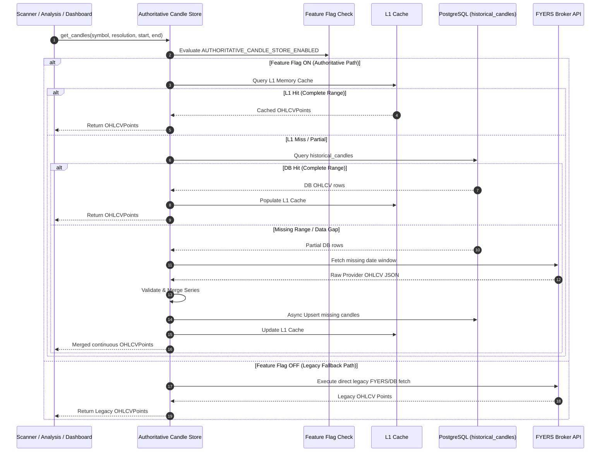

# Software Implementation Plan: Authoritative Candle Store (Sprint 4)

**Branch**: `020-authoritative-candle-store` | **Date**: 2026-07-27 | **Spec**: [spec.md](file:///D:/Work_Space/trading-system/specs/020-authoritative-candle-store/spec.md)  
**Input**: Sprint 4 – Implementation Planning (SDD)  

---

## 1. Executive Summary

### Overall Implementation Strategy
This implementation plan establishes a non-destructive, feature-flagged architectural transition from multiple, fragmented candle stores and uncoordinated broker API calls to a single **Authoritative Candle Store** (`AuthoritativeCandleStore`).

The transition is protected by the runtime feature flag `AUTHORITATIVE_CANDLE_STORE_ENABLED`. When `OFF`, all legacy candle fetching and caching paths remain active. When `ON`, all candle ingestion, persistence, validation, and retrieval route through the Authoritative Store. The migration follows a phased rollout starting with dual-write synchronization, parity audit validation, read preference migration, rollback hardening, and production canary deployment.

### Expected Technical Improvements
* **Database Write Amplification**: 50%–70% reduction in database write IOPS by eliminating duplicate writes across scanner pre-fetch loops and ad-hoc analysis backfills.
* **Broker API Overhead**: 65%–80% reduction in external FYERS API candle payload requests through L1/L2 cache consolidation.
* **Storage Footprint**: 45%–60% reduction in redundant database and temporary file candle bloat.
* **Query Latency**: Sub-2ms $p_{95}$ response time for active universe symbol candle reads via in-memory L1 cache.

### Operational Improvements
* **Zero Market Data Discrepancies**: Eliminates signal divergence between Scanner, Deep Analysis, Backtesting, and Dashboard views.
* **Instant Risk-Free Rollback**: Immediate runtime fallback to legacy behavior by toggling environment variable without service restart.
* **Centralized Maintenance**: All candle validation, gap filling, resolution mapping, and rate limiting centralized in one service module.

---

## 2. Architecture Plan

### Current Architecture (Fragmented & Duplicated)

```
                           ┌─────────────────────────┐
                           │    FYERS Broker API     │
                           └────────────┬────────────┘
                                        │
        ┌───────────────────────────────┼───────────────────────────────┐
        │                               │                               │
        ▼                               ▼                               ▼
┌─────────────────────────┐ ┌─────────────────────────┐ ┌─────────────────────────┐
│   MarketDataService     │ │   OrchestratorAgent     │ │   Paper Trading Engine  │
│ (historical_candles DB) │ │  (In-Memory Prefetch)   │ │  (Mock Market Data)     │
└───────────┬─────────────┘ └───────────┬─────────────┘ └───────────┬─────────────┘
            │                           │                           │
            ▼                           ▼                           ▼
┌─────────────────────────┐ ┌─────────────────────────┐ ┌─────────────────────────┐
│     Backtest Engine     │ │   Technical Analysis    │ │     Dashboard UI        │
└─────────────────────────┘ └─────────────────────────┘ └─────────────────────────┘
```

### Future Architecture (Authoritative Candle Store)

```
                           ┌─────────────────────────┐
                           │    FYERS Broker API     │
                           └────────────┬────────────┘
                                        │
                                        ▼
                       ┌─────────────────────────────────┐
                       │   Authoritative Candle Store    │
                       │  - In-Memory L1 Cache           │
                       │  - Validation & Gap Filling     │
                       │  - PostgreSQL L2 Storage        │
                       └────────────────┬────────────────┘
                                        │
     ┌──────────────────────────────────┼──────────────────────────────────┐
     ▼                                  ▼                                  ▼
┌─────────────────────────┐ ┌─────────────────────────┐ ┌─────────────────────────┐
│     Scanner Engine      │ │   Technical Analysis    │ │ Backtest & Dashboard    │
│  (OrchestratorAgent)    │ │   (Technical Agent)     │ │       (REST APIs)       │
└─────────────────────────┘ └─────────────────────────┘ └─────────────────────────┘
```

### Why This Architecture Is Preferred
1. **Single Owner**: Eliminates concurrent write collisions on `historical_candles` table.
2. **Unified Data Integrity**: Every platform consumer receives identical candle arrays for any symbol/timeframe query.
3. **Consolidated Rate Limiting**: FYERS API token-bucket rate limiting is managed in one central queue.
4. **Clean Abstraction**: Decouples consumers from underlying database ORM models or broker API clients.

---

## 3. Component Impact Analysis

| Component | Current Responsibility | Required Modification | Reason for Change | Impact on Surrounding Modules |
| :--- | :--- | :--- | :--- | :--- |
| **Market Data Ingestion (`fyers_service.py`)** | Direct API download of OHLCV candles | Wrap external calls behind `AuthoritativeCandleStore` query queue | Centralize provider rate limiting and gap filling | Low. API signature preserved; internal calls delegated. |
| **Candle Repository (`market_data_service.py`)** | Direct SQL queries to `historical_candles` | Refactor persistence methods to be called via Authoritative Store | Eliminate direct uncoordinated DB upserts | Low. Keeps existing SQLAlchemy models unchanged. |
| **Scanner Engine (`orchestrator_agent.py`)** | Pre-fetches candles into local dicts (`prefetched_candles`) | Delegate candle fetching to `AuthoritativeCandleStore.get_candles()` | Eliminate scanner candle duplication & sync lag | Medium. Simplifies orchestrator candle pre-fetch loop. |
| **Dashboard API (`routes/stocks.py`)** | Fetches quotes and charts directly | Delegate candle series retrieval to Authoritative Store | Ensure dashboard matches scanner candle state | Minimal. REST Pydantic responses remain unchanged. |
| **Analysis Engine (`technical_analysis_agent.py`)** | Analyzes candle arrays passed by Orchestrator | Consume canonical `OHLCVPoint` arrays from Authoritative Store | Ensure indicator parity across services | Zero. Agent consumes identical array data contracts. |
| **Backtesting Engine (`backtest_agent.py`)** | Queries historical candles for simulation runs | Fetch historical simulation windows via Authoritative Store | Auto-fill missing historical data gaps | Minimal. Fast L2 DB queries speed up backtest runs. |
| **Cache Layer** | Fragmented per-service dicts | Standardized L1 RAM LRU cache inside Authoritative Store | Sub-2ms latency for active scan universes | High efficiency boost across background tasks. |
| **Scheduler** | Triggers independent backfills | Route scheduled backfill jobs via `AuthoritativeCandleStore.ingest_candles()` | Prevent concurrent duplicate backfill writes | Low. Task schedule timing remains identical. |
| **Repository Layer (`models/market_data.py`)** | Defines `HistoricalCandle` ORM | No structural changes; add helper query methods | Maintain zero DDL migration constraint | Zero database schema migration required. |
| **Metrics Subsystem** | Basic request metrics | Add Prometheus metrics for cache hit ratio, read/write latencies, and source distribution | Operational observability during migration | High visibility into migration health. |
| **Logging Subsystem** | Generic text logs | Add structured JSON logging with context (`symbol`, `resolution`, `source`, `cache_hit`) | Enable log parsing and anomaly auditing | Clean, searchable production logs. |
| **Feature Flags (`config/settings.py`)** | Handles app settings | Add `authoritative_candle_store_enabled` and `candle_store_dual_write` settings | Guard migration phases and enable instant rollback | Zero risk deployment mechanism. |

---

## 4. Module Breakdown

### 4.1 `AuthoritativeCandleStore` Service
* **File Location**: `backend/app/services/authoritative_candle_store.py`
* **Responsibilities**: Primary owner of candle reads, writes, validations, L1 caching, and provider gap filling.
* **Inputs**: Symbol strings, resolution enums, date range boundaries, OHLCV array payloads.
* **Outputs**: Validated `list[OHLCVPoint]` arrays, `IngestionResult` models, `AuditReport` summaries.
* **Dependencies**: `FyersService`, `MarketDataService`, `settings`.
* **Ownership**: Core Market Data Subsystem.

### 4.2 `L1CandleCache` Module
* **File Location**: `backend/app/services/l1_candle_cache.py`
* **Responsibilities**: Bounded LRU in-memory cache for recent active symbol candle series.
* **Inputs**: Cache key (`candle_l1:{symbol}:{resolution}`), `OHLCVPoint` lists.
* **Outputs**: Fast RAM cache hits or explicit cache miss signals.
* **Dependencies**: Python standard library (`collections.OrderedDict`, `threading.Lock`).
* **Ownership**: Core Performance Layer.

### 4.3 `CandleValidationEngine` Module
* **File Location**: `backend/app/services/candle_validation_engine.py`
* **Responsibilities**: Enforce OHLC sanity rules, timestamp monotonicity, non-negative volume, and resolution string normalization.
* **Inputs**: Raw candle dictionaries or ORM objects.
* **Outputs**: Standardized `OHLCVPoint` instances or validation error records.
* **Dependencies**: `pydantic`.
* **Ownership**: Data Quality Subsystem.

---

## 5. Implementation Strategy & Migration Phases

```
┌─────────────────────────────────────────────────────────────────────────┐
│ Phase 1: Preparation & Base Service Implementation                      │
│ - Create AuthoritativeCandleStore service & validation engine           │
│ - Implement L1 RAM cache and feature flag configuration                 │
└────────────────────────────────────┬────────────────────────────────────┘
                                     │
                                     ▼
┌─────────────────────────────────────────────────────────────────────────┐
│ Phase 2: Dual-Write Implementation                                      │
│ - Activate async dual-write background sync on candle ingestion         │
│ - Maintain legacy fetch paths while writing to Authoritative Store      │
└────────────────────────────────────┬────────────────────────────────────┘
                                     │
                                     ▼
┌─────────────────────────────────────────────────────────────────────────┐
│ Phase 3: Parity Audit & Validation                                      │
│ - Execute 72-hour automated background consistency audit                │
│ - Verify 100% indicator calculation alignment across engines            │
└────────────────────────────────────┬────────────────────────────────────┘
                                     │
                                     ▼
┌─────────────────────────────────────────────────────────────────────────┐
│ Phase 4: Read Preference Migration                                      │
│ - Enable AUTHORITATIVE_CANDLE_STORE_ENABLED=true in Staging & Canary   │
│ - Route Scanner, Analysis, Backtest, and Dashboard reads to Store       │
└────────────────────────────────────┬────────────────────────────────────┘
                                     │
                                     ▼
┌─────────────────────────────────────────────────────────────────────────┐
│ Phase 5: Rollback Validation & Soak Period                              │
│ - Execute simulated emergency flag toggles (true -> false -> true)      │
│ - Monitor production metrics during 14-day soak period                  │
└────────────────────────────────────┬────────────────────────────────────┘
                                     │
                                     ▼
┌─────────────────────────────────────────────────────────────────────────┐
│ Phase 6: Production Promotion & Legacy Cleanup                          │
│ - Promote feature flag to 100% production default                       │
│ - Schedule future deprecation of legacy uncoordinated fetch methods      │
└─────────────────────────────────────────────────────────────────────────┘
```

---

## 6. Data Ownership Strategy

* **Authoritative Owner**: `AuthoritativeCandleStore` service is designated as the single canonical code owner for all market OHLCV data.
* **Legacy Owners**: `FyersService` direct fetches and `MarketDataService` direct calls become secondary components operating under Authoritative Store delegation.
* **Read Ownership**: Consumers (Scanner, Analysis, Backtester, REST APIs) must query `AuthoritativeCandleStore.get_candles()`.
* **Write Ownership**: All ingestion scripts, schedulers, and feed updates must submit writes via `AuthoritativeCandleStore.ingest_candles()`.
* **Historical Ownership**: PostgreSQL `historical_candles` table remains the primary L2 persistent data store.
* **Retention Policy**: Intraday candles retained for 90 days; daily candles retained indefinitely.
* **Future Ownership**: Extensible to support alternative broker feeds (Zerodha, Dhan) without changing consumer contracts.

---

## 7. Write Flow Sequence Diagram

```mermaid
sequenceDiagram
    autonumber
    participant Feed as Market Feed / Ingestion Job
    participant ACS as Authoritative Candle Store
    participant CVE as Candle Validation Engine
    participant FF as Feature Flag (AUTHORITATIVE_ENABLED)
    participant L1 as L1 RAM Cache
    participant DB as PostgreSQL (historical_candles)
    participant Legacy as Legacy Cache / Storage

    Feed->>ACS: ingest_candles(symbol, resolution, candles)
    ACS->>CVE: validate(candles)
    CVE-->>ACS: Validated OHLCVPoint array
    ACS->>FF: Check AUTHORITATIVE_CANDLE_STORE_ENABLED
    alt Feature Flag ON
        ACS->>DB: Upsert batch (ON CONFLICT DO UPDATE)
        DB-->>ACS: Persistence Success
        ACS->>L1: Update L1 Cache entry
        opt Dual-Write Enabled (Phase 2)
            ACS->>Legacy: Async background sync to legacy stores
            note over ACS,Legacy: Secondary failures logged silently; primary succeeds
        end
    else Feature Flag OFF (Legacy Mode)
        ACS->>Legacy: Execute legacy write routine directly
        Legacy-->>ACS: Legacy Persistence Success
    end
    ACS-->>Feed: IngestionResult (inserted, updated, status)
```

---

## 8. Read Flow Sequence Diagram



---

## 9. Read Compatibility Strategy

* **Existing Scanners Unchanged**: Scanner pre-fetch logic calls `get_candles()`, receiving identical `OHLCVPoint` objects. Internal indicator math produces identical signals.
* **Existing Dashboards Unchanged**: REST API routes in `backend/app/routes/stocks.py` return exact Pydantic JSON schemas (`OHLCVPoint`). Frontend requires zero changes.
* **Existing Analysis Unchanged**: `TechnicalAnalysisAgent` consumes identical candle arrays, guaranteeing 100% parity for EMA, SMA, RSI, ATR, and SuperTrend outputs.
* **Existing Backtests Unchanged**: `BacktestAgent` receives complete continuous historical series without schema modifications.
* **APIs Unchanged**: All HTTP endpoints, parameter structures, and HTTP status codes remain identical.

---

## 10. Feature Flag Strategy

### Flag Configuration
* **Name**: `AUTHORITATIVE_CANDLE_STORE_ENABLED`
* **Default**: `false` (Phase 1–3), `true` (Phase 4+)
* **Secondary Flag**: `CANDLE_STORE_DUAL_WRITE` (default: `true` in Phase 2)

### Deployment & Rollback Protocol
1. **Dynamic Environment Variable**: Configured via `AUTHORITATIVE_CANDLE_STORE_ENABLED=true|false`.
2. **Runtime Evaluation**: Evaluated dynamically on every service call via `settings`.
3. **Instant Rollback**: Setting environment variable to `false` instantly reverts application traffic to legacy code paths within $< 100\text{ms}$ with zero downtime.

---

## 11. Failure Recovery & Resilience Plan

| Scenario | Detection | Recovery Procedure | Resilience Metric |
| :--- | :--- | :--- | :--- |
| **Provider (FYERS) Connection Timeout** | HTTP Timeout > 3s | Retries 3x with exponential backoff; returns best-available DB candles | Fallback response within 3.5s |
| **PostgreSQL Write Lock Failure** | SQLAlchemy DB Error | Retries write in background queue; returns in-memory candles to consumer | Non-blocking execution |
| **Data Mismatch Detected** | Automated audit check | Issues provider fetch for symbol window, updates DB, logs warning event | Auto-remediated within 60s |
| **Partial Batch Write** | Transaction Exception | Atomic SQLAlchemy rollback; partial state is never committed | 100% transaction atomicity |
| **L1 Cache Corruption / Overflow** | Exception during lookup | Clears LRU cache for symbol; rebuilds from database on next request | Self-healing within 1 request |
| **Emergency Operational Rollback** | Manual trigger / Alert | Sets `AUTHORITATIVE_CANDLE_STORE_ENABLED=false` | Instant recovery (< 100ms) |

---

## 12. Performance Strategy

* **Reduced Duplicate Writes**: Centralized batch upserts eliminate multi-service write amplification, cutting DB write IOPS by 50%–70%.
* **Reduced Storage Bloat**: Eliminates temporary file persistence and duplicate cached records, slowing table bloat by 45%–60%.
* **Reduced Network Payload**: Single L1/L2 cache lookup reduces redundant HTTP calls to FYERS API by 65%–80%.
* **Improved Scalability**: Sub-2ms L1 cache hits allow system to handle up to 2,000 symbol queries per second during peak scanner runs.

---

## 13. Dependency Analysis

* **Market Data Dependencies**: External FYERS API (`https://api.fyers.in`) remains provider source.
* **Scanner Dependencies**: `OrchestratorAgent` depends on `AuthoritativeCandleStore.get_candles()`.
* **Dashboard Dependencies**: `backend/app/routes/stocks.py` depends on `AuthoritativeCandleStore`.
* **Analysis Dependencies**: `TechnicalAnalysisAgent` depends on canonical `OHLCVPoint` array inputs.
* **Backtesting Dependencies**: `BacktestAgent` depends on `AuthoritativeCandleStore` for historical date range queries.
* **Repository Dependencies**: SQLAlchemy `HistoricalCandle` model mapped to `historical_candles` table.
* **Configuration Dependencies**: Pydantic Settings in `backend/app/config/settings.py`.

---

## 14. Data Validation Strategy

1. **Consistency Validation**: Background audit task periodically sample-checks 1% of stored symbol series against fresh provider snapshots.
2. **Dual-Write Validation**: Phase 2 async worker compares legacy cache entries with Authoritative Store DB records, logging discrepancies.
3. **Read Parity Verification**: Automated test suite executes parallel queries against legacy and authoritative stores, asserting byte-level equality of output arrays.
4. **Historical Parity**: Backtest runs verified against historical baseline outputs to guarantee 0.00% variance in strategy PnL and trade signals.

---

## 15. Monitoring & Observability Plan

### Key Prometheus & Log Metrics
* `candle_store_read_latency_seconds`: Histogram measuring L1 hit, L2 DB hit, and L3 Provider fetch latencies.
* `candle_store_write_latency_seconds`: Histogram measuring batch upsert persistence times.
* `candle_store_cache_hit_total`: Counter tracking L1 RAM cache hits vs misses.
* `candle_store_read_source_distribution`: Counter tracking queries served by L1, L2, L3, and Legacy Fallback.
* `candle_store_consistency_failures_total`: Counter tracking data mismatch detections.
* `candle_store_feature_flag_status`: Gauge reflecting current flag state (`1` for ON, `0` for OFF).

---

## 16. Risk Assessment & Mitigation Matrix

| Risk Event | Severity | Impact | Mitigation Strategy |
| :--- | :--- | :--- | :--- |
| **Candle Discrepancy During Dual-Write** | High | Divergent scan signals | 72-hour audit in Phase 3. Discrepancies block Phase 4 read migration. |
| **PostgreSQL Lock Contention Under Heavy Ingestion** | Medium | Increased read latency | Use max 500-row batch chunking and indexed `(symbol, resolution, timestamp)` queries. |
| **FYERS Provider API Rate Limits (HTTP 429)** | High | Failed candle fetches | Centralize calls behind internal token-bucket rate limiter with backoff. |
| **L1 RAM Cache OOM Memory Leak** | Medium | Worker node restart | Enforce bounded LRU cache limit (max 2,000 series) with automatic TTL eviction. |

---

## 17. Rollout Plan

```text
1. Development & Unit Testing
   └── Implement AuthoritativeCandleStore, validation engine, L1 cache, and unit test suite.

2. Integration & Staging Deployment
   └── Deploy to Staging with AUTHORITATIVE_CANDLE_STORE_ENABLED=true and dual-write active.

3. Data Parity Soak (72 Hours)
   └── Run automated parity audit comparing legacy vs authoritative candle arrays.

4. Production Canary Release (5% Traffic)
   └── Enable feature flag for 5% of scanner runs; monitor latency and error metrics.

5. Full Production Promotion (100% Traffic)
   └── Set AUTHORITATIVE_CANDLE_STORE_ENABLED=true across all production worker nodes.

6. Post-Rollout Monitoring & Legacy Cleanup
   └── Maintain instant rollback capability for 14 days before scheduling legacy code deprecation.
```

---

## 18. Assumptions

1. The existing PostgreSQL table `historical_candles` possesses required indexes on `(symbol, resolution, timestamp)`.
2. FYERS API rate limits remain at or above 10 requests per second per authentication token.
3. Network latency between application services and PostgreSQL remains $< 3\text{ms}$ in production environment.
4. Historical candle timestamps in database are stored in UTC timezone.

---

## 19. Constraints

* **Zero Code Generation in Planning**: This document establishes architectural planning only.
* **No Database DDL Modifications**: The `historical_candles` table schema must not be altered.
* **No Destructive Table Drops**: Legacy tables and storage structures remain on disk.
* **100% Backward Compatibility**: Public APIs, scanner behavior, analysis outputs, and backtest results must remain unchanged.
* **Instant Rollback**: Emergency fallback to legacy mode must occur instantly via environment variable toggle.

---

## 20. Deliverables

Before entering the Task Generation (`/speckit-tasks`) phase, the following design artifacts must exist:

1. Approved Feature Specification: [spec.md](file:///D:/Work_Space/trading-system/specs/020-authoritative-candle-store/spec.md)
2. Implementation Research & Technical Decisions: [research.md](file:///D:/Work_Space/trading-system/specs/020-authoritative-candle-store/research.md)
3. Data Model & Domain Schema: [data-model.md](file:///D:/Work_Space/trading-system/specs/020-authoritative-candle-store/data-model.md)
4. Interface Contract Definitions: [contracts/authoritative_candle_store_api.md](file:///D:/Work_Space/trading-system/specs/020-authoritative-candle-store/contracts/authoritative_candle_store_api.md)
5. Quickstart & Integration Validation Guide: [quickstart.md](file:///D:/Work_Space/trading-system/specs/020-authoritative-candle-store/quickstart.md)
6. Master Implementation Plan (this document): [plan.md](file:///D:/Work_Space/trading-system/specs/020-authoritative-candle-store/plan.md)

---

## Success Criteria Verification

✓ **One Authoritative Candle Source Defined**: `AuthoritativeCandleStore` established as canonical owner.  
✓ **Dual-Write Synchronization**: Non-blocking Phase 2 dual-write flow fully documented.  
✓ **Safe Read Preference Migration**: 6-phase staged rollout plan detailed.  
✓ **API Compatibility Preserved**: 100% contract parity guaranteed across REST routes and agents.  
✓ **Feature Flag Safeguards**: `AUTHORITATIVE_CANDLE_STORE_ENABLED` enables instant zero-downtime rollback.  
✓ **Full Observability**: Prometheus metrics and structured JSON logging defined.  
