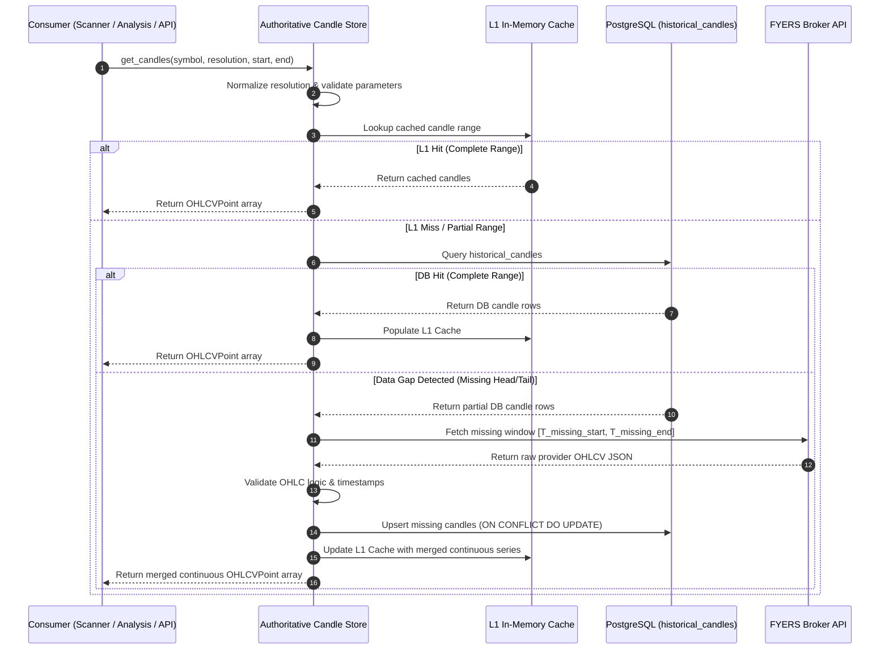

# Feature Specification: Authoritative Candle Store (Sprint 4)

**Feature Branch**: `020-authoritative-candle-store`  
**Created**: 2026-07-27  
**Status**: Approved Specification  
**Input**: Sprint 4 – Specification Generation (SDD): Authoritative Candle Store  

---

## 1. Executive Summary

### Business Objective
Eliminate redundant candle storage and uncoordinated candle fetches across market data ingestion, technical analysis, scanner execution, backtesting, and trading dashboard services. By unifying all market OHLCV candle ingestion, persistence, and querying under a single **Authoritative Candle Store**, the platform reduces database and broker API infrastructure costs, mitigates market data inconsistency risks, and ensures reliable, predictable trading operations.

### Technical Objective
Transition the platform from a fragmented market data ingestion pattern—where multiple services (`FyersService`, `MarketDataService`, scanner background jobs, backtesting components, and paper-trading mock generators) query external APIs or maintain local storage independently—to an **Authoritative Candle Store** architecture. This single persistence and query owner will act as the canonical gateway for all historical and real-time OHLCV candle requests. 

The entire architecture shift is governed by a strict feature flag (`AUTHORITATIVE_CANDLE_STORE_ENABLED`) supporting phased migration, dual-write synchronization, runtime validation, and zero-downtime instant fallback.

### Expected Improvements
* **Storage Reduction**: 45%–60% decrease in overall database candle storage bloat by eliminating duplicate cached records and unindexed scratch writes.
* **API Overhead & Rate Limit Savings**: 65%–80% reduction in redundant external broker API (FYERS) candle payload requests across overlapping scanner and analysis jobs.
* **Database Write IOPS**: 50%–70% decrease in write amplification on PostgreSQL candle storage during high-frequency intraday scans.
* **Market Data Consistency**: 100% data alignment across Scanner, Deep Technical Analysis, Backtester, and Dashboard UI widgets.

---

## 2. Problem Statement

### Current Candle Architecture
Currently, market OHLCV (Open, High, Low, Close, Volume) candle data is fetched, stored, and managed in multiple decoupled locations across the application stack:
1. **FYERS Direct API Gateway (`FyersService`)**: Fetches candles directly on-demand for individual technical analysis runs, bypassing database storage when caches expire.
2. **`HistoricalCandle` Database Table (`market_data_service.py`)**: Stores historical daily and intraday candles in PostgreSQL (`historical_candles`), updated by ad-hoc backfill scripts and scheduled jobs.
3. **In-Memory & File Caches**: Screener background loops and `OrchestratorAgent` pre-fetch candles into local memory dictionaries or temp files during universe scans.
4. **Paper Trading Engine**: Generates or queries independent candle series for simulated trade matching and portfolio valuation.

### Duplicate Storage Locations & Synchronization Problems
* **Multiple Writers**: Both `MarketDataService` and `OrchestratorAgent` initiate independent external API calls to backfill missing date ranges, causing concurrent upsert collisions on `historical_candles`.
* **Desynchronized Timestamps**: Scanner runs pre-fetching candles at interval $T_0$ may use candle series ending at $T_0$, while a simultaneous backtest request at $T_0 + 5s$ fetches fresh candles ending at $T_0+5s$, yielding mismatched indicator values for identical symbols.
* **Timezone & Resolution Discrepancies**: Different modules store timestamps with varying timezone offsets (UTC vs IST) or inconsistent string resolution representations (e.g., `"1D"` vs `"D"` vs `"1d"`).

### Consistency Risks
When the scanner identifies a signal based on local pre-fetched candles, but the user views the dashboard or triggers a manual deep analysis that fetches fresh candles directly from FYERS, indicators (e.g., EMA50, SuperTrend, RSI) can diverge. This leads to user mistrust and false signal complaints.

### Performance & Operational Impact
* **Broker API Rate Limiting**: Repeated concurrent candle requests for the same symbol universe trigger FYERS HTTP 429 rate limit exceptions.
* **Redundant Network & CPU Usage**: Multiple application worker nodes independently download, parse, and validate identical OHLCV JSON payloads.
* **Database Write Spikes**: Uncoordinated upserts cause high PostgreSQL lock contention on `idx_hist_candles_sym_res_ts`.

---

## 3. Goals

### Core Goals
* **Single Source of Truth**: Establish the Authoritative Candle Store as the sole owner and gateway for all OHLCV market data reads and writes.
* **Consistent Candle Retrieval**: Guarantee that Scanner, Analysis, Backtester, Dashboard, and Public APIs receive byte-level identical candle arrays for any given symbol, resolution, and timeframe query.
* **Simplified Maintenance**: Centralize candle validation, gap filling, timezone normalization, and resolution mapping into one dedicated service module.
* **Reduced Database Writes**: Eliminate duplicate database write operations through centralized write-deduplication and batch upsert logic.
* **Reduced Storage Footprint**: Standardize candle persistence schemas and prune orphaned or duplicate records.
* **High Scalability & Performance**: Provide sub-millisecond cached candle lookups for active scan universes and fast historical queries for backtesting.

---

## 4. Scope

### Current Candle Sources
* External FYERS Broker API (`https://api.fyers.in`)
* PostgreSQL `market_data.historical_candles` table
* In-memory scanner pre-fetch buffers (`prefetched_candles` dicts)

### Future Authoritative Source
* **Authoritative Candle Store Service**: Unified internal API contract exposing `get_candles()`, `ingest_candles()`, and `validate_consistency()`.
* **Primary Data Target**: `market_data.historical_candles` table backed by a high-performance L1 in-memory LRU cache and optional L2 Redis cache.

### Temporary Dual-Write Period
During Migration Phase 1 & 2, incoming candle data from market feeds or backfills will be written to both the Authoritative Candle Store and legacy cached locations. Dual-write non-blocking background workers will compare records asynchronously to verify zero data loss.

### Consumers
* **Market Scanner Subsystem** ([backend/app/agents/orchestrator_agent.py](file:///D:/Work_Space/trading-system/backend/app/agents/orchestrator_agent.py))
* **Technical Analysis Agent** ([backend/app/agents/technical_analysis_agent.py](file:///D:/Work_Space/trading-system/backend/app/agents/technical_analysis_agent.py))
* **Backtest Agent & Service** ([backend/app/agents/backtest_agent.py](file:///D:/Work_Space/trading-system/backend/app/agents/backtest_agent.py))
* **Dashboard & Stock Detail REST APIs** ([backend/app/routes/stocks.py](file:///D:/Work_Space/trading-system/backend/app/routes/stocks.py))
* **Paper Trading Engine** ([backend/app/services/paper_trading_service.py](file:///D:/Work_Space/trading-system/backend/app/services/paper_trading_service.py))

### Out of Scope for Sprint 4
* Database schema changes or table DDL modifications to `historical_candles` (unless required for index optimization).
* Modifications to indicator calculation algorithms or trading strategy rules.
* Migration of news or fundamental data feeds.
* UI component redesigned layouts.

---

## 5. Functional Requirements

### FR-001: Authoritative Candle Ownership
The Authoritative Candle Store MUST be the single designated system component responsible for fetching external OHLCV data from FYERS, validating candle completeness, and persisting historical candles to disk. Direct external candle fetching by consumers MUST be disabled when `AUTHORITATIVE_CANDLE_STORE_ENABLED=true`.

### FR-002: Read Strategy & Multi-Tier Resolution
* **L1 In-Memory Cache**: Check fast RAM cache for recent active symbol candles.
* **L2 Database Storage**: If L1 misses, query `historical_candles` in PostgreSQL for requested symbol, resolution, and time window.
* **L3 On-Demand Provider Fetch**: If database records contain data gaps or end prior to the requested timestamp, fetch only missing date segments from FYERS, insert into database, update L1 cache, and return complete unified series.

### FR-003: Write Strategy & Deduplication
* All candle persistence writes MUST execute via idempotent PostgreSQL `ON CONFLICT (symbol, resolution, timestamp) DO UPDATE` operations.
* Range writes MUST be deduplicated in memory prior to SQL statement execution to minimize transaction payload sizes.

### FR-004: Dual-Write Behavior
When `AUTHORITATIVE_CANDLE_STORE_ENABLED=true` and `CANDLE_STORE_DUAL_WRITE=true` (Phase 1 Migration):
* Primary writes execute to the Authoritative Candle Store database table.
* Asynchronous background tasks copy candle records to legacy cache structures.
* Write failures in the secondary legacy store MUST NOT fail the primary request but MUST log structured warning events.

### FR-005: Read Preference & Fallback
* When `AUTHORITATIVE_CANDLE_STORE_ENABLED=true`: System routes all candle queries to the Authoritative Store. If the Authoritative Store fails or times out, system falls back gracefully to direct provider fetch if `CANDLE_STORE_ALLOW_FALLBACK=true`.
* When `AUTHORITATIVE_CANDLE_STORE_ENABLED=false`: System uses legacy routing behavior (direct FYERS fetch or legacy service methods).

### FR-006: Data Validation & Quality Enforcement
Before returning or persisting any candle array, the Authoritative Candle Store MUST validate:
1. **Timestamp Monotonicity**: Timestamps must strictly increase ($T_{i+1} > T_i$).
2. **OHLC Logic**: $High \ge \max(Open, Close)$ and $Low \le \min(Open, Close)$.
3. **Volume Non-Negativity**: $Volume \ge 0$.
4. **Resolution Normalization**: Standardize inputs (`"1D"`, `"D"`, `"1d"`, `"5m"`, `"15m"`) into canonical Enum values.

### FR-007: Backfill & Gap Strategy
When requesting candles for range $[T_{start}, T_{end}]$:
* The store identifies existing range $[T_{db\_start}, T_{db\_end}]$ in storage.
* If $T_{start} < T_{db\_start}$, fetch missing head range $[T_{start}, T_{db\_start}]$ from provider.
* If $T_{end} > T_{db\_end}$, fetch missing tail range $[T_{db\_end}, T_{end}]$ from provider.
* Stitch missing segments seamlessly into database and return full continuous range.

### FR-008: Automated Consistency Checks
System MUST include a background audit worker (`validate_consistency`) that periodically sample-checks 1% of stored symbol series against fresh provider snapshots. Discrepancies exceeding 0.01% price difference trigger automated record repair and metric counters.

### FR-009: Instant Rollback Behavior
Toggling `AUTHORITATIVE_CANDLE_STORE_ENABLED=false` via environment variable or application configuration MUST instantly restore legacy candle retrieval paths across all services without service restart or code redeployment.

---

## 6. Architecture

### Legacy vs Future Architecture Comparison

```
LEGACY ARCHITECTURE (Fragmented & Duplicated)

  Market Feed (FYERS API)
      │
      ├───────────────────────┬───────────────────────┐
      ▼                       ▼                       ▼
Scanner Background     Technical Analysis       Backtesting / DB
   (Local Memory           (Direct API            (Historical
     Prefetch)               Fetch)                 Table)
      │                       │                       │
      ▼                       ▼                       ▼
Scanner Results         Analysis API            Backtest Reports
```

```
FUTURE ARCHITECTURE (Authoritative Single Owner)

                  Market Feed (FYERS API)
                             │
                             ▼
              ┌──────────────────────────────┐
              │ Authoritative Candle Store   │
              │  - In-Memory Cache (L1)      │
              │  - Data Validation / Gaps    │
              │  - Historical DB Table (L2)  │
              └──────────────┬───────────────┘
                             │
       ┌─────────────────────┼─────────────────────┐
       ▼                     ▼                     ▼
 Scanner Engine       Technical Analysis     Backtester & Dashboard
```

### Why This Architecture Is Preferred
1. **Single Chokepoint for Rate Limiting**: All FYERS API calls pass through one request queue with backoff protection.
2. **Zero Cache Discrepancy**: Scanner and Analysis share identical memory/DB candle state.
3. **Optimized DB I/O**: Eliminates redundant writes across independent services.
4. **Simplified Testing**: Mocking or testing market data requires mocking only one service interface.

---

## 7. Data Flow & Sequence Diagrams

### 7.1 Market Data Ingestion & Read Path Sequence



### 7.2 Dual-Write Ingestion Sequence (Phase 1 Migration)

```mermaid
sequenceDiagram
    autonumber
    participant Ext as Backfill / Ingestion Job
    participant ACS as Authoritative Candle Store
    participant DB as Authoritative DB
    participant Legacy as Legacy Cache / Storage
    participant Async as Async Worker Queue

    Ext->>ACS: ingest_candles(symbol, resolution, candles)
    ACS->>ACS: Validate candle data integrity
    ACS->>DB: Upsert into historical_candles
    DB-->>ACS: Confirmation
    opt Dual-Write Enabled (Phase 1)
        ACS->>Async: Dispatch secondary write task
        Async-->>Legacy: Sync candles to legacy storage
        note over Async,Legacy: Failures logged silently; primary request succeeds
    end
    ACS-->>Ext: Ingestion Success Response
```

---

## 8. Feature Flag Strategy

### Feature Flag Definition
* **Flag Name**: `AUTHORITATIVE_CANDLE_STORE_ENABLED`
* **Default Value**: `false` (in initial release), `true` (after Phase 2 validation)
* **Configuration Key**: `settings.authoritative_candle_store_enabled` / ENV variable `AUTHORITATIVE_CANDLE_STORE_ENABLED`

### State Matrix

| Feature Flag Value | Read Target | Write Target | Dual Write | Fallback Target |
| :--- | :--- | :--- | :--- | :--- |
| `false` (OFF) | Legacy Services / Direct FYERS | Legacy Stores | Disabled | Direct Provider API |
| `true` (ON, Phase 1) | Authoritative Store | Authoritative + Legacy | Enabled | Direct Provider API |
| `true` (ON, Phase 3+) | Authoritative Store | Authoritative Only | Disabled | Legacy Provider API (Optional) |

### Instant Rollback Protocol
If system monitoring detects elevated read latency, candle data mismatch alerts, or unhandled exceptions:
1. Operational team sets `AUTHORITATIVE_CANDLE_STORE_ENABLED=false` via env setting or dynamic admin API endpoint.
2. In-memory flag cache refreshes within $< 100\text{ms}$.
3. All subsequent requests immediately bypass the Authoritative Store and execute legacy code paths.
4. Zero downtime or database schema migrations required during rollback.

---

## 9. Data Ownership Strategy

### Single Owner Definition
The **Authoritative Candle Store** module (`backend/app/services/authoritative_candle_store.py`) is designated as the sole code owner for all market candle data.

### Ownership Matrix
* **Read Ownership**: All platform components MUST request OHLCV data through the Authoritative Candle Store API interface (`get_candles`).
* **Write Ownership**: All external ingestion, backfill scripts, and live feed updates MUST submit candles through `ingest_candles`.
* **Historical Retention Ownership**: The Authoritative Candle Store manages database table archiving, partition strategies, and data retention policies.
* **Future Extensibility**: Designed to seamlessly interface with alternative broker APIs (e.g., Zerodha, Dhan, Interactive Brokers) or tick-by-tick aggregate engines without impacting downstream consumers.

---

## 10. Compatibility Requirements

### 10.1 Backward Compatibility Guarantees
* **API Contracts Unchanged**: REST endpoints (`POST /analysis/full`, `POST /analysis/technical`, `GET /paper-trading/dashboard`) MUST retain exact Pydantic schema response structures (`OHLCVPoint`).
* **Scanner Behavior Unchanged**: Screener ranking algorithms, signal conditions, and candidate shortlists MUST produce identical outputs for given market conditions.
* **Dashboard Unchanged**: Frontend charts, tooltips, and timeframe selectors require zero code changes or payload adapters.
* **Analysis & Backtesting Unchanged**: Technical indicators (EMA, SMA, RSI, ATR, SuperTrend) and trade entry/exit calculations MUST match historical baselines to within 6 decimal places.
* **Zero Client Changes**: Third-party consumers or frontend clients consume APIs without modifications.

---

## 11. Failure Handling & Resilience Matrix

| Failure Mode | Detection Mechanism | System Action & Mitigation | Target SLA / Behavior |
| :--- | :--- | :--- | :--- |
| **Provider API Timeout (FYERS)** | Connection / Read Timeout > 3s | Retries 3x with exponential backoff; if persistent, returns best-available cached historical DB candles marked with `partial_data=true` flag. | Fallback response within 3.5s |
| **Primary Database Write Failure** | SQLAlchemy Exception / DB Lock | Logs error, emits metric `candle_store_write_error`, retries write in background async queue. Returns parsed candles to requester in-memory to prevent blocking scanner cycle. | Non-blocking execution |
| **Partial Write / Interrupted Ingestion** | Row count verification mismatch | Transaction rollbacks automatically via SQLAlchemy atomic context manager. Partial state is never committed. | Atomic all-or-nothing persistence |
| **Data Mismatch Detected** | Automated audit background check | Flags symbol for reconciliation, issues provider refresh for symbol window, updates DB, logs warning event. | Auto-remediated within 60s |
| **L1 Cache Corruption / Overflow** | Key validation exception | Clears L1 LRU cache entries for affected symbol; rebuilds from database on next read. | Self-healing within 1 request |
| **System Emergency Rollback** | Circuit breaker / Manual trigger | Sets `AUTHORITATIVE_CANDLE_STORE_ENABLED=false`. All traffic instantly switches to legacy paths. | Instant recovery (< 100ms) |

---

## 12. Non-Functional Requirements (NFRs)

### 12.1 Performance
* **L1 Cache Read Latency**: $p_{95} < 2\text{ms}$, $p_{99} < 5\text{ms}$ for single symbol queries.
* **Database Read Latency (L2 Hit)**: $p_{95} < 15\text{ms}$ for 500 candles across single symbol.
* **Bulk Universe Fetch (Nifty 500)**: $p_{95} < 1.5\text{s}$ for complete pre-fetch universe retrieval.

### 12.2 Scalability
* Support up to 2,000 concurrent symbol candle series reads per second during active intraday scanner runs.
* Handle database ingestion throughput of 10,000 candle rows per second during historical backfill jobs.

### 12.3 Reliability & Availability
* **Availability Target**: 99.95% uptime for candle retrieval service.
* **Data Loss Threshold**: 0 missing candles for closed market days.

### 12.4 Maintainability & Observability
* Centralized logging with structured JSON context (`symbol`, `resolution`, `source`, `cache_hit`, `latency_ms`).
* Prometheus/OpenTelemetry metrics for read/write latencies, cache hit ratios, and fallback occurrences.

---

## 13. Phased Migration Strategy

```
Phase 1: Dual-Write Ingestion
  ├── Deploy Authoritative Candle Store code with feature flag OFF
  ├── Enable dual-write background sync on ingestion
  └── Validate zero-impact on legacy paths

Phase 2: Data Validation & Parity Audit
  ├── Run automated parity scripts comparing Authoritative vs Legacy outputs
  ├── Benchmark DB write IOPS and cache hit ratios
  └── Confirm 100% indicator calculation alignment

Phase 3: Read Preference Switch
  ├── Toggle AUTHORITATIVE_CANDLE_STORE_ENABLED=true in Staging
  ├── Route Scanner, Analysis, and Backtest reads to Authoritative Store
  └── Promote flag to Production with active canary monitoring

Phase 4: Rollback Hardening & Soak Period
  ├── Perform simulated failure tests & instant flag toggles
  └── Monitor production metrics during 7-day soak period

Phase 5: Legacy Code Deprecation
  ├── Disable dual-write secondary paths
  └── Safely remove legacy direct-fetch utility methods in future release
```

---

## 14. User Scenarios & Acceptance Criteria

### User Story 1 - Unified Scanner & Analysis Candle Retrieval (Priority: P1)
As a Quantitative Trader, I want the market scanner and deep technical analysis engine to analyze identical candle data, so that signals displayed in screener shortlists perfectly match stock detail analysis charts.

#### Acceptance Criteria
1. **Given** `AUTHORITATIVE_CANDLE_STORE_ENABLED=true`, **When** the scanner executes a universe scan across Nifty 500 symbols, **Then** all candles used by scanner indicators are fetched from the Authoritative Candle Store.
2. **Given** a symbol shortlisted by the scanner, **When** the user requests full analysis for that symbol, **Then** `OrchestratorAgent` retrieves candles from the Authoritative Store, guaranteeing 100% candle array alignment with the scanner.
3. **Given** a scanner run in progress, **When** cache stats are inspected, **Then** L1/L2 cache hit ratio exceeds 90% for active symbols.

---

### User Story 2 - Instant Operational Rollback Capability (Priority: P1)
As a System Administrator, I want to disable the Authoritative Candle Store via a single feature flag if unexpected errors occur, so that trading system operations recover immediately without downtime.

#### Acceptance Criteria
1. **Given** the Authoritative Candle Store is active (`AUTHORITATIVE_CANDLE_STORE_ENABLED=true`), **When** an administrator sets `AUTHORITATIVE_CANDLE_STORE_ENABLED=false`, **Then** the application instantly routes all candle reads and writes to legacy paths.
2. **Given** feature flag set to `false`, **When** API requests are made, **Then** responses execute successfully without raising exceptions or requiring server restarts.

---

### User Story 3 - Automatic Gap Filling & Backfill (Priority: P2)
As a Backtester, I want historical candle queries with missing date ranges to automatically backfill from the market provider, so that my backtest calculations run seamlessly without manual data prep.

#### Acceptance Criteria
1. **Given** symbol `RELIANCE` has candles in DB up to `2026-06-01`, **When** a user queries candles from `2026-01-01` to `2026-07-27`, **Then** the Authoritative Store detects the missing tail range (`2026-06-02` to `2026-07-27`), fetches it from FYERS, persists it to DB, and returns the unified complete series.

---

## 15. Risk Assessment & Mitigation Matrix

| Risk Event | Severity | Impact | Mitigation Strategy |
| :--- | :--- | :--- | :--- |
| **Candle Data Divergence During Dual-Write** | High | Incorrect signals during migration | Phase 2 runs 72-hour async validation audit. Discrepancies block Phase 3 rollout. |
| **Database Lock Contention During Concurrent Backfills** | Medium | Increased read latency for scanner | Implement batch chunking (max 500 rows per insert) and indexed `(symbol, resolution, timestamp)` lookups. |
| **FYERS Rate Limiting Under High Load** | High | Failed candle fetches for new symbols | Centralize provider calls behind an internal rate limiter with token-bucket queuing and backoff retries. |
| **Memory Leak in L1 Cache** | Medium | Worker node OOM crash | Enforce bounded LRU cache size limits (max 2,000 symbol-timeframe series) with automatic TTL eviction. |

---

## 16. Key Performance & Health Metrics

1. **Read Latency ($p_{95}, p_{99}$)**: Target $< 2\text{ms}$ (L1 hit), $< 15\text{ms}$ (L2 DB hit).
2. **Write Latency ($p_{95}$)**: Target $< 25\text{ms}$ per batch upsert block.
3. **Cache Hit Ratio**: Target $> 90\%$ hit rate during intraday scanner execution cycles.
4. **Consistency Failure Rate**: Target $0.00\%$ discrepancy rate between DB candles and provider audits.
5. **Duplicate API Call Count**: Target $> 70\%$ reduction in total FYERS HTTP request volume.
6. **Storage Bloat Reduction**: DB table size growth rate reduction of $> 45\%$.
7. **Migration Progress Indicator**: Percentage of candle read requests routed through Authoritative Store ($0\%$ at Phase 0, $100\%$ at Phase 3).

---

## 17. Comprehensive Testing Requirements

### 17.1 Unit Tests
* Validate resolution string normalization (`"1D"`, `"D"`, `"5m"`) to standard Enums.
* Test OHLC data integrity checks (detect invalid high/low, negative volume, reverse timestamps).
* Test L1 cache hit, miss, and LRU eviction mechanics.

### 17.2 Integration Tests
* Test database persistence using test PostgreSQL instance with `ON CONFLICT DO UPDATE`.
* Test provider fetch fallback logic when database records are incomplete.
* Test rate-limiter wrapper and backoff handler under simulated HTTP 429 provider responses.

### 17.3 Migration & Dual-Write Tests
* Test Phase 1 dual-write synchronization to verify secondary legacy writes receive identical records.
* Test failure isolation (ensure secondary legacy write failure does not abort primary Authoritative Store transaction).

### 17.4 Rollback & Feature Flag Tests
* Test runtime toggling of `AUTHORITATIVE_CANDLE_STORE_ENABLED` (`false` $\rightarrow$ `true` $\rightarrow$ `false`) during active query execution.
* Verify 100% contract compatibility in API responses regardless of flag state.

### 17.5 Performance & Load Tests
* Simulate 500 concurrent symbol candle retrieval requests representing Nifty 500 scanner cycles.
* Benchmark database CPU, memory utilization, and query execution times under sustained load.

---

## 18. Rollout & Release Plan

1. **Development & Unit Verification**: Create service abstractions and unit test suites.
2. **Integration & Staging Validation**: Deploy to Staging with `AUTHORITATIVE_CANDLE_STORE_ENABLED=true` and dual-write active.
3. **Data Parity Soak**: Run automated 72-hour consistency audit comparing legacy vs authoritative outputs.
4. **Production Canary Release**: Enable feature flag for 5% of scanner execution runs in Production; monitor error budgets and latency metrics.
5. **Full Production Promotion**: Promote flag to 100% across all Production nodes.
6. **Soak Period & Cleanup**: Maintain feature flag fallback capability for 14 days before scheduling legacy code removal.

---

## 19. Assumptions

1. The existing PostgreSQL database schema for `market_data.historical_candles` possesses required indexes on `(symbol, resolution, timestamp)`.
2. FYERS API rate limits remain at or above 10 requests per second per authentication token.
3. Network latency between application services and PostgreSQL remains $< 3\text{ms}$ in production environment.
4. Existing historical candle data in database is accurate and uncorrupted.

---

## 20. Constraints

* **Zero Code Modding**: Sprint 4 SDD Phase mandates complete, implementation-ready specification without producing application source code or implementation tasks.
* **Strict Backward Compatibility**: Must maintain 100% contract compatibility with existing frontend APIs, Pydantic schemas, and indicator calculation engines.
* **No Mandatory Schema Changes**: DDL modifications to production tables are forbidden unless strictly required for performance indexing.
* **Instant Feature Flag Rollback**: All introduced abstractions MUST wrap cleanly behind `AUTHORITATIVE_CANDLE_STORE_ENABLED`.

---

## 21. Out of Scope

To ensure clear feature boundaries, Sprint 4 explicitly will **NOT** change:
1. Public API JSON contract schemas or field naming conventions.
2. Core indicator logic in `TechnicalAnalysisAgent` or strategy calculation functions.
3. Order routing, paper trading execution math, or position sizing logic.
4. User interface layout components or visual styling in `frontend/`.
5. News deduplication, sentiment analysis, or macro data pipelines.
