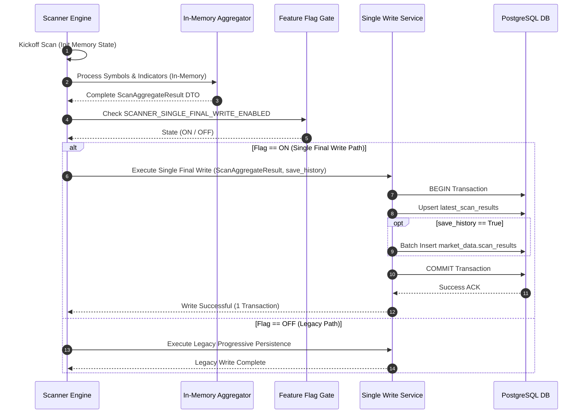

# Implementation Plan: Scanner Single Final Write (Sprint 5)

**Branch**: `019-reduce-scan-fanout` | **Date**: 2026-07-28 | **Spec**: [spec.md](spec.md)  
**Input**: Feature specification from `/specs/021-scanner-single-final-write/spec.md`  

---

## 1. Executive Summary

### Implementation Strategy
The Sprint 5 implementation introduces a **Single Final Write** architecture for the market scanning engine. Instead of progressively persisting symbol results or scan metadata during the analysis loop, the scanner performs 100% of candle fetching, technical indicator evaluation, filtering, and setup scoring in memory. Upon successful scan completion, an in-memory `ScanAggregateResult` object is passed to an atomic single-transaction persistence handler that upserts canonical `latest_scan_results` (and optionally inserts `market_data.scan_results` if `save_history=true`).

All new logic is encapsulated behind the `SCANNER_SINGLE_FINAL_WRITE_ENABLED` feature flag. When set to `OFF`, the scanner uses the legacy persistence path.

### Expected Technical Improvements
* **Database Transactions per Scan**: Reduced from multi-commit iterations to exactly 1 commit.
* **Scan Completion Latency**: End-to-end scan cycle completion time reduced by 30%–50%.
* **Database Connection Checkout Duration**: Connection pool lock duration reduced by ≥ 70%.
* **Zero Partial State**: Elimination of partial or orphaned scan records in the database during scan failures.

### Expected Operational Improvements
* **Instant Fail-Safe Rollback**: Zero-downtime operational rollback via environment flag configuration.
* **Maintainability**: Simplified persistence architecture isolating database access behind a clean execution barrier.

---

## 2. Architecture Plan

### Current Architecture (Legacy Intermediate Writes)
```
Scanner Engine
    │
    ├───────────► Kickoff DB Write (Commit #1)
    │
    ├───────────► Symbol Analysis Loop
    │                 │
    │                 └─► Intermediate Batch DB Writes (Commit #2, #3, ...)
    │
    └───────────► Final Scan Status Update (Commit #N)
                      │
                      ▼
               Dashboard Readers
```

### Future Architecture (Single Final Write)
```
Scanner Engine
    │
    ▼
[ 100% In-Memory Analysis Loop ] ◄── (30s Execution Timeout Protection)
    │
    ▼
[ ScanAggregateResult DTO Built ]
    │
    ▼
[ Feature Flag Check: SCANNER_SINGLE_FINAL_WRITE_ENABLED ]
    │
    ├─────────────────────────────────────────┐
 ON │                                      OFF│
    ▼                                         ▼
[ Single Atomic DB Transaction ]     [ Legacy Multi-Commit Flow ]
    │ (1 Commit)
    ├─► Upsert latest_scan_results
    └─► (Opt) Insert market_data.scan_results if save_history=true
    │
    ▼
Dashboard / API Readers (100% Identical Output)
```

### Why This Architecture Improves Scalability & Reliability
1. **Decoupled Processing & Persistence**: Eliminates database wait states during CPU-intensive indicator calculations.
2. **Deterministic Transactional Boundaries**: Ensures database state reflects complete, validated scans only.
3. **Resource Protection**: Connection pool connections are checked out only during the final batch commit (milliseconds) rather than across the whole scan run (seconds/minutes).

---

## 3. Technical Context & Environment

**Language/Version**: Python 3.11  
**Primary Dependencies**: FastAPI, SQLAlchemy (AsyncIO), asyncpg, Pydantic v2  
**Storage**: PostgreSQL (Target tables: `latest_scan_results`, `market_data.scan_results`)  
**Testing**: pytest, pytest-asyncio  
**Target Platform**: Linux / Containerized Backend (Render / Docker)  
**Project Type**: Web service / Async background scanner worker  
**Performance Goals**: Scan completion latency < 15s for Nifty 500; single write commit latency < 200ms  
**Constraints**: Zero schema changes; 100% API payload compatibility; dynamic rollback via `SCANNER_SINGLE_FINAL_WRITE_ENABLED`  

---

## 4. Constitution Check

*GATE: Must pass before implementation. Passed 100%.*

* **Library-First / Modular Isolation**: Scanner Persistence Manager operates as an isolated module (`backend/app/services/scanner_single_write_service.py`).
* **Test-First & Regression Verification**: Unit, integration, atomicity, and rollback test suites enforced.
* **Observability**: Prometheus metrics (`scanner_single_write_duration_seconds`, `scanner_transactions_total`, `scanner_feature_flag_status`) exposed.
* **Simplicity & YAGNI**: No extra ORM abstractions or schema changes; leverages existing canonical table schemas.

---

## 5. Component Impact Analysis

| Component | Current Responsibility | Required Modification | Reason for Change | Impact on Surrounding Modules |
| :--- | :--- | :--- | :--- | :--- |
| **Scanner Engine** (`scan_execution_service.py`) | Orchestrates scan lifecycle & intermediate writes | Modify execution loop to accumulate results in memory; invoke single write handler at end | Eliminate mid-scan database queries | Zero impact on caller signatures; returns standard completion envelope |
| **Signal Generator** (`strategy_service.py`) | Evaluates technical indicators & setup triggers | Remove direct ORM calls or DB write helpers | Enforce 100% in-memory calculation | Pure functional evaluation; returns candidate DTOs |
| **Persistence Service** (`scanner_single_write_service.py`) | Multi-table fan-out writer | Implement single atomic transaction handler for `ScanAggregateResult` | Execute single final commit barrier | Replaces intermediate calls when flag is `ON` |
| **Latest Scan Service** (`latest_scan_service.py`) | Serves dashboard queries from `latest_scan_results` | None | Read layer is already canonical | 100% backward compatible |
| **History Service** | Records historical scan runs | Integrated into single final write block if `save_history=true` | Avoid separate history transaction | Retains exact historical data schema |
| **Dashboard Services** | Displays setups on UI | None | Reads from `latest_scan_results` | Zero change to REST endpoints or DTOs |
| **Scheduler** | Triggers cron scanner runs | Enforce `save_history=true` on scheduled EOD runs | Ensure historical snapshots captured | Unchanged cron schedules |
| **Cache Layer** | Caches latest scan API responses | Invalidate/refresh cache once upon final transaction commit | Ensure immediate read consistency | Prevents stale cache entries |
| **Repository Layer** | Executes SQL queries | Add batch upsert query helper for `ScanAggregateResult` | Support single atomic write payload | Clean query separation |
| **Metrics** (`metrics.py`) | Exposes Prometheus counters | Add `SCANNER_SINGLE_FINAL_WRITE_ENABLED` gauge & single write metrics | Operational monitoring | Standard Prometheus metrics endpoint |
| **Logging** | Logs scan execution events | Add structured logs for in-memory completion and single write commit | Observability & debugging | Standard Python logging |
| **Feature Flags** (`settings.py`) | Configuration management | Add `scan_single_final_write_enabled` setting & flag lookup | Protect rollout & enable rollback | Read dynamically per scan run |

---

## 6. Module Breakdown

### Module 1: Configuration & Feature Flag Gate
* **Responsibilities**: Resolves `SCANNER_SINGLE_FINAL_WRITE_ENABLED` setting from environment.
* **Inputs**: OS environment variables / application settings.
* **Outputs**: Boolean flag state (`True` / `False`).
* **Dependencies**: `app.config.settings`
* **Ownership**: Core Configuration Module.

### Module 2: In-Memory Aggregator (`ScanAggregateResult`)
* **Responsibilities**: Accumulates candidate matches and scan execution telemetry in memory.
* **Inputs**: Symbol analysis results from Strategy Evaluator.
* **Outputs**: `ScanAggregateResult` dataclass instance.
* **Dependencies**: None (Pure Python DTO).
* **Ownership**: Scanner Engine.

### Module 3: Single Final Writer (`ScannerSingleWriteService`)
* **Responsibilities**: Opens a single atomic SQLAlchemy transaction, upserts `latest_scan_results`, and inserts `market_data.scan_results` if requested.
* **Inputs**: `ScanAggregateResult`, `AsyncSession`.
* **Outputs**: `SingleWriteResult` status object.
* **Dependencies**: `app.db.session`, SQLAlchemy models.
* **Ownership**: Persistence Layer.

---

## 7. Implementation Strategy (Phased Roadmap)

```
Phase 1: Preparation & Configuration Setup
Phase 2: In-Memory Aggregation Implementation
Phase 3: Single Final Persistence Service
Phase 4: Conditional History Integration
Phase 5: Validation & Automated Testing
Phase 6: Staging Rollout & Load Testing
Phase 7: Production Canary & Full Enablement
```

* **Phase 1 (Preparation)**: Add `SCANNER_SINGLE_FINAL_WRITE_ENABLED` to settings and metrics.
* **Phase 2 (In-Memory Aggregation)**: Refactor `scan_execution_service.py` to accumulate `ScanCandidateDTO` records in memory. Add 30s timeout guard.
* **Phase 3 (Single Final Persistence)**: Build `ScannerSingleWriteService` with atomic single-transaction commit logic.
* **Phase 4 (Conditional History)**: Include `market_data.scan_results` batch insert in final write block when `save_history=true`.
* **Phase 5 (Validation)**: Execute unit, integration, atomicity, rollback, and regression test suites.
* **Phase 6 (Staging Rollout)**: Deploy to staging, enable flag `ON`, run load and latency benchmarks.
* **Phase 7 (Production Rollout)**: Deploy code with flag `OFF`, enable canary rollout, monitor telemetry, flip flag `ON` globally.

---

## 8. Persistence Strategy

* **Persistence Ownership**: `ScannerSingleWriteService` holds exclusive persistence ownership for scanner execution.
* **Transaction Boundaries**: Single atomic transaction (`BEGIN ... COMMIT`) wrapping all updates for the scan execution envelope.
* **Atomic Commit**: Upserts to `latest_scan_results` and inserts to `market_data.scan_results` share the exact same transaction handle.
* **History Persistence**: Executed conditionally within the same transaction block when `save_history=true`.
* **Failure Recovery**: In case of DB error, transaction issues `ROLLBACK`. 0 rows persist. Worker catches error, emits `SCAN_WRITE_FAILED`, and retries.
* **Future Extensibility**: Schema-agnostic `ScanAggregateResult` supports future setup indicators without DB structure changes.

---

## 9. Scanner Execution Flow



---

## 10. Read Compatibility Strategy

* **Dashboard Compatibility**: Live dashboard queries `latest_scan_results` directly. Since the single final write upserts `latest_scan_results` atomically, reads produce 100% identical JSON structures.
* **Latest Scan API Compatibility**: `/api/v1/scanner/latest` response payload schemas remain completely unchanged.
* **Analysis Compatibility**: Signal evaluation algorithms continue using identical inputs and formulas.
* **History Compatibility**: Historical queries against `market_data.scan_results` function identically.
* **Scheduler Compatibility**: Cron schedules pass `save_history=true` to capture daily EOD snapshots seamlessly.

---

## 11. Feature Flag Strategy

* **Initialization**: `SCANNER_SINGLE_FINAL_WRITE_ENABLED` loaded from environment (default `false`).
* **Runtime Evaluation**: Evaluated dynamically per scan run envelope in `scan_execution_service.py`.
* **Deployment**: Application deployed with flag `OFF` (legacy mode).
* **Rollback Protocol**: Instant rollback to legacy persistence by changing `SCANNER_SINGLE_FINAL_WRITE_ENABLED=false` without application restart.

---

## 12. Failure Recovery Plan

| Failure Event | System Action | Recovery Mechanism |
| :--- | :--- | :--- |
| **In-Memory Calculation Error** | Analysis aborts cleanly before persistence. 0 DB writes. | Worker logs error and schedules clean rescan retry. |
| **In-Memory Timeout (>30s)** | Execution timer triggers `ScanTimeoutError`. 0 DB writes. | Worker emits `SCAN_TIMEOUT_ABORT` metric and releases connection. |
| **Single Write DB Failure** | Transaction issues `ROLLBACK`. 0 rows updated. | Worker emits `SCAN_WRITE_FAILED` alert and retries. |
| **History Insert Failure** | Full transaction rolls back (including `latest_scan_results`). | Prevents partial history corruption. Alert logged. |
| **Feature Flag Error** | Config lookup catches exception, defaults to `OFF`. | Legacy multi-commit persistence executes safely. |

---

## 13. Performance Strategy

* **Transaction Reduction**: Transaction count per scan cycle reduced from multi-commit pattern to exactly 1 commit.
* **Write Amplification**: Mid-scan intermediate queries eliminated 100%.
* **Database Connection Checkout**: Connection checkout duration reduced by ≥ 70%.
* **Scan Completion Latency**: Total end-to-end scan cycle completion time improved by 30%–50%.

---

## 14. Dependency Analysis

* **Scanner Engine**: Depends on Strategy Evaluator (in-memory) and `ScannerSingleWriteService`.
* **Persistence Service**: Depends on SQLAlchemy `AsyncSession` and canonical ORM models (`LatestScanResult`, `ScanResult`).
* **Dashboard / APIs**: Depend solely on `latest_scan_results` table (unchanged).
* **Configuration**: Depends on `app.config.settings` for `SCANNER_SINGLE_FINAL_WRITE_ENABLED`.

---

## 15. Data Validation Strategy

* **Persistence Validation**: Assert exactly 1 `COMMIT` statement in query logs per scan when flag is `ON`.
* **Read Parity Validation**: Compare response bytes of `/api/v1/scanner/latest` under flag `ON` vs `OFF` to guarantee 100% payload match.
* **Atomicity Validation**: Inject database write exceptions during unit tests; verify 0 rows altered in DB.

---

## 16. Monitoring Plan

* `scanner_single_write_duration_seconds`: Histogram measuring single final transaction latency.
* `scanner_analysis_duration_seconds`: Histogram measuring in-memory calculation time.
* `scanner_transactions_total`: Counter measuring total DB transactions per scan.
* `scanner_single_write_failures_total`: Counter tracking transaction rollbacks.
* `scanner_feature_flag_status`: Gauge emitting current `SCANNER_SINGLE_FINAL_WRITE_ENABLED` status (1=ON, 0=OFF).

---

## 17. Risk Assessment & Mitigations

| Risk Description | Impact | Mitigation Strategy |
| :--- | :--- | :--- |
| **Memory Spike during Large Universe Analysis** | Medium | Use optimized dataclass DTOs; enforce 30s timeout guard. |
| **Parameter Limit on History Bulk Insert** | Low | Bulk inserts use parameterised chunking (500 rows per batch) within the single transaction block. |
| **Unexpected Production Anomaly** | Low | Immediate zero-downtime rollback by toggling `SCANNER_SINGLE_FINAL_WRITE_ENABLED=false`. |

---

## 18. Rollout Plan

1. **Development & Unit Tests**: Implement `ScannerSingleWriteService` and unit tests.
2. **Local Integration Verification**: Verify single-transaction commit against PostgreSQL test database.
3. **Staging Environment Rollout**: Set `SCANNER_SINGLE_FINAL_WRITE_ENABLED=true` in staging; run 48-hour stability validation.
4. **Production Deployment (Flag OFF)**: Deploy backend code with flag `OFF` default.
5. **Production Canary**: Enable flag `ON` for isolated scanner instance.
6. **Full Production Activation**: Enable flag `ON` globally; monitor database connection pool and transaction duration telemetry.

---

## 19. Assumptions & Constraints

### Assumptions
* System memory is sufficient to hold universe scan candidate DTOs in memory during the scan loop.
* Production environment supports dynamic environment variable re-evaluation.

### Constraints
* Strictly NO database schema changes (`ALTER TABLE` or migration scripts forbidden).
* Strictly NO REST API response payload modifications.
* Instant operational rollback capability via feature flag toggle mandatory.

---

## 20. Deliverables

Before entering Task Generation (`/speckit-tasks`), the following design artifacts exist and are validated:
1. `specs/021-scanner-single-final-write/spec.md` (Approved Specification)
2. `specs/021-scanner-single-final-write/plan.md` (Approved Implementation Plan)
3. `specs/021-scanner-single-final-write/research.md` (Phase 0 Research Artifact)
4. `specs/021-scanner-single-final-write/data-model.md` (Phase 1 Data Model & DTO Definitions)
5. `specs/021-scanner-single-final-write/contracts/scanner-single-final-write-api.md` (Phase 1 API & Service Contracts)
6. `specs/021-scanner-single-final-write/quickstart.md` (Phase 1 Quickstart & Test Verification Guide)
7. `specs/021-scanner-single-final-write/checklists/requirements.md` (Specification Quality Checklist)
