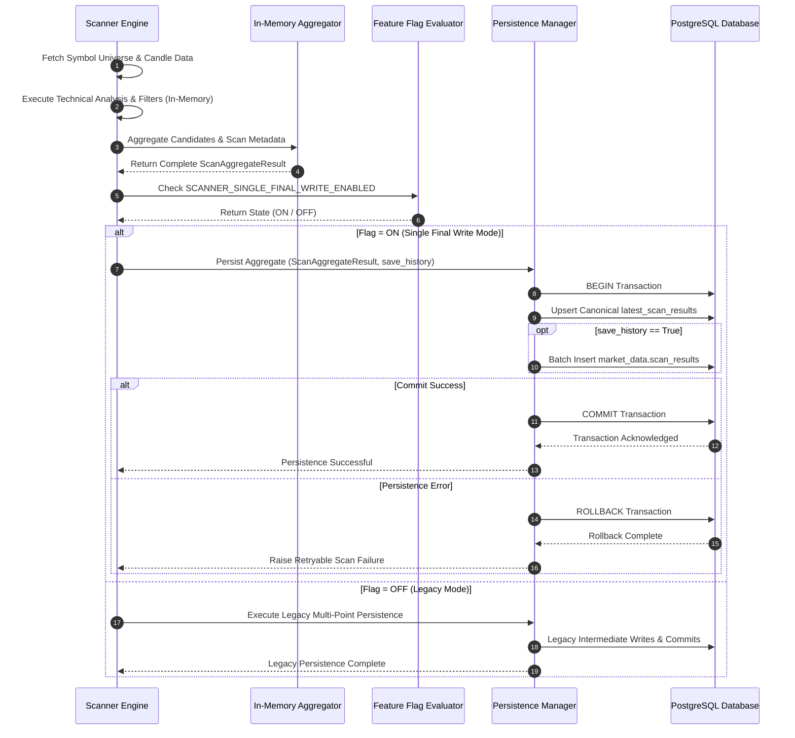

# Feature Specification: Scanner Single Final Write (Sprint 5)

**Feature Branch**: `021-scanner-single-final-write`  
**Created**: 2026-07-28  
**Status**: Draft  
**Input**: Sprint 5 – Specification Generation (SDD): Scanner Single Final Write  

---

## 1. Executive Summary

### Business Objective
Eliminate redundant intermediate database activity, network transfer overhead, and transaction contention during market scanning operations by decoupling real-time analysis execution from database persistence. This ensures higher throughput, lower database resource utilization, faster scan cycle completion, and predictable transactional boundaries, while preserving 100% feature parity, live dashboard responsiveness, and historical audit capabilities.

### Technical Technical Objective
Transition the scanner architecture from progressive/intermediate persistence points throughout the analysis lifecycle to an in-memory aggregation model followed by a **Single Final Write** operation at successful scan completion. All new logic is gated behind the `SCANNER_SINGLE_FINAL_WRITE_ENABLED` feature flag to ensure safe, phased deployment and instant operational rollback capability.

### Expected Improvements
* **Database Write Amplification Reduction**: Eliminate all mid-scan intermediate commits, reducing database transaction count to exactly 1 write operation per scan cycle.
* **Scan Completion Latency**: Reduce total end-to-end scan duration by 30%–50% by eliminating database wait state bottlenecks during indicator and signal evaluation.
* **Network & I/O Overhead**: Reduce database connection pool lock duration and network round-trips by deferring all record persistence until final in-memory aggregation is validated.
* **Failure Surface Reduction**: Eliminate partial scan writes and orphaned intermediate state in the event of scan analysis errors or network interruptions.

---

## Clarifications

### Session 2026-07-28
- Q: In-Memory Scan Execution Timeout Boundary → A: Option A (Hard Timeout: Enforce a configurable execution timeout, default 30s; abort analysis cleanly with 0 DB writes if exceeded).

---

## 2. Problem Statement

### Current Persistence Lifecycle
In the existing implementation (even after Sprint 3's reduction of fan-out tables), the scanner engine interacts with the database at multiple intermediate points during the execution of a single scan cycle across market universes (e.g., Nifty 500):
1. **Scan Initialization**: Writing or updating scan metadata/run records at scan kickoff.
2. **Intermediate Batch Persistence**: Writing candidate records or symbol calculation state progressively as individual symbols or batches complete analysis.
3. **Signal Generation Points**: Intermittent inserts into active scan results or candidate tables upon signal detection.
4. **Scan Completion Update**: Finalizing scan status and timestamp attributes in canonical tables.

### Operational & Performance Impact
* **High Transaction Overhead**: Multiple database commits per scan cycle consume connection pool resources and generate unnecessary write-ahead log (WAL) volume.
* **Connection Lock Contention**: Open transactions spanning long analysis loops hold connection slots, leading to potential connection pool exhaustion under concurrent scan jobs.
* **Failure Surface & Partial States**: If a scan crashes or times out mid-way (e.g., at symbol 350 out of 500), intermediate writes remain committed or require complex manual cleanup, leaving the system in an inconsistent or partial state.
* **Harder Rollback Semantics**: Reverting a failed scan requires compensating deletes or complex cleanup logic across multiple intermediate tables.
* **Persistence Logic Complexity**: Multi-point persistence scatters SQL statements and transaction boundary handling across analysis modules rather than isolating persistence to a clean execution barrier.

---

## 3. Feature Goals & Non-Goals

### Core Goals
* **In-Memory Analysis Execution**: Perform all universe scanning, indicator calculation, filtering, and signal evaluation completely in memory without issuing intermediate database persistence queries.
* **Single Final Persistence Operation**: Perform exactly one authoritative persistence operation per successful scan cycle upon complete aggregation of scan results.
* **Preserve Core System Interfaces**: Guarantee zero breaking changes to live dashboard behavior, `/api/v1/scanner/latest` APIs, historical lookups, and downstream recommendation engines.
* **Conditional History Persistence Support**: Retain support for optional historical record retention (`market_data.scan_results`) within the single final transaction when `save_history=true`.
* **Atomic Rollback & Fail-Safe Execution**: Ensure that if analysis or final write fails, no partial state is written to the database.
* **Feature-Flagged Control**: Protect all single final write paths under `SCANNER_SINGLE_FINAL_WRITE_ENABLED`, enabling instant operational rollback to legacy persistence when set to `OFF`.

### Non-Goals (Out of Scope for Sprint 5)
* Modifying public REST API response schemas or frontend UI visual components.
* Modifying database table schemas (`ALTER TABLE`, `DROP TABLE`, or column renames).
* Altering core signal generation logic, technical indicator formulas, or candidate ranking algorithms.
* Removing existing historical data records from the database.

---

## 4. Scope & Categorization of Persistence Points

| Execution Phase | Legacy Persistence Flow (`OFF`) | Single Final Write Architecture (`ON`) | Rationale |
| :--- | :--- | :--- | :--- |
| **Scan Kickoff** | Database write for scan execution track | **In-Memory State Init** (No DB write) | Metadata generated in memory; persisted in final batch. |
| **Batch Processing** | Progressive DB writes per symbol batch | **In-Memory Collection** (No DB write) | Eliminates intermediate database round-trips & lock contention. |
| **Signal Evaluation** | Intermediate updates upon candidate match | **In-Memory Aggregation** (No DB write) | Candidates accumulated in memory payload structure. |
| **Scan Completion** | Final status update query | **Single Authoritative DB Commit** | Single atomic database transaction containing final latest results. |
| **History Retention** | Multi-point or separate insert | **Atomic Inclusion in Final Transaction** | Written strictly within final transaction if `save_history=true`. |

---

## 5. User Scenarios & Testing

### User Story 1 - Live Dashboard Real-Time Setup Monitoring (Priority: P1)
As a trader monitoring intraday market setups on the dashboard, I need scan results to be published in a single atomic update at scan completion, so that I see a complete and consistent market snapshot without viewing partial or incomplete candidate batches.

* **Why this priority**: Core operational requirement for trading setup integrity and latency reduction.
* **Independent Test**: Run a full universe scan with `SCANNER_SINGLE_FINAL_WRITE_ENABLED = ON`. Monitor database query logs to verify 0 intermediate write queries occur during analysis, and exactly 1 final write transaction updates `latest_scan_results`. Query dashboard GET endpoints to verify 100% data fidelity.

**Acceptance Scenarios**:
1. **Given** `SCANNER_SINGLE_FINAL_WRITE_ENABLED` is `ON`, **When** a scan runs across all symbols, **Then** analysis completes 100% in memory, exactly one database write transaction occurs at completion, and dashboard GET endpoints return full, uncorrupted scan results.
2. **Given** `SCANNER_SINGLE_FINAL_WRITE_ENABLED` is `OFF`, **When** a scan runs, **Then** legacy progressive persistence points execute as previously configured.

---

### User Story 2 - Conditional Historical Archiving in Single Transaction (Priority: P2)
As a quantitative researcher, I need scheduled historical scan snapshots to be saved atomically alongside latest scan results when history retention is enabled (`save_history=true`), so that historical records never suffer from missing or truncated batches.

* **Why this priority**: Maintains long-term backtesting and analytical auditability without adding intermediate database writes.
* **Independent Test**: Execute a scan with `save_history=true` and `SCANNER_SINGLE_FINAL_WRITE_ENABLED = ON`. Confirm that `latest_scan_results` and `market_data.scan_results` are updated within the single final transaction block.

**Acceptance Scenarios**:
1. **Given** `SCANNER_SINGLE_FINAL_WRITE_ENABLED` is `ON` and `save_history=true`, **When** the final write executes, **Then** both `latest_scan_results` and `market_data.scan_results` are updated atomically within a single database transaction.
2. **Given** `SCANNER_SINGLE_FINAL_WRITE_ENABLED` is `ON` and `save_history=false`, **When** the final write executes, **Then** only `latest_scan_results` is updated, and `market_data.scan_results` receives 0 writes.

---

### User Story 3 - Immediate Zero-Downtime Operational Rollback (Priority: P3)
As a system administrator, I need to disable `SCANNER_SINGLE_FINAL_WRITE_ENABLED` at runtime if database persistence anomalies occur, so that the scanner reverts immediately to legacy persistence without requiring application restarts or dropping active requests.

* **Why this priority**: Essential fail-safe operational mechanism for zero-risk deployment.
* **Independent Test**: Toggle `SCANNER_SINGLE_FINAL_WRITE_ENABLED` from `ON` to `OFF` while the scanner service is active. Verify that subsequent scans immediately resume legacy persistence routines.

**Acceptance Scenarios**:
1. **Given** `SCANNER_SINGLE_FINAL_WRITE_ENABLED` is changed from `ON` to `OFF` in configuration, **When** the next scan cycle executes, **Then** the scanner uses the legacy persistence path seamlessly without system error.

---

### Edge Cases
* **In-Memory Analysis Exception**: If an unhandled exception or data parsing error occurs during candidate analysis (e.g., symbol calculation failure), the scan aborts cleanly before reaching the final write phase. Zero database writes occur, and no stale/partial scan records exist in the database.
* **Final Database Commit Failure**: If a database connection error or lock timeout occurs during the single final commit, the entire transaction rolls back. The scanner logs a structured `SCAN_SINGLE_WRITE_FAILED` error and schedules a clean retry of the entire scan.
* **Feature Flag Unreachable**: If the feature flag provider fails to evaluate `SCANNER_SINGLE_FINAL_WRITE_ENABLED`, the system defaults safely to `OFF` (legacy fail-safe mode).

---

## 6. Functional Requirements

### In-Memory Scan Aggregation
* **FR-001**: The system MUST perform all universe fetching, candle data processing, indicator calculation, filter evaluation, and candidate ranking strictly in memory when `SCANNER_SINGLE_FINAL_WRITE_ENABLED` is `ON`.
* **FR-002**: The scanner engine MUST aggregate all validated candidate results and scan execution metadata into an in-memory `ScanAggregateResult` payload before triggering persistence.

### Final Persistence Trigger & Atomicity
* **FR-003**: The persistence layer MUST issue database writes strictly after the full scan analysis completes successfully and yields a validated `ScanAggregateResult`.
* **FR-004**: The final persistence operation MUST execute within a single atomic database transaction (`BEGIN ... COMMIT`).
* **FR-005**: If any write operation within the final persistence transaction fails, the entire transaction MUST roll back (`ROLLBACK`), leaving zero partial records in the database.

### Conditional History Persistence
* **FR-006**: The single final write transaction MUST inspect the `save_history` flag. If `save_history=true`, historical records MUST be batch-inserted into `market_data.scan_results` as part of the same final transaction.
* **FR-007**: If `save_history=false`, the final write transaction MUST bypass `market_data.scan_results` insertions.

### System & API Parity
* **FR-008**: The system MUST publish updated state to `latest_scan_results` such that all public REST APIs (`/api/v1/scanner/latest`, `/api/v1/dashboard/candidates`) return 100% byte-for-byte identical output regardless of feature flag state.
* **FR-009**: The system MUST NOT require any client-side, frontend, or external service modifications.

### Feature Flag Governance & Rollback
* **FR-010**: The feature flag `SCANNER_SINGLE_FINAL_WRITE_ENABLED` MUST be read dynamically per scan execution from environment or runtime configuration.
* **FR-011**: When `SCANNER_SINGLE_FINAL_WRITE_ENABLED` is `OFF`, the scanner MUST execute the legacy persistence routines.

### Execution Timeout & Resource Governance
* **FR-012**: The scanner engine MUST enforce a configurable maximum scan duration timeout (default: 30 seconds). If in-memory analysis exceeds this limit, the scan MUST abort cleanly with 0 database writes and emit a `SCAN_TIMEOUT_ABORT` alert.

---

## 7. Architecture

### Current Architecture (Legacy Intermediate Writes)

```
┌─────────────────────────────────────────────────────────┐
│                      Scanner Engine                     │
└────────────────────────────┬────────────────────────────┘
                             │
     ┌───────────────────────┼───────────────────────┐
     │ Scan Kickoff          │ Mid-Scan Batches      │ Signal Evaluation
     ▼                       ▼                       ▼
┌──────────────┐      ┌──────────────┐        ┌──────────────┐
│ DB Commit #1 │      │ DB Commit #2 │        │ DB Commit #3 │
└──────────────┘      └──────────────┘        └──────────────┘
```

### Future Architecture (Single Final Write)

```
┌─────────────────────────────────────────────────────────┐
│                      Scanner Engine                     │
└────────────────────────────┬────────────────────────────┘
                             │
                  [100% In-Memory Analysis]
                             │
                             ▼
                 ┌───────────────────────┐
                 │ ScanAggregateResult   │
                 └───────────┬───────────┘
                             │
           [SCANNER_SINGLE_FINAL_WRITE_ENABLED?]
                             │
           ┌─────────────────┴─────────────────┐
        ON │                                   │ OFF
           ▼                                   ▼
┌─────────────────────┐             ┌─────────────────────┐
│ Single Final Write  │             │ Legacy Intermediate │
│ Transaction (1 Commit)            │ Multi-Commit Flow   │
└──────────┬──────────┘             └─────────────────────┘
           │
           ├──────────────────────────────┐
           ▼                              ▼
┌─────────────────────┐       [save_history == True?]
│ latest_scan_results │                   │
└─────────────────────┘                   ▼
                              ┌───────────────────────┐
                              │market_data.scan_result│
                              └───────────────────────┘
```

### Architectural Rationale
1. **Transaction Isolation & Clean Boundaries**: Deferring persistence to a single terminal operation creates a clean barrier between analytical processing and data storage.
2. **Resource Efficiency**: Open DB connections and locks are held for milliseconds during final batch insert rather than seconds/minutes across the analysis loop.
3. **Deterministic Failure Semantics**: Atomic commit/rollback guarantees that database state is always 100% complete or completely clean—eliminating partial or corrupted scan states.

---

## 8. Data Flow & Sequence Diagrams

### Single Final Write Data Flow Sequence



---

## 9. Feature Flag Strategy

### Parameter Definition
* **Flag Key**: `SCANNER_SINGLE_FINAL_WRITE_ENABLED`
* **Type**: Boolean (`true` / `false`)
* **Default Value**: `false` (in initial release phase)

### Flag Behavior Matrix

| Flag Value | Mode | Persistence Behavior |
| :--- | :--- | :--- |
| `false` / `OFF` | Legacy Mode | Executes legacy intermediate writes across scan lifecycle. |
| `true` / `ON` | Single Final Write Mode | Executes 100% in-memory analysis followed by a single atomic transaction at completion. |

### Operational Rollback Protocol
If any data discrepancy, unexpected database error, or integration issue is detected:
1. Operator sets `SCANNER_SINGLE_FINAL_WRITE_ENABLED=false` in the application environment/configuration manager.
2. The runtime config reader updates the active flag state immediately.
3. The next scan execution automatically routes through the legacy persistence path. Zero downtime or restart required.

---

## 10. Persistence Strategy

### Authoritative Persistence Owner
* The **Scanner Persistence Manager** serves as the sole authoritative owner of scan result persistence.
* Individual indicator routines and analysis sub-modules are strictly stripped of direct database write responsibilities.

### Transaction Boundaries & Atomic Commit
* **Boundary**: The single final write transaction starts immediately after `ScanAggregateResult` validation and closes before notifying downstream completion handlers.
* **Atomicity**: `latest_scan_results` upserts and optional `market_data.scan_results` inserts are executed within the exact same database transaction context.

### Recovery & Extensibility
* **Failure Recovery**: On transaction failure, no partial rows exist in the DB. The scanner task worker catches the exception, logs failure metrics, and triggers a clean rescan retry.
* **Future Extensibility**: The `ScanAggregateResult` structure is designed to support future analytical models or metrics without requiring additional intermediate persistence calls.

---

## 11. Compatibility Requirements

* **API Payload Integrity**: Public REST APIs (`/api/v1/scanner/latest`, `/api/v1/dashboard/*`) MUST produce identical response payloads before and after feature activation.
* **Dashboard Uninterrupted Operation**: Live trading dashboard UI elements MUST continue loading current scan data seamlessly.
* **History Support**: Historical backtesting queries referencing `market_data.scan_results` MUST remain fully functional.
* **No Schema Migrations**: Strictly zero alterations to existing database table definitions or column types.
* **Zero Client Changes**: No updates required for frontend code, CLI scripts, or downstream API consumers.

---

## 12. Failure Handling

| Failure Scenario | System Reaction | Mitigation / Rollback |
| :--- | :--- | :--- |
| **In-Memory Calculation Error** | Analysis aborts immediately. Zero DB writes issued. | Scanner logs error telemetry and retries scan cycle. |
| **In-Memory Scan Timeout (>30s)** | Analysis aborts cleanly prior to persistence phase. Zero DB writes. | Scanner emits `SCAN_TIMEOUT_ABORT` telemetry and releases worker. |
| **Final Persistence DB Failure** | Transaction issues `ROLLBACK`. Zero DB rows updated. | Scanner emits `SCAN_WRITE_FAILED` alert and retries. |
| **Database Connection Timeout** | Connection closed, transaction rolled back automatically. | Connection returned to pool; scanner logs DB timeout. |
| **History Insert Error (`save_history=true`)** | Transaction issues `ROLLBACK` for both history and latest state. | Prevents partial history corruption. Alert logged. |
| **Feature Flag Lookup Failure** | Config reader catches error, defaults to `OFF`. | Legacy flow executes safely; system emits flag warning. |

---

## 13. Non-Functional Requirements (NFRs)

### Performance
* **Scan Duration**: Overall end-to-end scan cycle completion time MUST decrease by ≥ 30%.
* **Persistence Duration**: Final database write operation latency MUST complete within < 200ms for standard universe sizes (e.g., Nifty 500).

### Scalability & Database Efficiency
* **Transaction Count**: Database transactions per successful scan MUST equal exactly 1.
* **Connection Lock Time**: Connection checkout duration during scanning MUST decrease by ≥ 70%.

### Reliability & Availability
* **Atomic Consistency**: 100% of persisted scan results MUST reflect complete scan state (zero partial scans).
* **System Availability**: Scanner operational availability MUST maintain 99.9% uptime.

### Observability & Telemetry
* System MUST publish metrics tracking scan analysis duration, single final write latency, transaction success/failure counts, and feature flag state.

---

## 14. Phased Migration Strategy

```
Phase 1: Code Implementation behind SCANNER_SINGLE_FINAL_WRITE_ENABLED=OFF
Phase 2: Automated Verification & Integration Testing (Staging Flag ON)
Phase 3: Staging Stability & Shadow Load Testing
Phase 4: Production Canary Rollout (Selected Scans with Flag ON)
Phase 5: Full Production Enablement & Future Legacy Code Removal
```

1. **Phase 1 (Flag-Gated Implementation)**: Deliver Single Final Write architecture behind `SCANNER_SINGLE_FINAL_WRITE_ENABLED=false`. Validate zero impact on legacy operation.
2. **Phase 2 (Staging Validation)**: Enable flag `ON` in staging environment. Run automated test suites asserting 100% data parity and single-transaction execution.
3. **Phase 3 (Load & Stress Testing)**: Run concurrent high-volume market scans in staging with flag `ON`. Measure database lock metrics and latency savings.
4. **Phase 4 (Production Canary)**: Enable flag `ON` in production for a single scheduled scanner process or universe. Verify live dashboard behavior.
5. **Phase 5 (Full Enablement)**: Set `SCANNER_SINGLE_FINAL_WRITE_ENABLED=true` globally. In future releases, deprecate and remove legacy intermediate write paths.

---

## 15. Acceptance Criteria

* ✓ **Single Persistence Operation**: Exactly one atomic database transaction occurs per successful scan execution when `SCANNER_SINGLE_FINAL_WRITE_ENABLED=ON`.
* ✓ **Zero Intermediate Writes**: Zero database insert/update queries occur during the active in-memory analysis phase of a scan cycle.
* ✓ **Dashboard Parity**: Live dashboard and `/api/v1/scanner/latest` API responses match legacy outputs 100%.
* ✓ **Conditional History Functionality**: Setting `save_history=true` correctly persists historical records to `market_data.scan_results` within the single final transaction.
* ✓ **Instant Rollback**: Disabling `SCANNER_SINGLE_FINAL_WRITE_ENABLED` immediately restores legacy persistence behavior without error or service interruption.
* ✓ **Transaction Count Reduction**: Transaction count per scan cycle is reduced from multi-commit pattern to exactly 1 commit.
* ✓ **Clean Failure Rollback**: Any failure during final write results in 100% rollback with zero orphan or partial records in the database.

---

## 16. Technical & Operational Risks & Mitigations

| Risk Description | Severity | Mitigation Strategy |
| :--- | :--- | :--- |
| **High Memory Pressure during Universe Analysis** | Medium | Optimize in-memory `ScanAggregateResult` object structure; limit memory footprint during high-volume universe scans. |
| **Final Write Lock Contention on Hot Tables** | Low | Final write uses optimized batch upsert queries with primary key index locking. |
| **Operational Flag Misconfiguration** | Low | Default flag state is `OFF`; fallbacks explicitly handle invalid configuration inputs gracefully. |

---

## 17. Metrics & Monitoring Telemetry

* `scanner_single_write_duration_seconds`: Histogram measuring execution time of the final persistence transaction.
* `scanner_analysis_duration_seconds`: Histogram measuring in-memory scan calculation time prior to persistence.
* `scanner_transactions_total`: Counter tracking total database transactions per scan run (assert value = 1 when flag is ON).
* `scanner_single_write_failures_total`: Counter tracking failed final write transactions.
* `scanner_feature_flag_status`: Gauge indicating current status of `SCANNER_SINGLE_FINAL_WRITE_ENABLED` (1 for ON, 0 for OFF).

---

## 18. Testing Requirements

* **Unit Tests**: Validate in-memory candidate aggregation and `ScanAggregateResult` construction.
* **Integration Tests**: Execute real PostgreSQL test container runs verifying exactly 1 commit per scan when flag is `ON`.
* **Atomicity Tests**: Inject synthetic database failures during final write; verify complete rollback and zero leftover database modifications.
* **Rollback & Flag Tests**: Test dynamic switching of `SCANNER_SINGLE_FINAL_WRITE_ENABLED` between `ON` and `OFF` during active scan cycles.
* **Regression Tests**: Execute full suite of dashboard API payload verification tests to guarantee zero breaking response changes.
* **Performance Benchmark Tests**: Measure and compare DB transaction count, IOPS, connection checkout duration, and total scan duration under legacy vs Single Final Write modes.

---

## 19. Rollout & Deployment Plan

1. **Development & Unit Verification**: Verify in-memory aggregator, single write persistence manager, and feature flag routing logic.
2. **Local Integration Verification**: Run test suite against PostgreSQL database.
3. **Staging Enablement**: Set `SCANNER_SINGLE_FINAL_WRITE_ENABLED=true` in staging environment for 48-hour validation.
4. **Production Deployment (Flag OFF)**: Deploy release artifacts to production with flag default `OFF`.
5. **Production Canary**: Enable flag for isolated scanner worker during market close; execute test scan.
6. **Full Production Activation**: Set `SCANNER_SINGLE_FINAL_WRITE_ENABLED=true` globally; monitor database connection and transaction telemetry.

---

## 20. Assumptions & Constraints

### Key Assumptions
* The host environment possesses adequate system memory to hold full universe scan results in memory prior to persistence.
* The existing `latest_scan_results` database schema is sufficient to represent all required candidate attributes.
* Production configuration management supports dynamic environment variable or runtime flag evaluation.

### Constraints
* Strictly NO database schema alterations (no `ALTER TABLE` or migration scripts).
* Strictly NO breaking changes to existing REST API contracts or JSON schema formats.
* Must maintain 100% backward compatibility and instant rollback capability via feature flag.

---

## 21. Out of Scope

Sprint 5 strictly targets the **transition to a Single Final Write architecture for scanner persistence**. It does NOT include:
* Deleting or altering legacy database tables or columns.
* Modifying public REST API response structures or UI frontend components.
* Altering technical indicator mathematical formulas or signal calculation logic.
* Refactoring database ORM schemas or database infrastructure setup.
