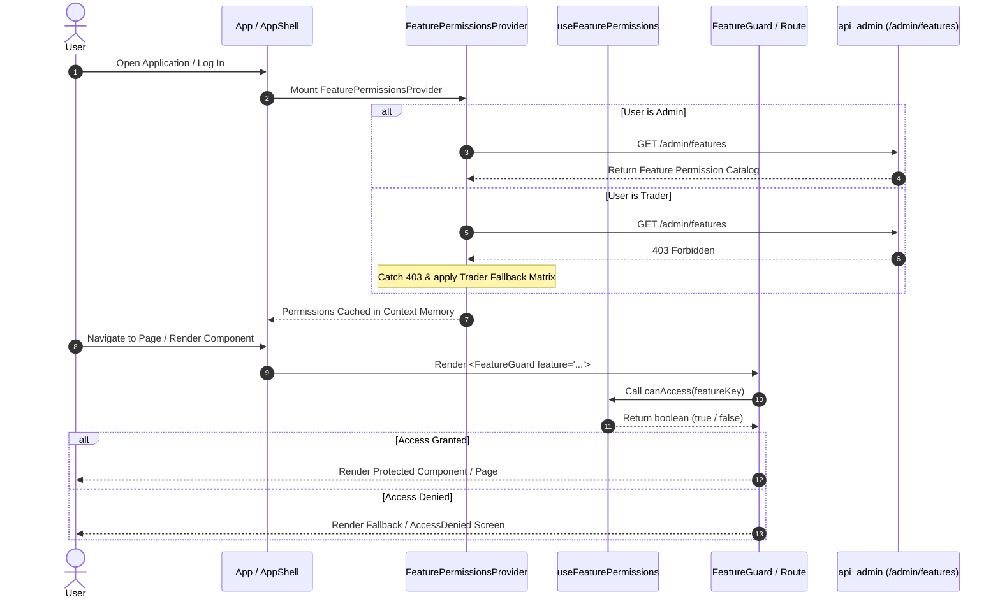

# Implementation Plan: Sprint 5 – Frontend Feature Guards & Integration

**Branch**: `026-feature-guards` | **Date**: 2026-07-31 | **Spec**: [spec.md](./spec.md)  
**Input**: Feature specification from `specs/026-feature-guards/spec.md`  

---

## Summary

Sprint 5 connects the backend Feature Permissions system (Sprint 3) and Admin Panel configuration (Sprint 4) to the live React frontend, and **complements** client guards with backend product API gates (NFR-002). It delivers dynamic frontend authorization gates (`FeatureGuard`, `useFeaturePermissions`, `canAccess`) so that feature visibility, component rendering, page access, and navigation links dynamically adapt to user roles and database-driven feature policies.

**Technical Approach**:
- Root-level `FeaturePermissionsContext` & `FeaturePermissionsProvider` caching feature rules in memory to eliminate redundant API calls.
- Session catalog `GET /features` (any authenticated user) as the SPA source of truth; admin mutations remain on `/admin/features`.
- `useFeaturePermissions` hook and `canAccess(featureKey)` helper exposing synchronous access evaluation.
- `<FeatureGuard feature="...">` component for declarative conditional rendering and route protection.
- Enhanced `navConfig` and `AppShell` filtering navigation menu items dynamically.
- Brand-consistent `<AccessDenied />` fallback page for direct unauthorized URL navigation.
- Fail-closed security posture ensuring access is denied if permission resolution fails.
- Backend `require_feature` / `require_feature_sync` on product surfaces (scanner, logs, paper analytics, watchlist mutations).
- Ungated core landing at `/markets` (avoid defaulting into a gated route).

---

## Technical Context

**Language/Version**: TypeScript 5.x, React 18; Python FastAPI backend  
**Primary Dependencies**: react-router-dom 7, Vite 5, Tailwind CSS 3, in-repo design system; existing FastAPI deps + feature_permission_service  
**Storage**: Server source of truth via `feature_permissions` table; SPA in-memory React Context cache  
**Testing**: Vitest + React Testing Library; pytest (session catalog, require_feature gates, logs integration)  
**Target Platform**: Web SPA (Modern Browsers) + API  
**Project Type**: Full-stack web application (frontend guards + backend complement)  
**Performance Goals**: <5ms synchronous permission evaluation from context memory; 0 redundant network calls on child component re-renders; gate path seeds only when feature key missing  
**Constraints**: No Admin Panel redesign; reuse existing AuthContext (`user.role`); fail-closed security; no hierarchical feature trees  
**Scale/Scope**: 1 context provider, 1 hook, 1 guard component, 1 fallback view, nav filtering, 6 protected feature surfaces, session catalog endpoint, product API feature gates

---

## Constitution Check

| Gate | Status | Notes |
| :--- | :---: | :--- |
| **I. Library-First & Reusability** | **Pass** | `FeatureGuard` & `useFeaturePermissions` built as reusable, self-contained utilities. |
| **II. Clean Interfaces** | **Pass** | Simple declarative API (`<FeatureGuard feature="watchlist">`). |
| **III. Test-First & Coverage** | **Pass** | Automated Vitest + RTL tests covering context, hooks, guards, and nav filtering. |
| **IV. Integration Testing** | **Pass** | Route protection and navigation filtering tested against user roles and permission states. |
| **V. Simplicity & YAGNI** | **Pass** | Single context provider, no unnecessary external state management libraries. |
| **VI. Fail-Closed Security** | **Pass** | Default-deny posture enforces security under error or loading states. |

---

## Project Structure

### Documentation (`specs/026-feature-guards/`)

```text
specs/026-feature-guards/
├── spec.md              # Feature Specification
├── plan.md              # Implementation Plan (this file)
├── research.md          # Design Decisions & Rationale
├── data-model.md        # Types, Interfaces, & Fallback Catalog Matrix
├── quickstart.md        # Runnable Validation Scenarios & Test Commands
├── RELEASE_NOTES.md     # Breaking changes & ops migration notes
├── contracts/           # Component & Hook API Contracts
│   └── feature-guards.md
├── tasks.md             # Actionable Task List
└── checklists/
    └── requirements.md  # Specification Quality Checklist
```

### Source Code Layout

```text
frontend/src/
├── types/
│   └── featurePermissions.ts       # NEW: FeatureKey, FeaturePermission, Context types
├── contexts/
│   └── FeaturePermissionsContext.tsx# NEW: FeaturePermissionsProvider & Context
├── hooks/
│   ├── useFeaturePermissions.ts     # NEW: Custom hook & canAccess helper
│   └── __tests__/
│       └── useFeaturePermissions.test.tsx
├── components/
│   ├── FeatureGuard.tsx             # NEW: Declarative guard component
│   ├── AccessDenied.tsx             # NEW: Route-level unauthorized fallback view
│   └── __tests__/
│       └── FeatureGuard.test.tsx
├── layout/
│   ├── navConfig.tsx                # REFACTOR: featureKey annotations
│   └── AppShell.tsx                 # REFACTOR: filter nav by canAccess
└── App.tsx                          # REFACTOR: FeaturePermissionsProvider + route guards

backend/app/
├── routes/features.py               # NEW: GET /features (session catalog)
├── core/deps.py                     # NEW: require_feature / require_feature_sync
├── services/feature_permission_service.py  # REFACTOR: seed central_command; sync can_access
└── routes/{analysis,scanner,logs,paper_trading,auth}.py  # REFACTOR: product feature gates
```

---

## Component Architecture & Data Flow



---

## Feature Protection Matrix

| Feature Key | Target Component / Route | Guard Approach | Access Denied Behavior |
| :--- | :--- | :--- | :--- |
| `watchlist` | Watchlist Widget / View | `<FeatureGuard feature="watchlist">` | Tab / Section Hidden or Fallback Msg |
| `advanced_scanner` | `/scanner` Route | Route wrapped in `<FeatureGuard>` | Nav hidden; `<AccessDenied />` page |
| `portfolio_analytics` | `/performance` Route | Route wrapped in `<FeatureGuard>` | Nav hidden; `<AccessDenied />` page |
| `system_logs` | `/admin/logs` Route | `AdminRoute` + `<FeatureGuard>` | Nav hidden; `<AccessDenied />` page |
| `central_command` | `/admin/command` Route | `AdminRoute` + `<FeatureGuard>` | Nav hidden; `<AccessDenied />` page |
| `export_data` | Data Export Buttons in Tables | `<FeatureGuard feature="export_data">` | Button omitted from DOM |

---

## Implementation Phases

### Phase 1: Foundations & Types (Day 1)
- Define `FeatureKey`, `FeaturePermission`, and Context interfaces in `frontend/src/types/featurePermissions.ts`.
- Build scaffold for `FeaturePermissionsContext`.

### Phase 2: Core Permissions Engine (Day 1–2)
- Implement `FeaturePermissionsProvider` fetching `/admin/features` for admins and handling 403 trader fallbacks.
- Implement `useFeaturePermissions()` hook and `canAccess(featureKey)` synchronous evaluation function.
- Write unit tests for `useFeaturePermissions` in `useFeaturePermissions.test.tsx`.

### Phase 3: Declarative Component & Fallback UI (Day 2)
- Build `<FeatureGuard>` component in `frontend/src/components/FeatureGuard.tsx`.
- Build `<AccessDenied />` page component in `frontend/src/components/AccessDenied.tsx`.
- Write RTL component tests in `FeatureGuard.test.tsx`.

### Phase 4: Dynamic Navigation Filtering (Day 2–3)
- Update `NavItem` in `frontend/src/layout/navConfig.tsx` with `featureKey?: string`.
- Update `AppShell.tsx` navigation filtering logic to evaluate `canAccess(item.featureKey)`.
- Write navigation filtering integration tests in `navConfig.featureGuards.test.tsx`.

### Phase 5: Gating Key Application Pages & Components (Day 3)
- Wrap routes in `App.tsx` (`/scanner`, `/performance`, `/admin/logs`, `/admin/command`).
- Protect Watchlist component/tab in UI.
- Wrap Data Export buttons across table components.

### Phase 6: Verification & DoD Sign-off (Day 4)
- Execute full test suite (`npm run test`).
- Verify manual scenarios from `quickstart.md`.
- Confirm zero regression across existing Sprint 1–4 capabilities.

---

## Risks & Mitigations

| Risk | Impact | Mitigation Strategy |
| :--- | :---: | :--- |
| **HTTP 403 for Non-Admin Users** | Medium | Catch 403 gracefully inside `FeaturePermissionsContext` and initialize context with default trader permission catalog matrix. |
| **Layout Shift / FOUC during Load** | Medium | Render skeleton or `loadingFallback` while `isLoading` is true. |
| **Direct URL Bypassing Sidebar Nav** | High | Enforce feature guards at the React Router route level in `App.tsx` rendering `<AccessDenied />`. |
| **Network Error / Timeout** | High | Enforce fail-closed security: `canAccess` returns `false` when permissions fail to load. |

---

## Testing Strategy

1. **Unit Testing (`useFeaturePermissions.test.tsx`)**:
   - Verify `canAccess` returns `true` for allowed active features and `false` for restricted or inactive features.
   - Verify fail-closed behavior on API network errors.
2. **Component Testing (`FeatureGuard.test.tsx`)**:
   - Test rendering `children` when access is granted.
   - Test rendering `fallback` or `null` when access is denied.
   - Test rendering `loadingFallback` during loading state.
3. **Integration Testing (`navConfig.featureGuards.test.tsx`)**:
   - Verify restricted menu items are excluded from sidebar navigation based on role and feature permissions.
4. **End-to-End Test Suite Execution**:
   - Run `npm run test` across all frontend tests to ensure 100% pass rate.

---

## Definition of Done (DoD)

- [ ] `FeaturePermissionsContext`, `useFeaturePermissions`, and `canAccess` implemented and exported.
- [ ] `<FeatureGuard>` component and `<AccessDenied />` fallback UI created and tested.
- [ ] `navConfig` extended with `featureKey` metadata; `AppShell` filters navigation dynamically.
- [ ] All 6 key feature surfaces (`watchlist`, `advanced_scanner`, `portfolio_analytics`, `system_logs`, `central_command`, `export_data`) fully protected.
- [ ] Automated tests written and passing in Vitest with >90% coverage on new components/hooks.
- [ ] All verification scenarios in `quickstart.md` validated with zero regression.
