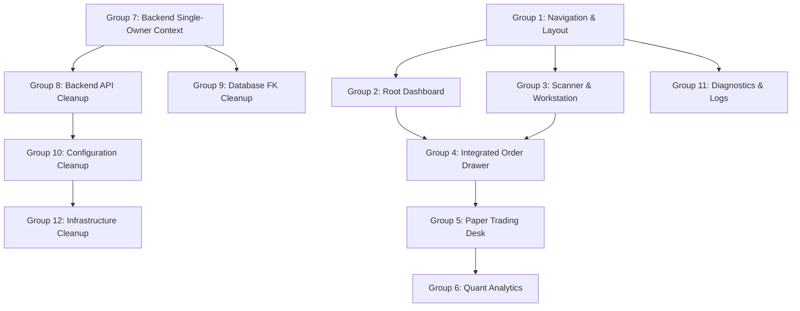

# Phase 2 Master Implementation Planning Specification: Product Architecture & Modernization Transformation

**Feature Branch**: `027-phase2-transformation` | **Date**: 2026-07-31 | **Spec**: [spec.md](file:///E:/Trading_lab/trading-system/specs/027-phase2-transformation/spec.md)  
**Input**: Phase 1 Baseline, Recommendation Engine Architecture, Application Source Code

---

## Technical Context

* **Language/Version**: Python 3.11+ (Backend), TypeScript 5.x / React 18 (Frontend)
* **Primary Dependencies**: FastAPI, Uvicorn, React, Vite, Lucide-React, Recharts, TailwindCSS / Vanilla CSS, Pydantic v2, APScheduler
* **Storage**: PostgreSQL (Time-series candles, scan snapshots, recommendation records, paper accounts)
* **Testing**: pytest (Backend), Vitest / React Testing Library (Frontend)
* **Target Platform**: Single-Operator Local Workstation / Private Cloud Instance (Windows Server / Linux)
* **Project Type**: Personal AI Trading Research & Execution Web Workstation
* **Performance Goals**: Instant page loads (<200ms), real-time scan rendering, zero latency on slide-out order drawer
* **Constraints**: 0% alteration to trading engines, indicator math, vectorization, scoring, backtesting, or execution logic.

---

## Constitution Check

| Principle / Gate | Compliance Status | Justification |
|---|---|---|
| **I. Library-First & Engine Safety** | PASS | Recommendation Engine, Scanner, Technical Indicators, and Paper Matching logic are isolated and strictly preserved. |
| **II. Zero Auth Overhead** | PASS | All authentication schemas and multi-tenant user checks removed; single-owner context applied. |
| **III. Test-First & Non-Regression** | PASS | Engine parity verified via regression test suites before UI routing refactor. |
| **IV. Structured Schema Stability** | PASS | Database tables for candles, scans, and recommendations remain 100% schema-compatible. |
| **V. Single Operator Workstation** | PASS | Unified sidebar and single-operator layout replaces retail vs admin splits. |

---

## Project Structure

```text
E:\Trading_lab\trading-system\
├── specs/027-phase2-transformation/
│   ├── spec.md              # Phase 2 Approved Specification
│   ├── plan.md              # Master Implementation Plan (This Document)
│   ├── research.md          # Phase 0 Technical Research & Decisions
│   ├── data-model.md        # Data Model & Database Architecture Blueprint
│   ├── quickstart.md        # End-to-End Quickstart & Validation Scenarios
│   └── contracts/
│       └── api_contracts.md # Single-Owner API Specification
├── backend/
│   ├── app/
│   │   ├── api/             # Single-Owner REST Routes
│   │   ├── core/            # App Config & Single-Owner Context
│   │   ├── db/              # SQLAlchemy Models & Session Management
│   │   ├── governance/      # Command Routing & Experiment Management
│   │   ├── models/          # ORM Schema Models
│   │   ├── schemas/         # Pydantic Request/Response Models
│   │   └── services/        # Unchanged Core Trading & Scanner Services
├── frontend/
│   ├── src/
│   │   ├── components/      # UI Workstation Components & OrderDrawer
│   │   ├── layout/          # AppShell & Domain Navigation Structure
│   │   ├── pages/           # Refactored Domain Pages
│   │   └── services/        # API Client Services
```

---

## 1. Executive Summary

This Master Implementation Planning Specification details the phase-by-phase architectural transformation of the trading application from a legacy multi-tenant retail/admin trading portal into a high-density, unified **Personal AI Trading Research Platform**. 

Phase 1 established the single-owner foundation by stripping away multi-tenant authentication, session management, and generic SaaS user infrastructure. Phase 2 defines the complete structural blueprint for updating the frontend surface, navigation taxonomy, backend service layers, API routes, database schemas, and configuration models.

Crucially, this phase is **planning-only**. It enforces a strict boundary: **zero business logic, technical indicator formulas, vectorization scanner pipelines, scoring algorithms, AI prompt chains, or order execution engines will be modified.** All underlying trading algorithms remain bit-for-bit identical.

---

## 2. Current State Assessment

The application currently exists in a post-Phase 1 baseline state:

1. **Frontend Surface**: Retains legacy split UI paradigms. Navigation is divided between `/admin/command` and `/markets`, `/scanner`, `/paper`, creating a disjointed experience for a single trader. Standalone pages such as `PaperOrderPage.tsx` force full page transitions to enter paper trades.
2. **Backend Services**: Contains residual imports and endpoints targeting removed authentication services (`auth_service.py`, `user_profile_service.py`).
3. **Database Layer**: Main data tables (`stock_candles`, `scan_snapshots`, `recommendation_records`) are intact. Foreign key constraints on `paper_trading_accounts` and `broker_tokens` pointing to deleted `users` tables require clean-up to ensure single-owner defaulting.
4. **Configuration & Infra**: Environment files still reference deprecated JWT variables (`JWT_SECRET`, `SMTP_HOST`), which creates noise in configuration setup.

---

## 3. Target Product Vision

The transformed product identity is a **Personal AI Trading Research Platform** — an integrated single-operator quantitative workstation.

```
+-----------------------------------------------------------------------------------+
|                        PERSONAL AI TRADING RESEARCH PLATFORM                      |
+-----------------------------------------------------------------------------------+
| [Market Regime Banner] Nifty: BULLISH (Permissive) | Scan Status: ACTIVE (12 cand.) |
+-----------------------------------------------------------------------------------+
| SIDEBAR NAV         | MAIN WORKSTATION SURFACE                                    |
| ------------------- | ----------------------------------------------------------- |
| [Overview]          | Today's High-Conviction AI Recommendations                 |
|   Dashboard (/)     | +---------------------------------------------------------+ |
| [Research]          | | TCS | BUY | Score: 92.0 | Target: 4350 | Stop: 4020      | |
|   Scanner           | | Rationale: Sector RS + EMA50 Breakout + MACD Cross      | |
|   Stock Workstation | | [ Inspect Details ]   [ Trade (OrderDrawer) ]          | |
|   Market Watch      | +---------------------------------------------------------+ |
| [Execution]         |                                                             |
|   Paper Desk        | Live Paper Portfolio Summary                                |
|   Watchlist         | Balance: ₹1,054,200 | Open P&L: +₹12,300 | Day P&L: +₹5,400  |
| [Analytics]         | +---------------------------------------------------------+ |
|   Quant Performance | | Active Positions (3) | Equity Curve | Win Rate: 68.4%     | |
| [Platform]          | +---------------------------------------------------------+ |
|   Diagnostics       |                                                             |
|   System Logs       |                                                             |
+-----------------------------------------------------------------------------------+
```

---

## 4. Implementation Principles

1. **Zero Core Logic Alteration**: Recommendation algorithms, scanner vectorization, indicator calculations (EMA, Supertrend, MACD), signal scoring, backtesting models, and paper execution rules MUST remain 100% untouched.
2. **Unified Single-Operator Surface**: Eliminate retail vs. admin split UI. Consolidate into a 5-domain navigation model (`Overview`, `Research`, `Execution`, `Analytics`, `System`).
3. **Research-Driven Execution Path**: Contextual transitions from recommendation discovery directly to deep technical inspection and slide-out paper order entry (`OrderDrawer.tsx`).
4. **Data Continuity & Zero Downtime**: Preserve historical candles, scan snapshots, paper positions, and broker tokens during database migrations.
5. **Technical Debt Elimination**: Remove orphan frontend pages, dead backend schemas, unused dependencies, and redundant environment variables.

---

## 5. Module Classification

Every module across the full application stack is classified with an explicit action and justification:

| Domain | Module / File | Action | Justification |
|---|---|---|---|
| **Frontend** | `frontend/src/layout/AppShell.tsx` | **MODIFY** | Update to support new 5-domain navigation structure. |
| **Frontend** | `frontend/src/layout/navConfig.tsx` | **MODIFY** | Replace `RETAIL_NAV`/`ADMIN_NAV` split with `PLATFORM_NAV`. |
| **Frontend** | `frontend/src/pages/DashboardPage.tsx` | **NEW/MODIFY** | Promoted from `/admin/command` to root `/`; merges market regime & paper cards. |
| **Frontend** | `frontend/src/pages/PaperTradingPage.tsx` | **MODIFY** | Integrates drawer-based execution; manages positions & portfolio. |
| **Frontend** | `frontend/src/pages/PaperOrderPage.tsx` | **REMOVE** | Functionality consolidated into slide-out `OrderDrawer.tsx`. |
| **Frontend** | `frontend/src/pages/StockWorkstationPage.tsx` | **NEW** | Deep technical chart overlay, indicator breakdown & AI rationale view. |
| **Frontend** | `frontend/src/components/OrderDrawer.tsx` | **NEW** | Slide-out execution drawer triggered from recommendations and scanner. |
| **Frontend** | `frontend/src/components/AuthInput.tsx` | **REMOVE** | Dead auth component from multi-tenant era. |
| **Backend** | `backend/app/services/scanner_service.py` | **KEEP** | Core scanner vectorization & indicator engine (100% untouched). |
| **Backend** | `backend/app/services/analysis_service.py` | **KEEP** | Scoring & recommendation generation engine (100% untouched). |
| **Backend** | `backend/app/services/paper_trading_service.py` | **MODIFY** | Refactor order routes to use static owner context `00000000-...`. |
| **Backend** | `backend/app/services/broker_token_service.py` | **MODIFY** | Standardize FYERS credential storage under static owner context. |
| **Backend** | `backend/app/services/auth_service.py` | **REMOVE** | Deprecated auth service removed in Phase 1. |
| **Backend** | `backend/app/core/deps.py` | **MODIFY** | Inject `get_application_owner_id()` dependency returning static owner UUID. |
| **APIs** | `POST /api/v1/scanner/scan` | **KEEP** | Manual scan trigger endpoint. |
| **APIs** | `GET /api/v1/analysis/recommendations` | **KEEP** | Recommendation retrieval endpoint. |
| **APIs** | `GET /api/v1/paper-trading/accounts` | **MODIFY** | Returns single owner paper account without requiring auth tokens. |
| **APIs** | `/api/v1/auth/*` | **REMOVE** | Purged endpoints; respond with 404 if accessed. |
| **Database** | `stock_candles` | **KEEP** | Historical OHLCV candle table. |
| **Database** | `scan_snapshots` | **KEEP** | Scanner snapshots & indicator calculation table. |
| **Database** | `recommendation_records` | **KEEP** | AI recommendation records & rationale table. |
| **Database** | `paper_trading_accounts` | **MODIFY** | Foreign key to `users.id` dropped; defaulted to static owner UUID. |
| **Database** | `users`, `user_sessions` | **REMOVE** | Multi-tenant tables dropped in Phase 1 migration. |
| **Config** | `.env`, `.env.template` | **MODIFY** | Clean up `JWT_SECRET`, `SMTP_*` variables; retain broker & DB keys. |
| **Infra** | `start_backend.ps1` | **MODIFY** | Simplified single-process startup script without auth server dependencies. |

---

## 6. Implementation Groups

### Group 1: Navigation & Layout Transformation
* **Objective**: Overhaul sidebar and top header to support single-operator domain navigation.
* **Business Value**: Provides intuitive workspace navigation without legacy retail/admin splits.
* **Features Included**: `navConfig.tsx` refactor, `AppShell.tsx` active path highlighting, header status widgets.
* **Dependencies**: None.
* **Estimated Complexity**: Low (2-3 days).
* **Risk Level**: Low.
* **Validation Required**: Verify all 5 navigation domains route correctly without auth popups.
* **Regression Impact**: Zero backend impact.
* **Rollback Strategy**: Revert `AppShell.tsx` and `navConfig.tsx` to prior git commit.

### Group 2: Unified Root Dashboard (`/`)
* **Objective**: Promote Central Command to root URL (`/`) with 4-quadrant research summary.
* **Business Value**: Single-glance situational awareness of market regime, top AI recommendations, and paper portfolio.
* **Features Included**: `MarketRegimeBanner`, `TopRecommendationsWidget`, `PaperPortfolioSummaryCard`.
* **Dependencies**: Group 1.
* **Estimated Complexity**: Medium (3-4 days).
* **Risk Level**: Low.
* **Validation Required**: Confirm dashboard loads top signals and market status cleanly.
* **Regression Impact**: Frontend presentation only.
* **Rollback Strategy**: Revert `/` route mapping to previous command view.

### Group 3: Scanner & Research Workstation Experience
* **Objective**: Relocate scanner under `/research/scanner` and introduce `/research/workstation`.
* **Business Value**: Allows deep technical examination of indicators, chart overlays, and AI agent rationale.
* **Features Included**: `StockWorkstationPage.tsx`, indicator toggles, AI rationale card.
* **Dependencies**: Group 1.
* **Estimated Complexity**: Medium (4-5 days).
* **Risk Level**: Low.
* **Validation Required**: Verify candles, Supertrend overlays, and AI rationale display accurately per symbol.
* **Regression Impact**: Zero impact on scan engine execution.
* **Rollback Strategy**: Maintain standalone scanner page while bugfixing workstation.

### Group 4: Integrated Paper Execution Drawer (`OrderDrawer.tsx`)
* **Objective**: Implement slide-out order drawer accessible from recommendations and scanner.
* **Business Value**: Eliminates full-page transitions when executing paper trades from AI signals.
* **Features Included**: `OrderDrawer.tsx`, automatic position sizing calculation, one-click submission.
* **Dependencies**: Group 2, Group 3.
* **Estimated Complexity**: Medium (4 days).
* **Risk Level**: Low-Medium.
* **Validation Required**: Place paper order from recommendation card; verify position appears in Paper Desk.
* **Regression Impact**: Order payload format must match `paper_trading_service.py` API schema.
* **Rollback Strategy**: Re-enable standalone `PaperOrderPage.tsx` route if drawer fails.

### Group 5: Paper Trading Desk & Portfolio Refactor
* **Objective**: Streamline `/trading/paper-desk` to show active positions, orders, and equity curves.
* **Business Value**: Clear portfolio management desk for tracking execution metrics and realized P&L.
* **Features Included**: `PaperTradingPage.tsx` refactor, positions table, order history, equity chart.
* **Dependencies**: Group 4.
* **Estimated Complexity**: Medium (3-4 days).
* **Risk Level**: Low.
* **Validation Required**: Position updates, close order triggers, and P&L calculations function accurately.
* **Regression Impact**: Ensures paper execution engine receives correct single-owner context.
* **Rollback Strategy**: Restore previous `PaperTradingPage.tsx`.

### Group 6: Quantitative Analytics Expansion
* **Objective**: Update `/analytics/performance` with holding period analytics and win-rate charts.
* **Business Value**: Enables empirical evaluation of AI recommendation quality and execution performance.
* **Features Included**: Win-rate summary, trade duration breakdown, signal efficiency charts.
* **Dependencies**: Group 5.
* **Estimated Complexity**: Medium (3 days).
* **Risk Level**: Low.
* **Validation Required**: Performance charts compute win-rate and realized P&L accurately from paper tables.
* **Regression Impact**: Read-only calculations. Zero write impact.
* **Rollback Strategy**: Revert analytics view components.

### Group 7: Single-Owner Backend Dependency Injection
* **Objective**: Update `backend/app/core/deps.py` to supply static owner UUID `00000000-0000-0000-0000-000000000001`.
* **Business Value**: Removes authentication middleware overhead while preserving table ownership fields.
* **Features Included**: `get_application_owner_id()` dependency function, endpoint dependency updates.
* **Dependencies**: None.
* **Estimated Complexity**: Low (1-2 days).
* **Risk Level**: Low.
* **Validation Required**: Test paper trading endpoints without Authorization header.
* **Regression Impact**: Endpoints fail if dependency fails to inject default owner UUID.
* **Rollback Strategy**: Re-add fallback header reader if static dependency encounters issues.

### Group 8: Backend & API Cleanup
* **Objective**: Remove residual auth schemas, unused imports, and deprecated auth endpoints.
* **Business Value**: Eliminates dead code, reduces bundle/service footprint, and cleans up API documentation.
* **Features Included**: File deletion of `auth.py` schemas, router cleanup in `backend/app/api/`.
* **Dependencies**: Group 7.
* **Estimated Complexity**: Low (2 days).
* **Risk Level**: Low.
* **Validation Required**: Run `pytest` across all backend modules to verify zero missing import errors.
* **Regression Impact**: High if active code depends on deleted schemas (mitigated by grep audit).
* **Rollback Strategy**: Restore deleted schema files from git history.

### Group 9: Database Foreign Key Cleanup
* **Objective**: Ensure Alembic migrations cleanly drop legacy FK constraints to deleted `users` table.
* **Business Value**: Prevents database migration errors and maintains clean table schemas.
* **Features Included**: Alembic script verification, foreign key removal on `paper_trading_accounts` and `broker_tokens`.
* **Dependencies**: Group 7.
* **Estimated Complexity**: Low (1-2 days).
* **Risk Level**: Medium (Database mutation).
* **Validation Required**: Run `alembic upgrade head` on fresh database backup.
* **Regression Impact**: High if DB constraints fail.
* **Rollback Strategy**: Restore database from pre-migration PostgreSQL backup dump (`pg_dump`).

### Group 10: Configuration & Environment Simplification
* **Objective**: Strip deprecated environment variables (`JWT_SECRET`, `SMTP_*`) from `.env` and `.env.template`.
* **Business Value**: Reduces environment configuration complexity for single-operator deployment.
* **Features Included**: Simplified `.env.template`, inventory cleanup in backend config loader.
* **Dependencies**: Group 8.
* **Estimated Complexity**: Low (1 day).
* **Risk Level**: Low.
* **Validation Required**: Application starts cleanly with minimal `.env` settings.
* **Regression Impact**: Low.
* **Rollback Strategy**: Re-add missing environment keys if runtime configuration throws KeyError.

### Group 11: System Diagnostics & Log Stream Consolidation
* **Objective**: Update `/system/diagnostics` and `/system/logs` to report single-operator broker and scheduler health.
* **Business Value**: Single-pane system health monitoring (broker token state, DB pool size, scheduled tasks).
* **Features Included**: Broker status badge, background task status table, live log tailing view.
* **Dependencies**: Group 1.
* **Estimated Complexity**: Low-Medium (2 days).
* **Risk Level**: Low.
* **Validation Required**: Verify log streaming and FYERS token expiry alerts display accurately.
* **Regression Impact**: None.
* **Rollback Strategy**: Revert diagnostic page views.

### Group 12: Infrastructure & Startup Automation Cleanup
* **Objective**: Clean up local startup scripts (`start_backend.ps1`) and Docker compose configuration.
* **Business Value**: Streamlines local workstation launch process.
* **Features Included**: Refactored `start_backend.ps1` script, single-container docker setup.
* **Dependencies**: Group 10.
* **Estimated Complexity**: Low (1 day).
* **Risk Level**: Low.
* **Validation Required**: Launch workstation via `start_backend.ps1` and verify backend/frontend start cleanly.
* **Regression Impact**: Startup failures if environment paths are invalid.
* **Rollback Strategy**: Revert script changes.

---

## 7. Dependency Analysis



### Dependency Matrix

| Group | Required Before | Required After | Blocking Dependencies | Shared Components | Potential Conflicts |
|---|---|---|---|---|---|
| **G1: Navigation** | G2, G3, G11 | None | None | `AppShell.tsx` | Route collision if paths overlap |
| **G2: Dashboard** | G4 | G1 | G1 | `TopRecommendationsWidget` | Data loading state sync |
| **G3: Workstation** | G4 | G1 | G1 | `IndicatorOverlayChart` | Symbol state handling |
| **G4: OrderDrawer** | G5 | G2, G3 | G2, G3 | `OrderDrawer.tsx` | Payload format mismatch |
| **G5: Paper Desk** | G6 | G4 | G4 | `PaperTradingService` | P&L calculation discrepancy |
| **G6: Analytics** | None | G5 | G5 | `PerformanceChart` | None |
| **G7: Owner Context**| G8, G9 | None | None | `deps.py` | Static UUID resolution |
| **G8: Backend Cleanup**| G10 | G7 | G7 | FastAPI Routers | Missing import references |
| **G9: DB FK Cleanup** | None | G7 | G7 | Alembic Migrations | Migration lock / schema mismatch |
| **G10: Config Cleanup**| G12 | G8 | G8 | `config.py` | Missing env key errors |
| **G11: Diagnostics** | None | G1 | G1 | `SystemHealthCard` | Broker status polling |
| **G12: Infra Cleanup**| None | G10 | G10 | `start_backend.ps1` | Environment path resolution |

---

## 8. Migration Strategy

### Step-by-Step Rollout Order

1. **Step 1: Database & Backend Foundation** (Groups 7, 8, 9)
   - Apply single-owner context in `backend/app/core/deps.py`.
   - Run Alembic migration to drop foreign keys on `paper_trading_accounts` and `broker_tokens`.
   - Verify static owner UUID default `'00000000-0000-0000-0000-000000000001'`.
   - Remove dead auth routers and Pydantic schemas.

2. **Step 2: Core Navigation & Dashboard Overhaul** (Groups 1, 2)
   - Deploy `navConfig.tsx` and updated `AppShell.tsx`.
   - Promote Central Command to root URL (`/`) with 4-quadrant layout.
   - Confirm zero auth redirects on page load.

3. **Step 3: Scanner & Workstation Refactor** (Group 3)
   - Deploy `/research/scanner` and `/research/workstation`.
   - Connect chart overlays, Supertrend indicators, and AI agent rationale cards.

4. **Step 4: Unified Execution Drawer Integration** (Groups 4, 5)
   - Implement `OrderDrawer.tsx` slide-out drawer on Dashboard and Scanner.
   - Verify paper trade execution writes to `paper_orders` under static owner context.
   - Refactor `/trading/paper-desk` to show live positions and equity curves.

5. **Step 5: Analytics & System Diagnostics** (Groups 6, 11)
   - Update `/analytics/performance` with win-rate analytics.
   - Update `/system/diagnostics` and `/system/logs`.

6. **Step 6: Configuration & Infrastructure Polish** (Groups 10, 12)
   - Clean up `.env.template` and `start_backend.ps1`.
   - Run end-to-end regression validation.

---

## 9. Risk Assessment

| Risk ID | Category | Description | Affected Components | Likelihood | Impact | Mitigation Strategy |
|---|---|---|---|---|---|---|
| **R-001** | **Critical** | Accidental mutation of trading engine or indicator scoring math during UI refactor. | `scanner_service.py`, `analysis_service.py` | Low | Critical | Execute pytest regression suite before and after every UI pull request. Core files locked from modification. |
| **R-002** | **High** | Database migration failure when dropping foreign keys on non-empty tables. | `paper_trading_accounts`, `broker_tokens` | Low | High | Take full `pg_dump` snapshot prior to running `alembic upgrade head`. Test migration on local staging database first. |
| **R-003** | **Medium** | Payload structure mismatch between slide-out `OrderDrawer` and backend paper order endpoint. | `OrderDrawer.tsx`, `paper_trading_service.py` | Medium | Medium | Define explicit TypeScript interface matching Pydantic `PaperOrderCreate` schema in `contracts/api_contracts.md`. |
| **R-004** | **Low** | Broken frontend route link resulting in 404 page for single operator. | `AppShell.tsx`, `navConfig.tsx` | Low | Low | Run automated Vitest route checks validating all 5 domain navigation paths. |

---

## 10. Validation Strategy

Validation will follow a strict 4-tier process:

1. **Pre-Migration Integrity Verification**:
   - Verify database baseline via `python check_tables.py`.
   - Confirm active FYERS broker token and PostgreSQL storage connection.

2. **Backend Contract Verification**:
   - Test endpoints (`GET /api/v1/analysis/recommendations`, `POST /api/v1/paper-trading/orders`) via Postman or HTTP client without Authorization header.
   - Verify response returns single-owner context (`user_id = '00000000-0000-0000-0000-000000000001'`).

3. **Frontend Workstation Verification**:
   - Perform end-to-end user flows in browser: Navigation, Scanner review, Stock Workstation inspection, Order Drawer execution, Paper Desk position tracking.

4. **Engine Parity & Non-Regression Audit**:
   - Run full unit & integration test suite (`pytest backend/app/tests/ -v`).
   - Confirm scanner outputs and recommendation scores match pre-transformation baseline 100%.

---

## 11. Testing Strategy

### 11.1 Unit Testing
- **Backend**: Test `get_application_owner_id()` dependency, paper order creation, broker token encryption.
- **Frontend**: Test `OrderDrawer` position sizing calculations, navigation link state rendering in `AppShell`.

### 11.2 Integration Testing
- **API Routes**: Test `POST /api/v1/paper-trading/orders` end-to-end from request receipt to database insertion.
- **Scanner-to-Workstation**: Test symbol query parameter passing (`/research/workstation?symbol=TCS`) and indicator data fetching.

### 11.3 Regression Testing
- **Scanner Engine**: Run vectorization benchmark tests to guarantee indicator formulas (EMA50, EMA200, MACD, Supertrend) return identical results.
- **Recommendation Scoring**: Run scoring test suite to verify conviction scores remain unchanged.

### 11.4 Manual Validation
- Execute the complete operator workflow detailed in `quickstart.md` (Dashboard → Scan → Workstation → Order Drawer → Paper Desk).

### 11.5 Acceptance Testing
- Verify all 4 Success Criteria (`SC-001` through `SC-004`) in `spec.md` are 100% satisfied.

---

## 12. Future Phase Roadmap

```
+-----------------------------------------------------------------------------------+
|                        FUTURE IMPLEMENTATION PHASE ROADMAP                        |
+-----------------------------------------------------------------------------------+
| Phase 3: Frontend Navigation & Root Dashboard Transformation                     |
|   - Implement 5-domain navigation sidebar & AppShell                               |
|   - Promote Central Command to root Dashboard (/)                                 |
+-----------------------------------------------------------------------------------+
| Phase 4: Research Scanner & Stock Workstation Implementation                      |
|   - Refactor Scanner view under /research/scanner                                 |
|   - Build deep-dive Stock Workstation (/research/workstation)                     |
+-----------------------------------------------------------------------------------+
| Phase 5: Unified Paper Trading & Order Drawer Execution                           |
|   - Implement slide-out OrderDrawer.tsx component                                 |
|   - Refactor Paper Trading Desk (/trading/paper-desk)                             |
+-----------------------------------------------------------------------------------+
| Phase 6: Quantitative Analytics & System Diagnostics                              |
|   - Build Quant Performance view (/analytics/performance)                         |
|   - Update System Diagnostics & Live Logs (/system/*)                            |
+-----------------------------------------------------------------------------------+
| Phase 7: Backend & Database Technical Debt Cleanup                                |
|   - Apply static owner dependency injection                                       |
|   - Execute foreign key Alembic migrations                                        |
|   - Clean up deprecated auth schemas & environment variables                      |
+-----------------------------------------------------------------------------------+
| Phase 8: End-to-End Validation & Engine Parity Audit                             |
|   - Run full regression test suites                                               |
|   - Perform end-to-end quickstart scenario testing                                |
+-----------------------------------------------------------------------------------+
| Phase 9: Production Workstation Baseline Consolidation                            |
|   - Freeze Phase 2 baseline release                                               |
|   - Prepare platform for future AI Agent experiment sweeps                        |
+-----------------------------------------------------------------------------------+
```

---

## 13. Assumptions

1. The platform is operated by a single quant trader in a local workstation or dedicated private server environment.
2. FYERS API credentials and market data streams are maintained under the single application owner context.
3. Historical data tables (`stock_candles`, `scan_snapshots`, `recommendation_records`) are intact and accessible in PostgreSQL.

---

## 14. Constraints

1. **Zero Core Engine Modifications**: No changes to scanner vectorization, recommendation scoring, technical indicators, backtesting logic, or paper order matching math.
2. **Zero Auth Overhead**: No login screens, JWT tokens, session cookies, or multi-tenant permission logic allowed.
3. **Database Schema Continuity**: Main pricing and signal tables must retain 100% backward schema compatibility.

---

## 15. Out of Scope

The following items are explicitly **OUT OF SCOPE** for Phase 2:

- Modifying Recommendation Engine scoring parameters or LLM prompt chains.
- Modifying Technical Indicator calculation logic (EMA50, EMA200, Supertrend, MACD, RSI).
- Modifying Market Scanner execution loops or vectorization methods.
- Real-money live broker order routing (Paper trading execution only).
- Multi-user authentication, multi-tenant RBAC, or user registration flows.
- Multi-broker support beyond FYERS integration.

---

## 16. Definition of Done

This Phase 2 Master Implementation Specification Plan is considered complete when:

1. **All 16 Required Sections** are fully defined, reviewed, and formatted into `plan.md`.
2. **Phase 0 Research & Phase 1 Blueprints** (`research.md`, `data-model.md`, `contracts/api_contracts.md`, `quickstart.md`) are complete and synchronized.
3. **Core Engine Locking** is explicitly documented, guaranteeing zero alteration to scanner, scoring, and trading algorithms.
4. **The Master Implementation Roadmap** (Phases 3-9) is clearly structured for execution in future implementation phases.
