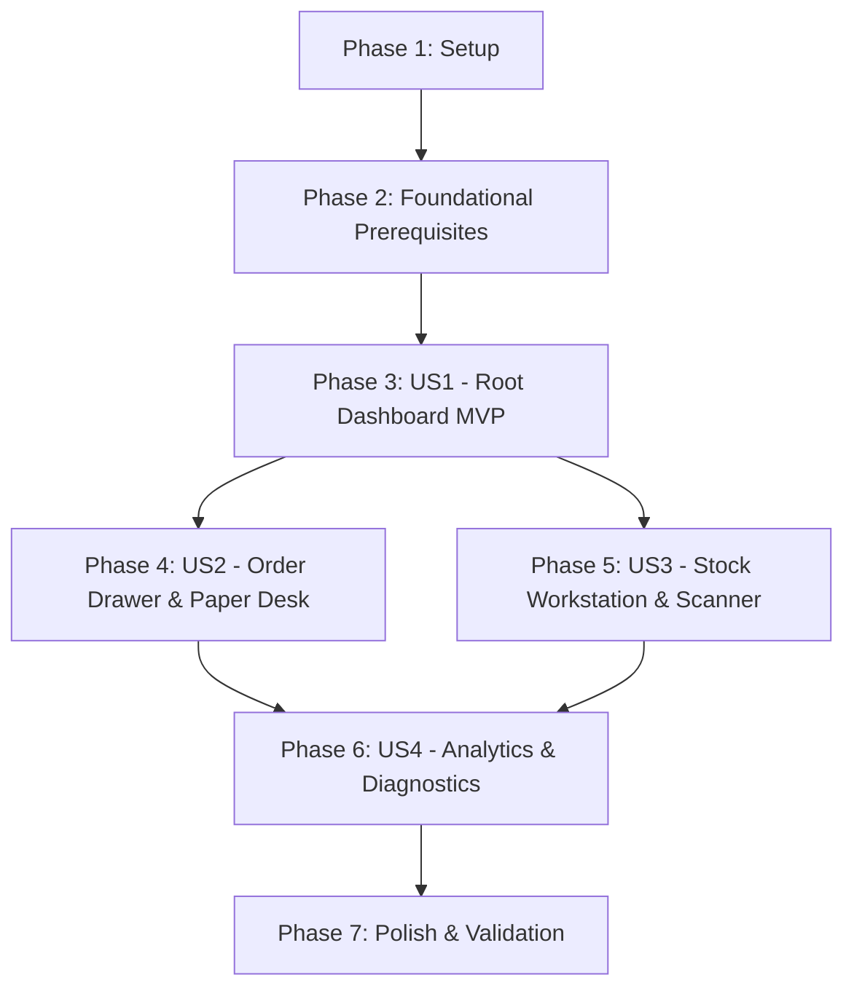

# Tasks: Phase 2 Product Architecture & Modernization Transformation

**Input**: Design documents from `specs/027-phase2-transformation/`
**Prerequisites**: [plan.md](file:///E:/Trading_lab/trading-system/specs/027-phase2-transformation/plan.md), [spec.md](file:///E:/Trading_lab/trading-system/specs/027-phase2-transformation/spec.md), [data-model.md](file:///E:/Trading_lab/trading-system/specs/027-phase2-transformation/data-model.md), [contracts/api_contracts.md](file:///E:/Trading_lab/trading-system/specs/027-phase2-transformation/contracts/api_contracts.md), [quickstart.md](file:///E:/Trading_lab/trading-system/specs/027-phase2-transformation/quickstart.md)

---

## Format: `- [X] [ID] [P?] [Story?] Description with file path`

- **[P]**: Can run in parallel (different files, no dependencies)
- **[Story]**: Maps to user stories from spec.md ([US1], [US2], [US3], [US4])

---

## Phase 1: Setup (Shared Infrastructure)

**Purpose**: Verify repository setup, environment templates, and test harness before transformation work begins.

- [X] T001 Verify baseline repository structure and pytest suite in `backend/app/tests/`
- [X] T002 [P] Clean up deprecated environment variables (`JWT_SECRET`, `SMTP_*`) in `.env.template`
- [X] T003 [P] Update local startup script in `start_backend.ps1` for single-operator execution

---

## Phase 2: Foundational (Blocking Prerequisites)

**Purpose**: Core single-owner backend infrastructure and database schema updates that MUST be complete before UI user story implementation begins.

**⚠️ CRITICAL**: No user story implementation can begin until this phase is complete.

- [X] T004 Implement static application owner context `get_application_owner_id()` returning UUID `00000000-0000-0000-0000-000000000001` in `backend/app/core/deps.py`
- [X] T005 Verify Alembic migration dropping legacy foreign keys to `users.id` on `paper_trading_accounts` and `broker_tokens` in `alembic/versions/`
- [X] T006 [P] Update single-owner paper account retrieval in `backend/app/services/paper_trading_service.py`
- [X] T007 [P] Update single-owner FYERS token management in `backend/app/services/broker_token_service.py`
- [X] T008 Remove deprecated authentication routers and schemas in `backend/app/api/v1/endpoints/`
- [X] T009 [P] Implement 5-domain navigation structure (`PLATFORM_NAV`) in `frontend/src/layout/navConfig.tsx`
- [X] T010 Implement domain navigation active state and layout header in `frontend/src/layout/AppShell.tsx`

**Checkpoint**: Foundation ready — single-owner backend and domain navigation are in place.

---

## Phase 3: User Story 1 - Unified Command Center & One-Click Research (Priority: P1) 🎯 MVP

**Goal**: Transform `/admin/command` into the root Dashboard (`/`) presenting market regime permissiveness, live scanner operating status, top AI recommendation cards, and one-click workstation inspection.

**Independent Test**: Load `http://localhost:5173/` in browser; verify market regime banner, scanner status widget, top AI recommendation cards render without authentication prompts, and clicking "Inspect" opens symbol research.

### Implementation for User Story 1

- [X] T011 [P] [US1] Create Market Health & Regime Permissiveness widget component in `frontend/src/components/MarketRegimeBanner.tsx`
- [X] T012 [P] [US1] Create Scanner Live Operating Status widget component in `frontend/src/components/ScannerStatusCard.tsx`
- [X] T013 [P] [US1] Create Top AI Recommendations card list component in `frontend/src/components/TopRecommendationsWidget.tsx`
- [X] T014 [US1] Assemble 4-quadrant layout for root Dashboard page in `frontend/src/pages/DashboardPage.tsx`
- [X] T015 [US1] Update application router to map root URL `/` to `DashboardPage.tsx` in `frontend/src/App.tsx`
- [X] T016 [US1] Verify engine safety by connecting Dashboard widgets to `GET /api/v1/analysis/recommendations` and `GET /api/v1/scanner/latest`

**Checkpoint**: User Story 1 (MVP) is fully functional and independently testable at `/`.

---

## Phase 4: User Story 2 - Streamlined Paper Trading Execution via Order Drawer (Priority: P2)

**Goal**: Enable one-click paper trade execution from any recommendation card or scanner row using a global slide-out `OrderDrawer.tsx` component and refactor `/trading/paper-desk`.

**Independent Test**: Click "Trade" on a recommendation card; verify `OrderDrawer.tsx` slides open pre-filled with symbol, entry price, and stop-loss; submitting creates a paper order that immediately appears in `/trading/paper-desk`.

### Implementation for User Story 2

- [X] T017 [P] [US2] Create slide-out order drawer component in `frontend/src/components/OrderDrawer.tsx`
- [X] T018 [US2] Wire "Trade" action triggers on `TopRecommendationsWidget.tsx` to launch `OrderDrawer.tsx`
- [X] T019 [US2] Connect `OrderDrawer.tsx` form submission to `POST /api/v1/paper-trading/orders`
- [X] T020 [P] [US2] Create paper portfolio summary card component in `frontend/src/components/PaperPortfolioSummaryCard.tsx`
- [X] T021 [US2] Refactor Paper Desk workstation view in `frontend/src/pages/PaperTradingPage.tsx` to display active positions, order history, and realized P&L
- [X] T022 [US2] Delete obsolete full-screen paper order page in `frontend/src/pages/PaperOrderPage.tsx`

**Checkpoint**: User Story 2 is fully functional — paper trades execute seamlessly from recommendations via `OrderDrawer.tsx`.

---

## Phase 5: User Story 3 - Stock Workstation & Opportunity Scanner Experience (Priority: P3)

**Goal**: Relocate scanner to `/research/scanner` and introduce deep-dive symbol technical inspection at `/research/workstation`.

**Independent Test**: Navigate to `/research/scanner`, select a candidate, and click "Inspect Details"; verify app routes to `/research/workstation?symbol=XYZ` displaying price charts, indicator overlays (EMA50, EMA200, Supertrend), and AI agent rationale.

### Implementation for User Story 3

- [X] T023 [P] [US3] Create Stock Workstation deep-dive page in `frontend/src/pages/StockWorkstationPage.tsx`
- [X] T024 [P] [US3] Create indicator overlay chart component (EMA50, EMA200, Supertrend) in `frontend/src/components/IndicatorOverlayChart.tsx`
- [X] T025 [P] [US3] Create AI agent rationale breakdown component in `frontend/src/components/AIRationaleCard.tsx`
- [X] T026 [US3] Relocate Opportunity Scanner view to `/research/scanner` in `frontend/src/pages/ScannerPage.tsx`
- [X] T027 [US3] Wire symbol inspection buttons from Scanner table to navigate to `/research/workstation?symbol=XYZ`

**Checkpoint**: User Story 3 is complete — operator can seamlessly transition from scanner discovery to deep workstation research.

---

## Phase 6: User Story 4 - Quantitative Analytics & System Health Diagnostics (Priority: P3)

**Goal**: Expand `/analytics/performance` with holding period and win-rate charts, and update `/system/diagnostics` and `/system/logs` for single-operator monitoring.

**Independent Test**: Navigate to `/analytics/performance` to view win-rate analytics, then check `/system/diagnostics` for live broker token status and database pool health.

### Implementation for User Story 4

- [X] T028 [P] [US4] Update Quant Analytics performance page with win-rate and holding period metrics in `frontend/src/pages/PerformancePage.tsx`
- [X] T029 [P] [US4] Create system health badge component for FYERS token and DB pool in `frontend/src/components/SystemHealthBadge.tsx`
- [X] T030 [US4] Update System Diagnostics page in `frontend/src/pages/DiagnosticsPage.tsx`
- [X] T031 [US4] Update System Logs streaming page in `frontend/src/pages/LogsPage.tsx`

**Checkpoint**: User Story 4 is complete — quantitative analytics and single-operator system health are fully operational.

---

## Phase 7: Polish & Technical Debt Cleanup

**Purpose**: Cross-cutting cleanup, dead code removal, and end-to-end quickstart validation.

- [X] T032 [P] Delete obsolete authentication components (`AuthInput.tsx`, `PasswordInput.tsx`, `AuthLayout.tsx`) in `frontend/src/components/`
- [X] T033 [P] Remove unused CSS selectors and legacy admin styling rules in `frontend/src/styles.css`
- [X] T034 Run full backend test suite `pytest backend/app/tests/ -v` to verify zero core engine regression
- [X] T035 Execute all 4 end-to-end validation scenarios documented in `quickstart.md`

---

## Dependencies & Execution Order

### Phase Dependencies

- **Phase 1 (Setup)**: Can start immediately.
- **Phase 2 (Foundational)**: Depends on Phase 1 — **BLOCKS all User Stories**.
- **Phase 3 (User Story 1 - MVP)**: Depends on Phase 2 completion.
- **Phase 4 (User Story 2)**: Depends on Phase 3 completion (`DashboardPage.tsx` & recommendation cards).
- **Phase 5 (User Story 3)**: Depends on Phase 3 completion (`DashboardPage.tsx` & router).
- **Phase 6 (User Story 4)**: Depends on Phase 4 & Phase 5 completion.
- **Phase 7 (Polish)**: Depends on all User Stories being complete.

---

## Parallel Execution Opportunities

- **Phase 1 Setup**: `T002` and `T003` can run in parallel.
- **Phase 2 Foundational**: `T006`, `T007`, and `T009` can run in parallel.
- **Phase 3 (US1)**: `T011`, `T012`, and `T013` (UI widget components) can run in parallel before assembly in `T014`.
- **Phase 4 (US2)**: `T017` (`OrderDrawer.tsx`) and `T020` (`PaperPortfolioSummaryCard.tsx`) can run in parallel.
- **Phase 5 (US3)**: `T023`, `T024`, and `T025` can run in parallel.
- **Phase 6 (US4)**: `T028` and `T029` can run in parallel.
- **Phase 7 Polish**: `T032` and `T033` can run in parallel.

---

## Implementation Strategy

### MVP First Scope (Phase 1 → Phase 2 → Phase 3)
1. Complete Setup and Foundational backend/navigation prerequisites.
2. Build User Story 1 (Root Dashboard `/`).
3. **STOP and VALIDATE**: Verify root dashboard renders market regime, live scanner state, and top AI recommendations with zero auth popups.

### Incremental Delivery Scope
1. Deliver US1 (Root Dashboard).
2. Deliver US2 (Slide-out `OrderDrawer.tsx` and Paper Trading Desk).
3. Deliver US3 (Stock Workstation and Opportunity Scanner).
4. Deliver US4 (Quant Analytics and System Diagnostics).
5. Complete Polish and run quickstart validation.
