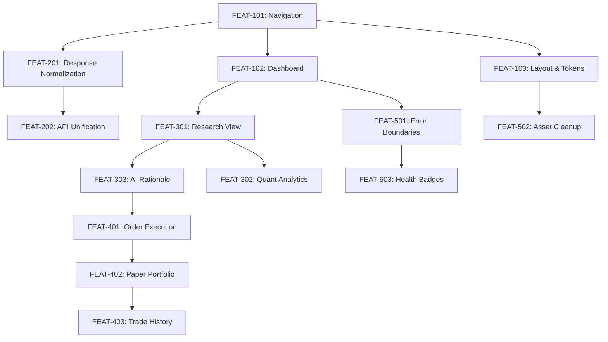

# Master Implementation Specification Plan: Phase 3 & Beyond

**Branch**: `028-phase3-frontend-foundation` | **Date**: 2026-07-31 | **Spec**: [spec.md](file:///E:/Trading_lab/trading-system/specs/028-phase3-frontend-foundation/spec.md)  
**Input**: Feature specification from `/specs/028-phase3-frontend-foundation/spec.md`

---

## Technical Context

**Language/Version**: TypeScript 5.2+ / React 18 / Vite 5  
**Primary Dependencies**: React Router DOM (v6.22+), Lucide React / SVG Icons, Vitest / React Testing Library, Playwright  
**Storage**: Web Browser `localStorage` (UI preferences, sidebar state, token cache)  
**Testing**: Vitest (Unit/Component testing), Playwright (End-to-End browser automation)  
**Target Platform**: Evergreen Desktop & Mobile Web Browsers (Chrome, Edge, Safari, Firefox)  
**Project Type**: Single Page Web Application (SPA) with domain-driven modular routing  
**Performance Goals**: < 1.5s Initial AppShell Paint; < 100ms client-side route transitions  
**Constraints**: Pure Brownfield modernization. Zero modifications to Recommendation Engine, Scanner Logic, AI Agents, Scoring Engine, Database Schemas, or Backend API endpoints. Vanilla CSS with CSS variable design tokens (`tokens.css`).  
**Scale/Scope**: 5 core UI navigation domains, 9 dashboard widgets, 15 decomposed features (FEAT-101 through FEAT-503), 6 implementation sprints.

---

## Constitution Check

*GATE: Must pass before Phase 0 research. Re-check after Phase 1 design.*

- [x] **Brownfield Preservation**: Existing API contracts and backend engines remain 100% untouched.
- [x] **No Unnecessary Framework Complexity**: Uses standard React 18 SPA primitives; no extra state libraries or Tailwind dependencies introduced.
- [x] **Test-Driven Verification**: Automated Vitest and Playwright test gates defined for every feature.
- [x] **Backward Compatibility**: Client-side route aliases provided for all legacy paths (`/home`, `/scanner`, `/paper`, `/watchlist`, `/logs`).

---

## Project Structure

### Documentation (`specs/028-phase3-frontend-foundation/`)

```text
specs/028-phase3-frontend-foundation/
├── spec.md              # Feature Specification (Phase 3 Foundation)
├── plan.md              # Master Implementation Specification Plan (This file)
├── research.md          # Technical research & architectural decisions
├── data-model.md        # UI Data Models, Component Entities & State Contracts
├── quickstart.md        # Validation & execution guide for developers
├── contracts/
│   └── ui-contracts.md  # Client-side routing, navigation & widget contracts
└── checklists/
    └── requirements.md  # Specification quality checklist
```

### Source Code (`frontend/src/`)

```text
frontend/src/
├── components/          # Standardized UI components & Dashboard widgets
│   ├── Breadcrumbs.tsx
│   ├── GlobalSearch.tsx
│   ├── QuickActionsBar.tsx
│   ├── WidgetContainer.tsx
│   └── ...
├── design-system/       # Reusable UI design system & CSS design tokens
│   ├── components/
│   ├── tokens.css
│   └── components.css
├── layout/              # Application Shell & Navigation configurations
│   ├── AppShell.tsx
│   ├── navConfig.tsx
│   └── shell.css
├── pages/               # Domain-driven Page views
│   ├── DashboardPage.tsx
│   ├── StockWorkstationPage.tsx
│   ├── MarketsPage.tsx
│   ├── PaperOrderPage.tsx
│   ├── PerformancePage.tsx
│   ├── Diagnostics.tsx
│   └── SystemLogs.tsx
├── routes/              # Centralized route table & redirect aliases
│   └── routesConfig.tsx
└── utils/               # Helper utilities & API prefetchers
```

---

## 1. Executive Summary

This Master Implementation Specification Plan decomposes the brownfield modernization of the trading system into 15 independently implementable, testable feature specifications (FEAT-101 to FEAT-503) organized across 6 logical execution sprints. It serves as the authoritative architectural roadmap driving future implementation phases without requiring changes to backend algorithms or database schemas.

---

## 2. Planning Objectives

- **Decompose System Roadmap**: Transform macro modernization objectives into granular, self-contained feature specifications.
- **Isolate Technical Scope**: Establish strict boundaries for Frontend, Backend, Analytics, Paper Trading, and Infrastructure features.
- **Establish Dependency Order**: Map strict implementation prerequisites to prevent blocking dependencies or regression risks.
- **Define Validation Standards**: Specify automated unit, component, integration, and E2E validation gates for every feature.

---

## 3. Feature Inventory

### Frontend Group
- **FEAT-101**: Navigation Foundation (Domain-driven sidebar, sticky header, dynamic breadcrumbs)
- **FEAT-102**: Dashboard Foundation (9-widget grid command center at `/`)
- **FEAT-103**: Layout & Design Token Modernization (AppShell geometry, density controls, responsive drawer)

### Backend Group (Integration & Endpoint Normalization)
- **FEAT-201**: Service Layer Response Normalization (Standardized client error handling & response schemas)
- **FEAT-202**: API Endpoint Route Unification (Ensuring client API helper compatibility across endpoints)
- **FEAT-203**: Client Configuration & Environment Cleanup (Unified env variables & cache settings)

### Analytics Group
- **FEAT-301**: AI Research Dashboard View (Interactive candidate shortlist & strategy overlay views)
- **FEAT-302**: Strategy Performance Analytics (Quant metrics, win-rate charts & risk distribution cards)
- **FEAT-303**: Recommendation Rationale Visualization (Score breakdowns, confidence meters & trade plan cards)

### Paper Trading Group
- **FEAT-401**: Paper Order Execution Bridge (Dedicated `/paper-order` ticket & prefill route handlers)
- **FEAT-402**: Paper Portfolio & Watchlist Experience (Tabbed paper workspace & watchlist synchronization)
- **FEAT-403**: Trade History & PnL Tracking (Trade log table, unrealized PnL meters & capital allocation cards)

### Infrastructure Group
- **FEAT-501**: Frontend Logging & Error Boundary Cleanup (Global React error boundaries & audit logger)
- **FEAT-502**: Design Token & Asset Standardization (Eliminating legacy styles & unreferenced graphics)
- **FEAT-503**: Client Health & Token Status Monitoring (Real-time Fyers token status & API ping badges)

---

## 4. Master Feature Specifications

### FEAT-101: Navigation Foundation
- **Business Objective**: Provide intuitive, domain-based navigation across 5 core research domains.
- **Scope**: `navConfig.tsx`, `AppShell.tsx`, `Breadcrumbs.tsx`.
- **Out of Scope**: Page content implementation.
- **Impact**: Frontend layout only; zero backend impact.
- **Dependencies**: None.
- **Risk Level**: Low | **Complexity**: Low.
- **Acceptance Criteria**: All 5 domains render in sidebar; breadcrumbs update dynamically on route change.

### FEAT-102: Dashboard Foundation
- **Business Objective**: Establish `/` as the personal AI Trading Research platform entry point.
- **Scope**: `DashboardPage.tsx`, `WidgetContainer.tsx`, 9 widget components.
- **Out of Scope**: Modifying underlying backend scan APIs.
- **Impact**: Consolidates homepage UI components.
- **Dependencies**: FEAT-101.
- **Risk Level**: Medium | **Complexity**: Medium.
- **Acceptance Criteria**: 9 widgets render cleanly; responsive grid adapts to viewport width.

### FEAT-103: Layout Modernization
- **Business Objective**: Enforce consistent design tokens, density toggles, and responsive drawers.
- **Scope**: `tokens.css`, `shell.css`, density context (`useDensity`).
- **Out of Scope**: Redesigning core color palettes.
- **Impact**: CSS styling & shell layout geometry.
- **Dependencies**: FEAT-101.
- **Risk Level**: Low | **Complexity**: Low.
- **Acceptance Criteria**: Theme & density toggles apply instantly without layout shift.

### FEAT-201: Service Response Normalization
- **Business Objective**: Ensure frontend gracefully handles all backend API error responses.
- **Scope**: `src/utils/apiErrors.ts`, `src/api.ts`.
- **Dependencies**: FEAT-101.
- **Risk Level**: Low | **Complexity**: Low.

### FEAT-202: API Route Unification
- **Business Objective**: Clean up API endpoint aliases in frontend services.
- **Scope**: `src/api.ts`.
- **Dependencies**: FEAT-201.
- **Risk Level**: Low | **Complexity**: Low.

### FEAT-203: Configuration & Cache Cleanup
- **Business Objective**: Centralize client localStorage keys and prefetch settings.
- **Scope**: `src/utils/appCache.ts`, `src/config.ts`.
- **Dependencies**: FEAT-202.
- **Risk Level**: Low | **Complexity**: Low.

### FEAT-301: AI Research Dashboard View
- **Business Objective**: Enhance candidate screening table with quick trade actions and filters.
- **Scope**: `CandidateTable.tsx`, `FilterBar.tsx`.
- **Dependencies**: FEAT-102.
- **Risk Level**: Medium | **Complexity**: Medium.

### FEAT-302: Strategy Performance Analytics
- **Business Objective**: Provide quant analytics metrics and performance summary charts.
- **Scope**: `PerformancePage.tsx`, `AnalyticsPanel.tsx`.
- **Dependencies**: FEAT-301.
- **Risk Level**: Medium | **Complexity**: Medium.

### FEAT-303: Recommendation Rationale Visualization
- **Business Objective**: Display AI composite scores, confidence meters, and trade setup plans.
- **Scope**: `AIRationaleCard.tsx`, `StockDetailPanel.tsx`.
- **Dependencies**: FEAT-301.
- **Risk Level**: Low | **Complexity**: Medium.

### FEAT-401: Paper Order Execution Bridge
- **Business Objective**: Provide a full-page trade ticket prefilled from AI recommendations.
- **Scope**: `PaperOrderPage.tsx`, `PaperOrderContext.tsx`.
- **Dependencies**: FEAT-101, FEAT-303.
- **Risk Level**: Medium | **Complexity**: Medium.

### FEAT-402: Paper Portfolio & Watchlist Experience
- **Business Objective**: Integrate watchlists and open paper positions into a unified desk view.
- **Scope**: `PaperTradingPage.tsx`, `WatchlistTab.tsx`.
- **Dependencies**: FEAT-401.
- **Risk Level**: Low | **Complexity**: Medium.

### FEAT-403: Trade History & PnL Tracking
- **Business Objective**: Display realized/unrealized PnL metrics and order execution history.
- **Scope**: `PaperPortfolioSummaryCard.tsx`, `PnL.tsx`.
- **Dependencies**: FEAT-402.
- **Risk Level**: Low | **Complexity**: Low.

### FEAT-501: Frontend Logging & Error Boundary
- **Business Objective**: Prevent app crashes with isolated widget error boundaries and client audit logging.
- **Scope**: `ErrorBoundary.tsx`, `SystemLogs.tsx`.
- **Dependencies**: FEAT-102.
- **Risk Level**: Low | **Complexity**: Low.

### FEAT-502: Design Token & Asset Standardization
- **Business Objective**: Remove unreferenced legacy assets (`BullIllustration.tsx`) and dead CSS selectors.
- **Scope**: `frontend/src/components/`, `styles.css`.
- **Dependencies**: FEAT-103, FEAT-501.
- **Risk Level**: Low | **Complexity**: Low.

### FEAT-503: Client Health & Token Monitoring
- **Business Objective**: Display live Fyers API token health and backend ping badges in real time.
- **Scope**: `TokenStatus.tsx`, `SystemHealthBadge.tsx`, `useInfrastructureHealth.ts`.
- **Dependencies**: FEAT-501.
- **Risk Level**: Low | **Complexity**: Low.

---

## 5. Feature Grouping (Implementation Sprints)

| Sprint | Group Name | Included Features | Focus & Goal |
| :--- | :--- | :--- | :--- |
| **Sprint 1** | **Frontend Foundation** | FEAT-101, FEAT-103 | Establish domain navigation, AppShell layout, breadcrumbs & design tokens |
| **Sprint 2** | **Dashboard & Core Routing** | FEAT-102, FEAT-201, FEAT-202 | Build 9-widget Dashboard entry point & normalize client API route calls |
| **Sprint 3** | **Recommendation & Research Experience** | FEAT-301, FEAT-303 | Upgrade Opportunity Scanner, candidate table & AI setup cards |
| **Sprint 4** | **Paper Trading & Execution** | FEAT-401, FEAT-402, FEAT-403 | Deliver full-page order ticket, paper desk workspace & PnL tracking |
| **Sprint 5** | **Quant Analytics** | FEAT-302, FEAT-203 | Integrate performance analytics, strategy metrics & client cache cleanup |
| **Sprint 6** | **Infrastructure & Cleanup** | FEAT-501, FEAT-502, FEAT-503 | Add React error boundaries, token health badges & dead-code elimination |

---

## 6. Dependency Matrix



---

## 7. Implementation Sequence & Rationale

1. **Sprint 1 (FEAT-101, FEAT-103)**: Sets up the structural skeleton (nav, layout, tokens) so subsequent feature work has a consistent container.
2. **Sprint 2 (FEAT-102, FEAT-201, FEAT-202)**: Implements the main landing experience (`/`) and stabilizes client-side API error handling.
3. **Sprint 3 (FEAT-301, FEAT-303)**: Refines the core value feature of the platform—AI research screening and trade setup rationales.
4. **Sprint 4 (FEAT-401, FEAT-402, FEAT-403)**: Connects research findings to execution via the paper trading order ticket and portfolio desk.
5. **Sprint 5 (FEAT-302, FEAT-203)**: Completes quantitative performance tracking and optimizes application client caching.
6. **Sprint 6 (FEAT-501, FEAT-502, FEAT-503)**: Polishes resilience with global error boundaries, removes legacy debt, and adds token health monitoring.

---

## 8. Risk Assessment

| Feature ID | Category | Technical Risk | Business Impact | Rollback Complexity | Overall Risk |
| :--- | :--- | :--- | :--- | :--- | :--- |
| **FEAT-101** | Navigation | Low (Route mapping) | High (User navigation) | Low (Revert navConfig) | **Low** |
| **FEAT-102** | Dashboard | Medium (Multiple widget calls) | High (First impression) | Low (Revert DashboardPage) | **Medium** |
| **FEAT-103** | Layout | Low (CSS tokens) | Medium (Visual polish) | Low (Revert CSS) | **Low** |
| **FEAT-301** | Research View | Medium (Table state) | High (Core screening) | Low (Revert CandidateTable) | **Medium** |
| **FEAT-401** | Order Execution | Medium (Route state bridge) | Critical (Paper execution) | Low (Revert PaperOrderPage) | **Medium** |
| **FEAT-502** | Cleanup | Low (File deletion) | Low (Build optimization) | Low (Git restore) | **Low** |

---

## 9. Validation Strategy

- **Static Validation**: TypeScript strict mode checks (`tsc --noEmit`) and ESLint linting.
- **Component Validation**: Vitest unit/component tests for nav state, breadcrumb matching, and widget render states.
- **Browser E2E Validation**: Playwright test suite validating full user journeys across viewports.

---

## 10. Testing Strategy

- **Unit Tests**: Test `isNavActive`, `Breadcrumbs` path generation, `buildCandidateRows` logic, and `paperCapital` math.
- **Integration Tests**: Verify `<Routes>` render expected components and redirect legacy alias URLs seamlessly.
- **Regression Tests**: Execute `npm run test` to verify zero regression across existing UI component test suites.

---

## 11. Migration Considerations

- **Client-Side Alias Redirects**: All legacy URLs (`/scanner`, `/paper`, `/watchlist`, `/logs`) redirect seamlessly without breaking user bookmarks.
- **Preference Storage**: Retain existing `localStorage` keys (`ui_sidebar_collapsed`, `theme`) so returning users experience uninterrupted preferences.

---

## 12. Assumptions

- Modern evergreen web browser environment.
- Backend services remain operational on existing local/remote host ports.
- No database migrations or Python backend changes required.

---

## 13. Constraints

- Zero modifications to recommendation scoring, scanner algorithms, or indicator calculation logic.
- Must use existing design system tokens and Vanilla CSS styling conventions.

---

## 14. Out of Scope

- Live broker integration or real-money trade routing.
- Backend API restructuring or database schema alterations.
- Re-writing scanner or recommendation engine in JavaScript/TypeScript.

---

## 15. Definition of Done

- [x] Complete Master Implementation Specification Plan generated in `specs/028-phase3-frontend-foundation/plan.md`.
- [x] Technical research document generated in `specs/028-phase3-frontend-foundation/research.md`.
- [x] UI data model and component entities defined in `specs/028-phase3-frontend-foundation/data-model.md`.
- [x] Developer validation guide generated in `specs/028-phase3-frontend-foundation/quickstart.md`.
- [x] UI contracts and routing schemas defined in `specs/028-phase3-frontend-foundation/contracts/ui-contracts.md`.
