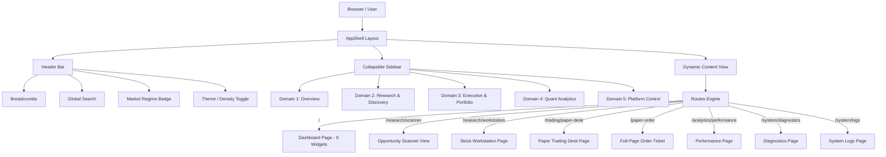

# Feature Specification: Phase 3 Frontend Foundation & Navigation Transformation

**Feature Branch**: `028-phase3-frontend-foundation`  
**Created**: 2026-07-31  
**Status**: Draft  
**Input**: User description: "PHASE 3 Frontend Foundation & Navigation Transformation (FEAT-030 to FEAT-035)"

---

## 1. Executive Summary

Phase 3 transforms the application's user experience from a generic retail trading view into a personal **AI Trading Research Platform**. This phase focuses strictly on the frontend foundation layer, establishing a modern navigation hierarchy, a centralized research dashboard, unified application shell layouts, standardized shared design components, disciplined client-side routing, and dead-code elimination.

Crucially, **no backend logic, recommendation engines, technical indicator scanners, database models, or API contracts are modified**. All existing APIs (`/api/v1/latest-scan`, `/api/v1/paper/*`, `/api/v1/system/*`) will be consumed as the source of truth without backend side effects.

---

## 2. Objectives

- **Refactor Navigation Hierarchy**: Replace generic retail navigation tabs with a domain-driven structure (Overview, Research & Discovery, Execution & Portfolio, Quantitative Analytics, Platform Control).
- **Establish Dashboard Landing Page**: Make `/` (Dashboard / Command Center) the authoritative, widgetized entry point for market regimes, daily scan summaries, AI recommendations, and quick research actions.
- **Unify Layout & Design Tokens**: Enforce consistent shell container widths, sticky header navigation, collapsible sidebars with persisted preferences, and dark/light design token harmony.
- **Normalize Routing & Deep Linking**: Standardize deep linking (e.g., symbol parameters, active tab sync), eliminate orphan views, and create redirect aliases for legacy routes.
- **Standardize Shared Components**: Classify every shared UI component into KEEP, MODIFY, REMOVE, or NEW to eliminate UI debt and duplicate logic.
- **Frontend Codebase Cleanup**: Remove unused components, legacy files, duplicate hooks, and unreferenced styles across `frontend/src/`.

---

## 3. Business Requirements

- **BR-001**: System MUST present a cohesive AI Trading Research environment immediately upon user landing.
- **BR-002**: System MUST allow zero-friction navigation between market screening, detailed stock analysis, paper order execution, and performance tracking.
- **BR-003**: System MUST maintain full backward compatibility for existing saved bookmarks, deep links, and user interface preferences (dark theme, sidebar state).
- **BR-004**: System MUST NOT disrupt operational stability or change underlying trading algorithms, scoring math, or backend persistence.

---

## 4. User Scenarios & Testing *(mandatory)*

### User Story 1 - Unified Research & Market Entry Point (Priority: P1)

As a quant trader, I want to open the platform landing page (`/`) and immediately see market regime health, today's top AI scan recommendations, portfolio status, and quick scan actions so that I can decide where to focus my research without clicking through multiple pages.

**Why this priority**: The Dashboard is the core entry point of the entire application. Without a unified entry point, navigation feels fragmented and generic.

**Independent Test**: Navigate to `/` after launch. Verify that all 9 dashboard widgets load their data from current endpoints, display status metrics, and provide direct action links to deep views.

**Acceptance Scenarios**:
1. **Given** an active backend session, **When** user navigates to `/`, **Then** the Market Overview, Scan Summary, AI Recommendations, and Quick Actions widgets display updated metrics.
2. **Given** a finished daily scan, **When** user clicks "View Shortlist" on the Dashboard Recommendation widget, **Then** the platform routes seamlessly to `/research/scanner` with filters preserved.

---

### User Story 2 - Domain-Driven Sidebar & Header Navigation (Priority: P2)

As a research analyst, I want a structured sidebar grouped by logical domains (Overview, Research & Discovery, Execution & Portfolio, Quantitative Analytics, Platform Control) with breadcrumb context so that I always know my location within the application.

**Why this priority**: Navigation structure guides user mental models and ensures complex analytics remain accessible.

**Independent Test**: Click through all domain sections in the sidebar. Verify active link highlighting, collapse/expand toggle persistence, breadcrumb updates in the header, and mobile drawer responsiveness.

**Acceptance Scenarios**:
1. **Given** the sidebar in expanded mode, **When** user clicks the collapse button, **Then** the sidebar shrinks to icon-only mode and remembers state across browser reloads.
2. **Given** a deep route `/research/workstation?symbol=TATAMOTORS`, **When** user checks top header, **Then** breadcrumbs display `Home / Research & Discovery / Stock Workstation / TATAMOTORS`.

---

### User Story 3 - Full-Page Order Execution & Watchlist Integration (Priority: P3)

As a paper trader, I want to initiate trade plans directly from scanner results or dashboard widgets into a full-page execution desk (`/paper-order`) or manage watchlists cleanly inside the paper trading workspace (`/trading/paper-desk?tab=watchlist`).

**Why this priority**: Streamlines the transition from AI idea generation to paper execution validation.

**Independent Test**: Click "Trade" on an AI candidate card. Confirm redirection to `/paper-order` with pre-filled entry, stop-loss, and target values, while supporting returning navigation.

**Acceptance Scenarios**:
1. **Given** an AI candidate with a defined trade plan, **When** user clicks "Paper Trade", **Then** the application navigates to `/paper-order` with pre-filled trade parameters.
2. **Given** legacy bookmark `/watchlist`, **When** accessed directly, **Then** system redirects seamlessly to `/trading/paper-desk?tab=watchlist`.

---

### Edge Cases

- **Backend Offline / API Timeout**: How does the layout handle unavailable API feeds on dashboard widgets? (Widgets must render isolated error cards with retry buttons without crashing the entire AppShell).
- **Narrow Viewport (Mobile/Tablet)**: How does navigation behave on screens under 768px? (Sidebar converts to slide-over drawer triggered by hamburger menu; top actions collapse into a quick action menu).
- **Missing Symbol Parameter**: What happens when accessing `/research/workstation` without `?symbol=`? (Displays empty state placeholder encouraging symbol search via global search bar).

---

## 5. Requirements *(mandatory)*

### Functional Requirements

- **FR-001**: System MUST provide a domain-grouped sidebar containing 5 core domains: Overview (`/`), Research & Discovery (`/research/*`), Execution & Portfolio (`/trading/*`), Quantitative Analytics (`/analytics/*`), and Platform Control (`/system/*`).
- **FR-002**: System MUST render a widgetized Dashboard on `/` comprising: Market Overview, Today's Scan, Recommendation Summary, Portfolio Summary, Recent Activity, Market Status, Research Status, Quick Actions, and Scanner Status.
- **FR-003**: System MUST support dynamic breadcrumb trails in the top sticky header matching the current active route and symbol context.
- **FR-004**: System MUST support global symbol search in the header bar with instant navigation to `/research/workstation?symbol={query}`.
- **FR-005**: System MUST collapse legacy orphan routes into canonical domain paths via standard client-side HTTP/route redirects (`/home` → `/`, `/scanner` → `/research/scanner`, `/paper` → `/trading/paper-desk`, `/diagnostics` → `/system/diagnostics`, `/logs` → `/system/logs`).
- **FR-006**: System MUST standardize all design system tokens across cards, tables, modal dialogs, buttons, density toggles (compact/comfortable), and theme modes (dark/light).
- **FR-007**: System MUST eliminate dead code, unreferenced components, duplicate helper files, and unused CSS selectors across `frontend/src/`.

### Key Entities

- **Navigation Domain**: Structuring entity for main navigation (ID, label, icon, items list).
- **Navigation Item**: Leaf route entry (ID, label, target path, match pattern, icon, test ID).
- **Dashboard Widget**: Standardized container component (Widget ID, title, grid span, state: loading | ready | error, refresh interval).
- **Breadcrumb Segment**: Dynamic route segment indicator (label, path, active state).
- **Design Token System**: CSS custom properties for dark/light theme colors, surfaces, borders, typography, and elevation.

---

## 6. Feature Specifications

### FEAT-030: Application Navigation Transformation

#### Purpose
Transform generic navigation into a structured, domain-driven AI Trading Research hierarchy.

#### Current Implementation
Current navigation in `frontend/src/layout/navConfig.tsx` defines 5 groups with flat links, retaining legacy aliases (`RETAIL_NAV`, `ADMIN_NAV`) and unorganized page headers.

#### Future Implementation
- **Domains & Page Mapping**:
  1. **Overview**: Dashboard (`/`)
  2. **Research & Discovery**: Opportunity Scanner (`/research/scanner`), Stock Workstation (`/research/workstation`), Market Watch & Sectors (`/research/markets`)
  3. **Execution & Portfolio**: Paper Trading Desk (`/trading/paper-desk`), Full-Page Order Ticket (`/paper-order`)
  4. **Quantitative Analytics**: Quant Analytics (`/analytics/performance`)
  5. **Platform Control**: System Diagnostics (`/system/diagnostics`), System Logs (`/system/logs`)
- **Pages to Keep**: DashboardPage, StockWorkstationPage, MarketsPage, PaperTradingPage, PaperOrderPage, PerformancePage, DiagnosticsPage, SystemLogs.
- **Pages to Rename/Restructure**: Standardize route prefixes to domain paths (`/research/*`, `/trading/*`, `/analytics/*`, `/system/*`).
- **Pages to Merge**: Consolidate Watchlist tab inside Paper Trading Desk while maintaining redirect alias `/watchlist` → `/trading/paper-desk?tab=watchlist`.
- **Navigation Elements**:
  - **Sidebar**: Collapsible (240px expanded / 64px collapsed), domain section headers, active route pill, live status indicator badges.
  - **Header**: Sticky top navigation bar with breadcrumb trail, global symbol search bar, market regime indicator, quick order CTA, theme toggle, and density mode control.
  - **Breadcrumbs**: Dynamic hierarchical navigation path string (e.g. `Overview` or `Research / Opportunity Scanner`).

---

### FEAT-031: Dashboard Foundation

#### Purpose
Establish `/` (Dashboard / Command Center) as the primary entry point for AI research insights and system operations.

#### Future Implementation Specification for Widgets:

| Widget Name | Purpose | Layout Position | Required Components | Required APIs | Dependencies |
| :--- | :--- | :--- | :--- | :--- | :--- |
| **Market Overview** | Display major Indian indices & market regime status | Grid Span 4 (Top Left) | `MarketRegimeBanner`, `StatCard` | `/api/v1/market-status`, `/api/v1/latest-scan` | Market feed cache |
| **Today's Scan** | Summarize daily screener results & candidate counts | Grid Span 4 (Top Center) | `StatusCards`, `ScannerProgress` | `/api/v1/latest-scan` | Scanner store |
| **Recommendation Summary** | Top AI buy/watch recommendations with trade setup details | Grid Span 4 (Top Right) | `TopRecommendationsWidget`, `AIRationaleCard` | `/api/v1/latest-scan` | Recommendation engine output |
| **Portfolio Summary** | Active paper positions, PnL, cash vs equity split | Grid Span 6 (Middle Left) | `PaperPortfolioSummaryCard`, `PnL` | `/api/v1/paper/portfolio` | Paper Trading context |
| **Recent Activity** | Timeline of latest scans, executed orders, and system alerts | Grid Span 6 (Middle Right) | `Card`, `Badge` | `/api/v1/paper/orders`, `/api/v1/system/logs` | Order & log history |
| **Market Status** | Market hours indicator (NSE/BSE status) & token health | Grid Span 3 (Bottom) | `SystemHealthBadge`, `TokenStatus` | `/api/v1/token/status` | Fyers token manager |
| **Research Status** | Active research idea lifecycle & candle store sync state | Grid Span 3 (Bottom) | `Card`, `Badge` | `/api/v1/research/ideas` | Research pipeline |
| **Quick Actions** | One-click triggers for instant scan, order ticket, and search | Grid Span 3 (Bottom) | `Button`, `GlobalSearch` | None (Client routing) | AppShell router |
| **Scanner Status** | Live scanner progress bar, fanout health, active step | Grid Span 3 (Bottom) | `ScannerProgress` | `/api/v1/latest-scan` | WebSocket / Poll status |

---

### FEAT-032: Application Layout

#### Purpose
Establish a unified, high-density, accessible layout shell (`AppShell`) across the platform.

#### Layout Specification Standard:
- **Header**: Height `56px` (compact) / `64px` (comfortable), fixed top (`z-index: 100`), backdrop glassmorphism (`backdrop-filter: blur(8px)`), border-bottom tokens.
- **Sidebar**: Width `240px` (expanded) / `64px` (collapsed), smooth transition (`200ms ease-in-out`), persisted state in `localStorage` key `ui_sidebar_collapsed`.
- **Content Area**: Fluid container with max-width `1400px` (standard pages) / `1800px` (workstation & scanner tables). Content padding `16px` (compact) / `24px` (comfortable).
- **Responsive Layout Breakpoints**:
  - `> 1280px`: Desktop (Sidebar expanded by default).
  - `768px - 1279px`: Tablet (Sidebar collapsed by default).
  - `< 768px`: Mobile (Sidebar hidden; slide-over menu drawer + bottom sticky nav bar).
- **Theme & Tokens**: CSS variables defined in `tokens.css` for background surfaces (`--bg-primary`, `--bg-secondary`, `--bg-card`), text colors (`--text-primary`, `--text-muted`), and border/accent tokens.
- **UI States Standard**:
  - **Loading**: `Skeleton` placeholder components maintaining target container geometry.
  - **Empty**: `EmptyState` component with illustration, title, description, and call-to-action button.
  - **Error**: Bordered error banner with alert icon, technical summary, and retry CTA.

---

### FEAT-033: Routing

#### Purpose
Establish clean, modular routing with strict canonical paths, automatic legacy redirects, deep-linking, and route guards.

#### Future Routing Structure Table:

| Canonical Route | Legacy Alias Redirects | Rendered Page Component | Route Guard / Deep-Link Params |
| :--- | :--- | :--- | :--- |
| `/` | `/home`, `/admin/command` | `DashboardPage` | Public / Direct |
| `/research/scanner` | `/scanner` | `ScannerView` (App.tsx) | Deep-link: `?signal=BUY&search=INFY` |
| `/research/workstation` | None | `StockWorkstationPage` | Deep-link: `?symbol=RELIANCE` |
| `/research/markets` | `/markets` | `MarketsPage` | Deep-link: `?universe=NIFTY500` |
| `/trading/paper-desk` | `/paper`, `/watchlist` (redirect `?tab=watchlist`) | `PaperTradingPage` | Deep-link: `?tab=positions\|orders\|watchlist` |
| `/paper-order` | None | `PaperOrderPage` | State bridge: symbol, side, prefill params |
| `/analytics/performance` | `/performance` | `PerformancePage` | Deep-link: `?timeframe=30d` |
| `/system/diagnostics` | `/diagnostics` | `DiagnosticsPage` | Public / System check |
| `/system/logs` | `/logs`, `/admin/logs` | `SystemLogs` | Deep-link: `?level=ERROR` |
| `/fyers/callback` | None | `FyersCallback` | OAuth token callback handler |
| `*` | N/A | Redirect to `/` | Fallback catch-all |

---

### FEAT-034: Shared Components

#### Purpose
Audit, classify, and standardize all shared components across `frontend/src/components` and `frontend/src/design-system`.

#### Classification Matrix:

| Component Name | Classification | Action Required |
| :--- | :--- | :--- |
| `Button.tsx` (design-system) | **KEEP** | Retain primary/secondary/ghost variants and density padding tokens |
| `Card.tsx` (design-system) | **KEEP** | Standardize background surface tokens and header/content subcomponents |
| `Badge.tsx` (design-system) | **KEEP** | Standardize status color mappings (BUY: success, WATCH: warning, REJECT: danger) |
| `Modal.tsx` (design-system) | **KEEP** | Ensure proper focus trapping and ESC key handlers |
| `Tabs.tsx` (design-system) | **KEEP** | Retain border and pill tab variants |
| `Toast.tsx` (design-system) | **KEEP** | Retain notification stack and auto-dismiss timing |
| `PnL.tsx` (design-system) | **KEEP** | Retain color formatting for positive/negative values |
| `Skeleton.tsx` | **KEEP** | Retain chart and panel skeleton loaders |
| `AppShell.tsx` | **MODIFY** | Integrate dynamic `Breadcrumbs`, top header global search, and density toggle |
| `navConfig.tsx` | **MODIFY** | Update navigation table to reflect domain-driven 5-domain structure |
| `DashboardHeader.tsx` | **MODIFY** | Add market status indicators and quick action buttons |
| `StatusCards.tsx` | **MODIFY** | Refactor to use design-system `StatCard` tokens for metric uniformity |
| `CandidateTable.tsx` | **MODIFY** | Add quick "Paper Trade" action button and column density control |
| `StockDetailPanel.tsx` | **MODIFY** | Refactor internal layout to responsive tabbed card sections |
| `PaperPortfolioSummaryCard.tsx` | **MODIFY** | Apply design-system `Card` and `PnL` components |
| `BullIllustration.tsx` | **REMOVE** | Remove unused vector graphic; replace with icon-based empty state |
| `LegacyInlineStatus` | **REMOVE** | Remove redundant inline health badges in favor of `SystemHealthBadge` |
| `Breadcrumbs.tsx` | **NEW** | Create standalone breadcrumb component consuming route matches |
| `GlobalSearch.tsx` | **NEW** | Create header search bar with symbol autocomplete and direct routing |
| `QuickActionsBar.tsx` | **NEW** | Create dashboard quick action bar with direct execution shortcuts |
| `WidgetContainer.tsx` | **NEW** | Create standard dashboard widget container with refresh & error state wrapper |

---

### FEAT-035: Frontend Cleanup

#### Purpose
Eliminate unreferenced components, dead hooks, duplicate utilities, unused layouts, and orphaned assets to streamline frontend build bundle size and maintainability.

#### Cleanup Audit & Strategy:
1. **Unused Files & Components**:
   - `BullIllustration.tsx`: Unused inline asset.
   - Duplicate utility helpers across `src/utils/`: Consolidate `paperCapital.ts` and `paperOrderNavigation.ts`.
2. **Bundle Optimization**:
   - Verify code-splitting boundaries for lazy-loaded pages (`PaperTradingPage`, `StockWorkstationPage`, `MarketsPage`, `PerformancePage`, `SystemLogs`).
   - Remove redundant CSS classes from `styles.css` superseded by `design-system/tokens.css` and `shell.css`.
3. **Execution Plan**:
   - Phase 1: Audit references using static imports and ripgrep checks.
   - Phase 2: Deprecate target files by removing imports in `App.tsx` and `AppShell.tsx`.
   - Phase 3: Delete unreferenced files and run `npm run build` and `npm run test` to verify zero build regressions.

---

## 7. Frontend Architecture Changes

---

## 8. File Impact Analysis

| File Path | Nature of Change | Purpose & Scope |
| :--- | :--- | :--- |
| `frontend/src/layout/navConfig.tsx` | **MODIFY** | Define 5-domain navigation structure and active link match logic |
| `frontend/src/layout/AppShell.tsx` | **MODIFY** | Embed `Breadcrumbs`, header `GlobalSearch`, and density selector |
| `frontend/src/layout/shell.css` | **MODIFY** | Update layout styling for responsive breakpoints and theme variables |
| `frontend/src/App.tsx` | **MODIFY** | Clean up route definitions, add legacy redirects, remove inline views |
| `frontend/src/pages/DashboardPage.tsx` | **MODIFY** | Assemble 9 dashboard widgets into structured grid layout |
| `frontend/src/components/Breadcrumbs.tsx` | **NEW** | Render route hierarchy links dynamically from `useLocation` |
| `frontend/src/components/GlobalSearch.tsx` | **NEW** | Render header symbol search input with quick navigate handler |
| `frontend/src/components/QuickActionsBar.tsx` | **NEW** | Render quick action shortcut buttons on Dashboard |
| `frontend/src/components/WidgetContainer.tsx` | **NEW** | Standardize dashboard widget layout, title, and loading/error states |
| `frontend/src/components/BullIllustration.tsx` | **REMOVE** | Delete unused graphic file |
| `frontend/src/design-system/tokens.css` | **MODIFY** | Add surface and spacing variables for high-density design system |

---

## 9. Dependency Analysis

- **Third-Party Libraries**: `react` (v18+), `react-router-dom` (v6+), `lucide-react` / SVG icons, `vite`. No new external npm packages required.
- **Backend APIs (Read-Only)**:
  - `/api/v1/latest-scan` (Screener results & recommendations)
  - `/api/v1/paper/portfolio` (Paper portfolio summary & open positions)
  - `/api/v1/paper/orders` (Paper trade order history)
  - `/api/v1/token/status` (Fyers token status)
  - `/api/v1/system/health` & `/api/v1/system/logs` (System health & audit logs)

---

## 10. Risk Assessment

| Risk Description | Severity | Likelihood | Mitigation Strategy |
| :--- | :--- | :--- | :--- |
| **Broken Links / Bookmarks** | Medium | Medium | Provide explicit `Navigate to="..." replace` redirect routes for all legacy paths (`/home`, `/scanner`, `/paper`, `/diagnostics`, `/logs`) |
| **Layout Shift on Load** | Low | Low | Enforce standard min-height constraints and `Skeleton` loaders matching widget grid geometry |
| **State Disconnect on Route Change** | Medium | Low | Maintain state bridges (e.g. `PaperOrderRouteBridge`, `PaperOrderContext`) outside `<Routes>` tree |
| **CSS Leakage / Specificity Conflicts** | Low | Medium | Restrict component styles to scoped classes and design system tokens (`tokens.css`, `components.css`) |

---

## 11. Validation Strategy

1. **Route Integrity Verification**: Execute automated client routing tests verifying every path renders its target view and legacy paths perform instant redirect without console errors.
2. **Visual & Theme Parity**: Verify theme toggling (dark mode default to light mode) renders proper contrast ratios across all components.
3. **Responsive Breakpoint Check**: Test layout rendering across 1920px, 1280px, 768px, and 375px viewports.
4. **Build & Test Suite Execution**: Run `npm run build` and `npm run test` in `frontend/` to confirm zero build errors or TypeScript failures.

---

## 12. Testing Strategy

- **Unit Testing**: Test `navConfig.ts` helper functions (`isNavActive`), `Breadcrumbs` path generation, and route redirect rules using Vitest / React Testing Library.
- **Component Testing**: Test `WidgetContainer` loading, empty, and error render states.
- **End-to-End (E2E) Playwright Tests**:
  - Test navigation workflow: Dashboard → Opportunity Scanner → Stock Workstation → Paper Order Desk.
  - Test sidebar toggle state persistence in `localStorage`.
  - Test global search input redirection.

---

## 13. Regression Checklist

- [ ] Navigating to `/` displays the 9-widget Dashboard layout.
- [ ] Navigating to legacy route `/home` automatically redirects to `/`.
- [ ] Navigating to legacy route `/scanner` automatically redirects to `/research/scanner`.
- [ ] Navigating to legacy route `/paper` automatically redirects to `/trading/paper-desk`.
- [ ] Navigating to legacy route `/watchlist` automatically redirects to `/trading/paper-desk?tab=watchlist`.
- [ ] Navigating to legacy route `/logs` automatically redirects to `/system/logs`.
- [ ] Collapsing the sidebar updates layout width and persists state across page reloads.
- [ ] Theme toggle switches between dark mode and light mode without unstyled text or broken backgrounds.
- [ ] Paper order placement via `/paper-order` correctly receives prefilled trade setup parameters.
- [ ] Frontend build (`npm run build`) completes with zero errors and clean bundle output.

---

## 14. Success Criteria *(mandatory)*

### Measurable Outcomes

- **SC-001**: 100% of defined canonical routes and legacy redirect paths resolve correctly without broken links or white-screen errors.
- **SC-002**: Initial page paint time for AppShell and Dashboard landing page completes in under `1.5 seconds` on local dev server.
- **SC-003**: 0 backend API endpoints, database schemas, scanner functions, or recommendation scoring files are modified during implementation.
- **SC-004**: Frontend codebase size is reduced by removing all identified unreferenced components and duplicate style declarations.

---

## 15. Assumptions

- **Target Browser**: Modern evergreen browsers (Chrome, Edge, Firefox, Safari) with standard ES2022+ and CSS Custom Properties support.
- **Backend Availability**: Existing backend APIs defined in `frontend/src/api.ts` are running and accessible without contract modifications.
- **Design Framework**: Built using React, Vite, react-router-dom, and Vanilla CSS with custom design tokens. No TailwindCSS or external UI component frameworks introduced.

---

## 16. Out of Scope

- Modifying Recommendation Engine scoring, weights, or algorithms.
- Modifying Technical Analysis indicators, market regime detectors, or scanner pipeline logic.
- Modifying backend FastAPI routes, Python models, or database schemas.
- Adding real-money broker execution or live exchange connections beyond existing Fyers token status integration.

---

## 17. Definition of Done

- [x] Complete Phase 3 Frontend Foundation Specification generated in `specs/028-phase3-frontend-foundation/spec.md`.
- [x] Feature requirements FEAT-030 through FEAT-035 fully detailed with purpose, current state, future state, and impacts.
- [x] File impact analysis, component classification matrix, widget specifications, and routing tables documented.
- [x] Validation strategy, testing plan, and regression checklist finalized.
